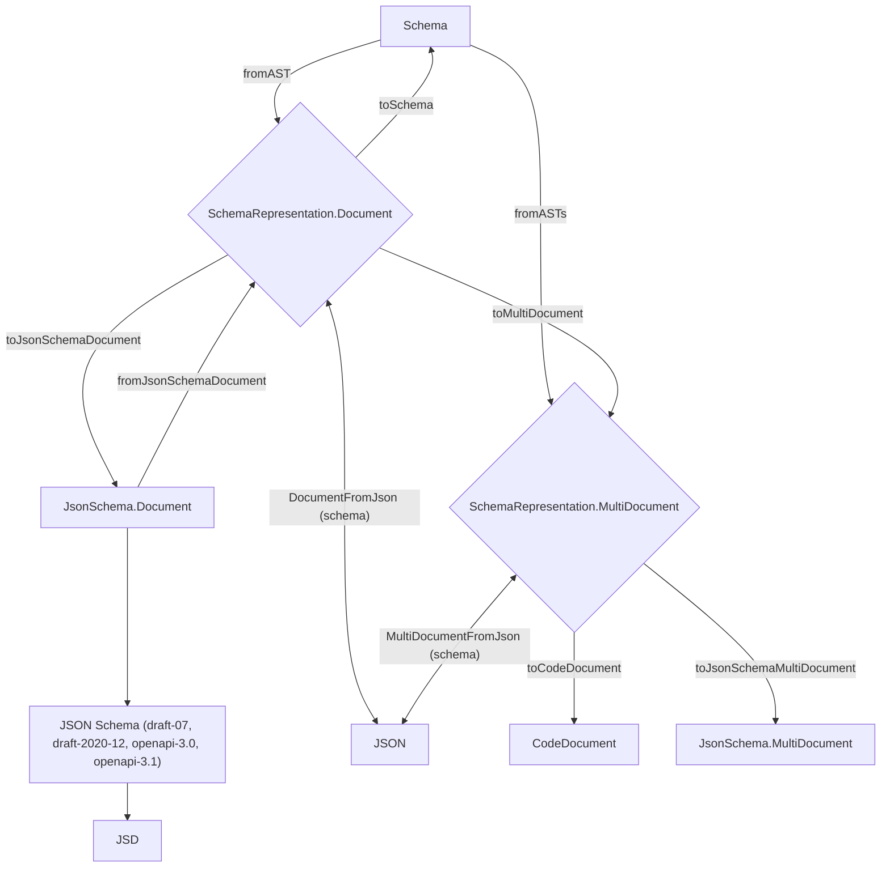
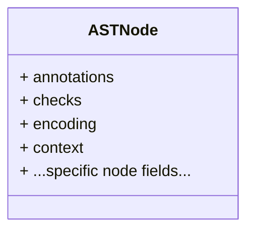
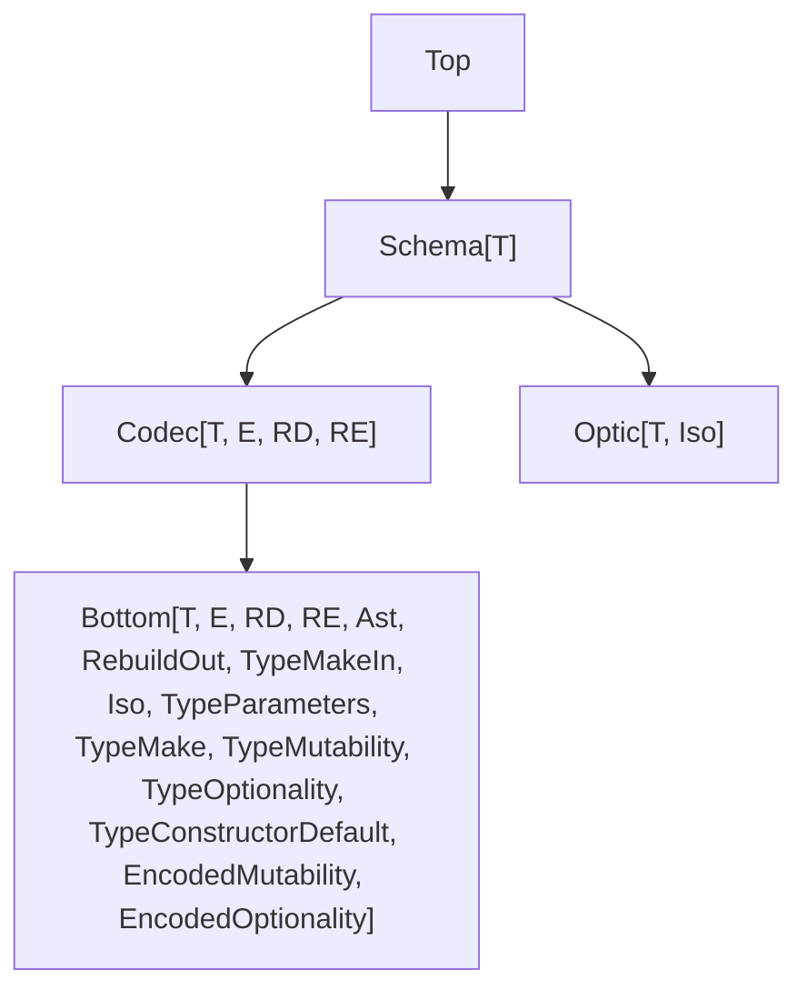

# Schema

`Schema` is a TypeScript-first library for defining data shapes, validating unknown input, and transforming values between formats.

Two key concepts appear throughout this guide:

- **Decoding** — turning unknown external data (API responses, form submissions, config files) into typed, validated values.
- **Encoding** — turning typed values back into a serializable format (JSON, FormData, etc.).

Use Schema to:

- **Define types** — declare the shape of your data once and get both the TypeScript type and a runtime validator.
- **Validate input** — decode unknown data into type-safe values, with clear error messages when it doesn't match.
- **Transform values** — convert between your domain types and serialization formats like JSON, FormData, and URLSearchParams.
- **Generate tooling** — derive JSON Schemas, test data generators, equivalence checks, and more from a single schema definition.

## Design Philosophy

- **Lightweight by default** — only import the features you need, keeping your bundle small.
- **Familiar API** — naming conventions and patterns are consistent with popular validation libraries, so getting started is easy.
- **Explicit** — you choose which features to use. Nothing is included implicitly.

### What's in This Guide

1. **Elementary schemas** — built-in schemas for primitives, literals, strings, numbers, dates, and template literals.
2. **Composite schemas** — combine elementary schemas into structs (objects), tuples, arrays, records, and unions.
3. **Validation** — add runtime checks (filters) to constrain values, report multiple errors, and define custom rules.
4. **Constructors** — create validated values at runtime, with support for defaults, brands, and refinements.
5. **Transformations** — convert values between types during decoding and encoding. Transformations are reusable objects you compose with schemas.
6. **Flipping** — swap a schema's decoding and encoding directions.
7. **Classes and opaque types** — create distinct TypeScript types backed by structs, with optional methods and equality.
8. **Serialization** — convert values to and from JSON, FormData, URLSearchParams, and XML using canonical codecs.
9. **Tooling** — generate JSON Schemas, test data generators (Arbitraries), equivalence checks, optics, and JSON Patch differs from a single schema.
10. **Error handling** — format validation errors for display, with hooks for internationalization.
11. **Middlewares** — intercept decoding/encoding to provide fallbacks or inject services.
12. **Advanced topics** — internal type model and type hierarchy (for library authors).
13. **Integrations** — working examples for TanStack Form and Elysia.
14. **Migration from v3** — API mapping from Schema v3 to v4.

# Defining Elementary Schemas

Schema provides built-in schemas for all common TypeScript types. These schemas represent a single value — like a string or a number — and they are the building blocks you combine into more complex shapes.

## Primitives

Use these schemas when a value should be exactly one of the basic JavaScript types.

```ts
import { Schema } from "effect"

// primitive types
Schema.String
Schema.Number
Schema.BigInt
Schema.Boolean
Schema.Symbol
Schema.Undefined
Schema.Null
```

Sometimes you receive data that is not the right type yet — for example, a number that should become a string. You can build a schema that converts (coerces) values to the target type during decoding:

```ts
import { Getter, Parser, Schema } from "effect/schema"

//      ┌─── Codec<string, unknown>
//      ▼
const schema = Schema.Unknown.pipe(
  Schema.decodeTo(Schema.String, {
    decode: Getter.String(),
    encode: Getter.passthrough()
  })
)

const parser = Parser.decodeUnknownSync(schema)

console.log(parser("tuna")) // => "tuna"
console.log(parser(42)) // => "42"
console.log(parser(true)) // => "true"
console.log(parser(null)) // => "null"
```

## Literals

A literal schema matches one exact value. Use it when a field must be a specific string, number, or other constant.

```ts
import { Schema } from "effect"

const tuna = Schema.Literal("tuna")
const twelve = Schema.Literal(12)
const twobig = Schema.Literal(2n)
const tru = Schema.Literal(true)
```

Symbol literals:

```ts
import { Schema } from "effect"

const terrific = Schema.UniqueSymbol(Symbol("terrific"))
```

`null`, `undefined`, and `void`:

```ts
import { Schema } from "effect"

Schema.Null
Schema.Undefined
Schema.Void
```

To allow multiple literal values:

```ts
import { Schema } from "effect"

const schema = Schema.Literals(["red", "green", "blue"])
```

To extract the set of allowed values from a literal schema:

```ts
import { Schema } from "effect"

const schema = Schema.Literals(["red", "green", "blue"])

// readonly ["red", "green", "blue"]
schema.literals

// readonly [Schema.Literal<"red">, Schema.Literal<"green">, Schema.Literal<"blue">]
schema.members
```

## Strings

You can add validation rules to a string schema. Each rule is applied with `.check(...)` and returns a new schema that enforces that constraint.

```ts
import { Schema } from "effect"

Schema.String.check(Schema.isMaxLength(5))
Schema.String.check(Schema.isMinLength(5))
Schema.String.check(Schema.isLengthBetween(5, 5))
Schema.String.check(Schema.isPattern(/^[a-z]+$/))
Schema.String.check(Schema.isStartsWith("aaa"))
Schema.String.check(Schema.isEndsWith("zzz"))
Schema.String.check(Schema.isIncludes("---"))
Schema.String.check(Schema.isUppercased())
Schema.String.check(Schema.isLowercased())
```

To perform some simple string transforms:

```ts
import { Schema, SchemaTransformation } from "effect"

Schema.String.decode(SchemaTransformation.trim())
Schema.String.decode(SchemaTransformation.toLowerCase())
Schema.String.decode(SchemaTransformation.toUpperCase())
```

## String formats

Schema includes built-in checks for common string formats.

```ts
import { Schema } from "effect"

Schema.String.check(Schema.isUUID())
Schema.String.check(Schema.isBase64())
Schema.String.check(Schema.isBase64Url())
```

## Numbers

```ts
import { Schema } from "effect"

Schema.Number // all numbers
Schema.Finite // finite numbers (i.e. not +/-Infinity or NaN)
```

You can add validation rules to a number schema. Each rule constrains the allowed range or value.

```ts
import { Schema } from "effect"

Schema.Number.check(Schema.isBetween({ minimum: 5, maximum: 10 }))
Schema.Number.check(Schema.isGreaterThan(5))
Schema.Number.check(Schema.isGreaterThanOrEqualTo(5))
Schema.Number.check(Schema.isLessThan(5))
Schema.Number.check(Schema.isLessThanOrEqualTo(5))
Schema.Number.check(Schema.isMultipleOf(5))
```

## Integers

To require that a number has no decimal part, use `isInt()`. For 32-bit integers specifically, use `isInt32()`.

```ts
import { Schema } from "effect"

Schema.Number.check(Schema.isInt())
Schema.Number.check(Schema.isInt32())
```

## BigInts

Schema does not ship pre-built BigInt validation factories (unlike numbers). Instead, you create your own using helper functions and a BigInt-compatible ordering. The example below shows how.

```ts
import { BigInt, Order, Schema } from "effect"

const options = { order: Order.BigInt }

const isBetween = Schema.makeIsBetween(options)
const isGreaterThan = Schema.makeIsGreaterThan(options)
const isGreaterThanOrEqualTo = Schema.makeIsGreaterThanOrEqualTo(options)
const isLessThan = Schema.makeIsLessThan(options)
const isLessThanOrEqualTo = Schema.makeIsLessThanOrEqualTo(options)
const isMultipleOf = Schema.makeIsMultipleOf({
  remainder: BigInt.remainder,
  zero: 0n
})

const isPositive = isGreaterThan(0n)
const isNonNegative = isGreaterThanOrEqualTo(0n)
const isNegative = isLessThan(0n)
const isNonPositive = isLessThanOrEqualTo(0n)

Schema.BigInt.check(isBetween({ minimum: 5n, maximum: 10n }))
Schema.BigInt.check(isGreaterThan(5n))
Schema.BigInt.check(isGreaterThanOrEqualTo(5n))
Schema.BigInt.check(isLessThan(5n))
Schema.BigInt.check(isLessThanOrEqualTo(5n))
Schema.BigInt.check(isMultipleOf(5n))
Schema.BigInt.check(isPositive)
Schema.BigInt.check(isNonNegative)
Schema.BigInt.check(isNegative)
Schema.BigInt.check(isNonPositive)
```

## Dates

The `Schema.Date` schema matches `Date` objects (even invalid dates).

If you want to validate only valid dates, use `Schema.DateValid` instead.

## Template literals

You can use `Schema.TemplateLiteral` to define structured string patterns made of multiple parts. Each part can be a literal or a schema, and **additional constraints** (such as `isMinLength` or `isMaxLength`) can be applied to individual parts.

Template literal matching is based on the semantics of each part rather than only a generated regular expression. Checks on string, number, and bigint schema parts are applied while matching each segment.

**Example** (Constraining parts of an email-like string)

```ts
import { Schema } from "effect"

// Construct a template literal schema for values like `${string}@${string}`
// Apply constraints to both sides of the "@" symbol
const email = Schema.TemplateLiteral([
  // Left part: must be a non-empty string
  Schema.String.check(Schema.isMinLength(1)),

  // Separator
  "@",

  // Right part: must be a string with a maximum length of 64
  Schema.String.check(Schema.isMaxLength(64))
])

// The inferred type is `${string}@${string}`
export type Type = typeof email.Type

console.log(String(Schema.decodeUnknownExit(email)("a@b.com")))
/*
Success("a@b.com")
*/

console.log(String(Schema.decodeUnknownExit(email)("@b.com")))
/*
Failure(Cause([Fail(SchemaError(Expected a string matching template literal parts, got "@b.com"))]))
*/
```

### Template literal parser

If you want to extract the parts of a string that match a template, you can use `Schema.TemplateLiteralParser`. This allows you to parse the input into its individual components rather than treat it as a single string.

**Example** (Parsing a template literal into components)

```ts
import { Schema } from "effect"

const schema = Schema.TemplateLiteralParser([
  Schema.String.check(Schema.isMinLength(2)),
  ":",
  Schema.Int
])

// The inferred type is `readonly [string, ":", number]`
export type Type = typeof schema.Type

console.log(String(Schema.decodeUnknownExit(schema)("aa:1")))
// Success(["aa",":",1])

console.log(String(Schema.decodeUnknownExit(schema)("a:1")))
// Failure(Cause([Fail(SchemaError(Expected a value with a length of at least 2, got "a"
//   at [0]))]))

console.log(String(Schema.decodeUnknownExit(schema)("aa:1.2")))
// Failure(Cause([Fail(SchemaError(Expected an integer, got 1.2
//   at [2]))]))
```

# Defining Composite Schemas

Once you have elementary schemas, you can combine them into composite schemas that describe objects, arrays, tuples, key-value maps, and unions.

## Structs

A struct schema describes a JavaScript object with a known set of keys. Each key maps to a schema that validates and types its value.

### Optional and Mutable Keys

By default, every key in a struct is required and readonly. Use `Schema.optionalKey` to make a key optional (the key can be absent from the object), and `Schema.mutableKey` to make it writable.

You can mark struct properties as optional or mutable using `Schema.optionalKey` and `Schema.mutableKey`.

```ts
import { Schema } from "effect"

const schema = Schema.Struct({
  a: Schema.String,
  b: Schema.optionalKey(Schema.String),
  c: Schema.mutableKey(Schema.String),
  d: Schema.optionalKey(Schema.mutableKey(Schema.String))
})

/*
with "exactOptionalPropertyTypes": true

type Type = {
    readonly a: string;
    readonly b?: string;
    c: string;
    d?: string;
}
*/
type Type = (typeof schema)["Type"]
```

### Optional Fields

There are several ways to represent optional properties, depending on whether you want `undefined` in the type, `null` in the type, or just a missing key. By combining `Schema.optionalKey`, `Schema.optional`, and `Schema.NullOr`, you can represent any variant.

```ts
import { Schema } from "effect"

export const schema = Schema.Struct({
  // Exact Optional Property
  a: Schema.optionalKey(Schema.FiniteFromString),
  // Optional Property
  b: Schema.optional(Schema.FiniteFromString),
  // Exact Optional Property with Nullability
  c: Schema.optionalKey(Schema.NullOr(Schema.FiniteFromString)),
  // Optional Property with Nullability
  d: Schema.optional(Schema.NullOr(Schema.FiniteFromString))
})

/*
type Encoded = {
    readonly a?: string;
    readonly b?: string | undefined;
    readonly c?: string | null;
    readonly d?: string | null | undefined;
}
*/
type Encoded = typeof schema.Encoded

/*
type Type = {
    readonly a?: number;
    readonly b?: number | undefined;
    readonly c?: number | null;
    readonly d?: number | null | undefined;
}
*/
type Type = typeof schema.Type
```

#### Omitting Values When Transforming Optional Fields

If an optional field arrives as `undefined`, you may want to omit it from the output entirely rather than keeping it.

```ts
import { Option, Predicate, Schema, SchemaGetter } from "effect"

export const schema = Schema.Struct({
  a: Schema.optional(Schema.FiniteFromString).pipe(
    Schema.decodeTo(Schema.optionalKey(Schema.Number), {
      decode: SchemaGetter.transformOptional(
        Option.filter(Predicate.isNotUndefined) // omit undefined
      ),
      encode: SchemaGetter.passthrough()
    })
  )
})

/*
type Encoded = {
    readonly a?: string | undefined;
}
*/
type Encoded = typeof schema.Encoded

/*
type Type = {
    readonly a?: number;
}
*/
type Type = typeof schema.Type
```

#### Representing Optional Fields with never Type

You can use `Schema.Never` inside an optional key to represent a field that should never have a value but may still appear as a key in the type.

```ts
import { Schema } from "effect"

export const schema = Schema.Struct({
  a: Schema.optionalKey(Schema.Never)
})

/*
type Encoded = {
    readonly a?: never;
}
*/
type Encoded = typeof schema.Encoded

/*
type Type = {
    readonly a?: never;
}
*/
type Type = typeof schema.Type
```

### Decoding Defaults

You can assign default values to fields during decoding using:

| API                                 | Encoded side              | Default value type |
| ----------------------------------- | ------------------------- | ------------------ |
| `Schema.withDecodingDefaultKey`     | key absent                | `Encoded`          |
| `Schema.withDecodingDefault`        | key absent or `undefined` | `Encoded`          |
| `Schema.withDecodingDefaultTypeKey` | key absent                | `Type`             |
| `Schema.withDecodingDefaultType`    | key absent or `undefined` | `Type`             |

The "Key" variants use `optionalKey` (the key may be absent but not `undefined`), while the non-"Key" variants use `optional` (the key may be absent **or** `undefined`).

The "Type" variants accept a default specified as a `Type` (decoded) value, which is useful when the schema has a transformation and you want to provide the default in the decoded representation.

#### Encoded-Side Defaults

`withDecodingDefaultKey` and `withDecodingDefault` accept a default specified as an
**`Encoded` value** (before any decoding transformation). This is the most common
case and works well when the Encoded and Type representations are the same, or
when you already have the value in encoded form.

**Example** (Default as an Encoded value)

In `FiniteFromString`, the `Encoded` type is `string` and the `Type` is `number`.
The default `"1"` is a **string** (the Encoded type), which is then decoded to `1`.

```ts
import { Effect, Schema } from "effect"

const schema = Schema.Struct({
  //                                          ┌─── "1" is a string (Encoded type)
  //                                          ▼
  a: Schema.FiniteFromString.pipe(Schema.withDecodingDefault(Effect.succeed("1")))
})

//     ┌─── { readonly a?: string | undefined; }
//     ▼
type Encoded = typeof schema.Encoded

//     ┌─── { readonly a: number; }
//     ▼
type Type = typeof schema.Type

console.log(Schema.decodeUnknownSync(schema)({}))
// Output: { a: 1 }

console.log(Schema.decodeUnknownSync(schema)({ a: undefined }))
// Output: { a: 1 }

console.log(Schema.decodeUnknownSync(schema)({ a: "2" }))
// Output: { a: 2 }
```

#### Type-Side Defaults

`withDecodingDefaultTypeKey` and `withDecodingDefaultType` accept a default
specified as a **`Type` value** (the decoded representation). This is useful when
the schema has a transformation and you want to provide the default directly as a
decoded value, bypassing the decoding step.

**Example** (Default as a Type value)

Here the default `1` is a **number** (the Type), not a string. It does not go
through the `FiniteFromString` decoding transformation.

```ts
import { Effect, Schema } from "effect"

const schema = Schema.Struct({
  //                                              ┌─── 1 is a number (Type)
  //                                              ▼
  a: Schema.FiniteFromString.pipe(Schema.withDecodingDefaultType(Effect.succeed(1)))
})

//     ┌─── { readonly a?: string | undefined; }
//     ▼
type Encoded = typeof schema.Encoded

//     ┌─── { readonly a: number; }
//     ▼
type Type = typeof schema.Type

console.log(Schema.decodeUnknownSync(schema)({}))
// Output: { a: 1 }

console.log(Schema.decodeUnknownSync(schema)({ a: undefined }))
// Output: { a: 1 }

console.log(Schema.decodeUnknownSync(schema)({ a: "2" }))
// Output: { a: 2 }
```

#### Nested Decoding Defaults

You can also apply decoding defaults within nested structures.

**Example** (Nested struct with defaults for missing or undefined fields)

```ts
import { Effect, Schema } from "effect"

const schema = Schema.Struct({
  a: Schema.Struct({
    b: Schema.FiniteFromString.pipe(Schema.withDecodingDefault(Effect.succeed("1")))
  }).pipe(Schema.withDecodingDefault(Effect.succeed({})))
})

/*
type Encoded = {
    readonly a?: {
        readonly b?: string | undefined;
    } | undefined;
}
*/
type Encoded = typeof schema.Encoded

/*
type Type = {
    readonly a: {
        readonly b: number;
    };
}
*/
type Type = typeof schema.Type

console.log(Schema.decodeUnknownSync(schema)({}))
// Output: { a: { b: 1 } }

console.log(Schema.decodeUnknownSync(schema)({ a: undefined }))
// Output: { a: { b: 1 } }

console.log(Schema.decodeUnknownSync(schema)({ a: {} }))
// Output: { a: { b: 1 } }

console.log(Schema.decodeUnknownSync(schema)({ a: { b: undefined } }))
// Output: { a: { b: 1 } }

console.log(Schema.decodeUnknownSync(schema)({ a: { b: "2" } }))
// Output: { a: { b: 2 } }
```

### Manual Decoding Defaults

If the defaulting logic is more specific than just handling `undefined` or missing values, you can use `Schema.decodeTo` to apply custom fallback rules.

This is useful when you need to account for values like `null` or other invalid states.

**Example** (Providing a fallback when value is `null` or missing)

```ts
import { Option, Predicate, Schema, SchemaGetter } from "effect"

const schema = Schema.Struct({
  a: Schema.optionalKey(Schema.NullOr(Schema.String)).pipe(
    Schema.decodeTo(Schema.FiniteFromString, {
      decode: SchemaGetter.transformOptional((oe) =>
        oe.pipe(
          // remove null values
          Option.filter(Predicate.isNotNull),
          // default to "1" if none
          Option.orElseSome(() => "1")
        )
      ),
      encode: SchemaGetter.passthrough()
    })
  )
})

//     ┌─── { readonly a?: string | null; }
//     ▼
type Encoded = typeof schema.Encoded

//     ┌─── { readonly a: number; }
//     ▼
type Type = typeof schema.Type

console.log(Schema.decodeUnknownSync(schema)({}))
// Output: { a: 1 }

// console.log(Schema.decodeUnknownSync(Product)({ quantity: undefined }))
// throws

console.log(Schema.decodeUnknownSync(schema)({ a: null }))
// Output: { a: 1 }

console.log(Schema.decodeUnknownSync(schema)({ a: "2" }))
// Output: { a: 2 }
```

**Example** (Providing a fallback when value is `null`, `undefined`, or missing)

```ts
import { Option, Predicate, Schema, SchemaGetter } from "effect"

const schema = Schema.Struct({
  a: Schema.optional(Schema.NullOr(Schema.String)).pipe(
    Schema.decodeTo(Schema.FiniteFromString, {
      decode: SchemaGetter.transformOptional((oe) =>
        oe.pipe(
          // remove null and undefined
          Option.filter(Predicate.isNotNullish),
          // default to "1" if none
          Option.orElseSome(() => "1")
        )
      ),
      encode: SchemaGetter.passthrough()
    })
  )
})

//     ┌─── { readonly a?: string | null | undefined; }
//     ▼
type Encoded = typeof schema.Encoded

//     ┌─── { readonly a: number; }
//     ▼
type Type = typeof schema.Type

console.log(Schema.decodeUnknownSync(schema)({}))
// Output: { a: 1 }

console.log(Schema.decodeUnknownSync(schema)({ a: undefined }))
// Output: { a: 1 }

console.log(Schema.decodeUnknownSync(schema)({ a: null }))
// Output: { a: 1 }

console.log(Schema.decodeUnknownSync(schema)({ a: "2" }))
// Output: { a: 2 }
```

### Optional Fields as Options

Effect's `Option` type is a safer alternative to `undefined` for representing the presence or absence of a value. These helpers convert between optional struct fields and `Option` values.

#### Exact Optional Property

```ts
import { Option, Schema } from "effect"

const Product = Schema.Struct({
  quantity: Schema.OptionFromOptionalKey(Schema.FiniteFromString)
})

//     ┌─── { readonly quantity?: string; }
//     ▼
type Encoded = typeof Product.Encoded

//     ┌─── { readonly quantity: Option<number>; }
//     ▼
type Type = typeof Product.Type

console.log(Schema.decodeUnknownSync(Product)({}))
// Output: { quantity: { _id: 'Option', _tag: 'None' } }

console.log(Schema.decodeUnknownSync(Product)({ quantity: "2" }))
// Output: { quantity: { _id: 'Option', _tag: 'Some', value: 2 } }

// console.log(Schema.decodeUnknownSync(Product)({ quantity: undefined }))
// throws

console.log(Schema.encodeSync(Product)({ quantity: Option.some(2) }))
// Output: { quantity: "2" }

console.log(Schema.encodeSync(Product)({ quantity: Option.none() }))
// Output: {}
```

#### Optional Property

```ts
import { Option, Schema } from "effect"

const Product = Schema.Struct({
  quantity: Schema.OptionFromOptional(Schema.FiniteFromString)
})

//     ┌─── { readonly quantity?: string | undefined; }
//     ▼
type Encoded = typeof Product.Encoded

//     ┌─── { readonly quantity: Option<number>; }
//     ▼
type Type = typeof Product.Type

console.log(Schema.decodeUnknownSync(Product)({}))
// Output: { quantity: { _id: 'Option', _tag: 'None' } }

console.log(Schema.decodeUnknownSync(Product)({ quantity: "2" }))
// Output: { quantity: { _id: 'Option', _tag: 'Some', value: 2 } }

console.log(Schema.decodeUnknownSync(Product)({ quantity: undefined }))
// Output: { quantity: { _id: 'Option', _tag: 'None' } }

console.log(Schema.encodeSync(Product)({ quantity: Option.some(2) }))
// Output: { quantity: "2" }

console.log(Schema.encodeSync(Product)({ quantity: Option.none() }))
// Output: {}
```

#### Exact Optional Property with Nullability

```ts
import { Option, Predicate, Schema, SchemaTransformation } from "effect"

const Product = Schema.Struct({
  quantity: Schema.optionalKey(Schema.NullOr(Schema.FiniteFromString)).pipe(
    Schema.decodeTo(
      Schema.Option(Schema.Number),
      SchemaTransformation.transformOptional({
        decode: (oe) => oe.pipe(Option.filter(Predicate.isNotNull), Option.some),
        encode: Option.flatten
      })
    )
  )
})

//     ┌─── { readonly quantity?: string | null; }
//     ▼
type Encoded = typeof Product.Encoded

//     ┌─── { readonly quantity: Option<number>; }
//     ▼
type Type = typeof Product.Type

console.log(Schema.decodeUnknownSync(Product)({}))
// Output: { quantity: { _id: 'Option', _tag: 'None' } }

console.log(Schema.decodeUnknownSync(Product)({ quantity: null }))
// Output: { quantity: { _id: 'Option', _tag: 'None' } }

console.log(Schema.decodeUnknownSync(Product)({ quantity: "2" }))
// Output: { quantity: { _id: 'Option', _tag: 'Some', value: 2 } }

// console.log(Schema.decodeUnknownSync(Product)({ quantity: undefined }))
// throws
```

#### Optional Property with Nullability

```ts
import { Schema } from "effect"

const Product = Schema.Struct({
  quantity: Schema.OptionFromOptionalNullOr(Schema.FiniteFromString)
})

//     ┌─── { readonly quantity?: string | null | undefined; }
//     ▼
type Encoded = typeof Product.Encoded

//     ┌─── { readonly quantity: Option<number>; }
//     ▼
type Type = typeof Product.Type

console.log(Schema.decodeUnknownSync(Product)({}))
// Output: { quantity: { _id: 'Option', _tag: 'None' } }

console.log(Schema.decodeUnknownSync(Product)({ quantity: undefined }))
// Output: { quantity: { _id: 'Option', _tag: 'None' } }

console.log(Schema.decodeUnknownSync(Product)({ quantity: null }))
// Output: { quantity: { _id: 'Option', _tag: 'None' } }

console.log(Schema.decodeUnknownSync(Product)({ quantity: "2" }))
// Output: { quantity: { _id: 'Option', _tag: 'Some', value: 2 }
```

### Key Annotations

You can annotate individual keys using the `annotateKey` method. This is useful for adding a description or customizing the error message shown when the key is missing.

**Example** (Annotating a required `username` field)

```ts
import { Schema } from "effect"

const schema = Schema.Struct({
  username: Schema.String.annotateKey({
    description: "The username used to log in",
    // Custom message shown if the key is missing
    messageMissingKey: "Username is required"
  })
})

console.log(String(Schema.decodeUnknownExit(schema)({})))
/*
Failure(Cause([Fail(SchemaError: Username is required
  at ["username"]
)]))
*/
```

### Unexpected Key Message

You can annotate a struct with a custom message to use when a key is unexpected (when `onExcessProperty` is `error`).

**Example** (Annotating a struct with a custom message)

```ts
import { Schema } from "effect"

const schema = Schema.Struct({
  a: Schema.String
}).annotate({ messageUnexpectedKey: "Custom message" })

console.log(String(Schema.decodeUnknownExit(schema)({ a: "a", b: "b" }, { onExcessProperty: "error" })))
/*
Failure(Cause([Fail(SchemaError: Custom message
  at ["b"]
)]))
*/
```

### Preserve unexpected keys

You can preserve unexpected keys by setting `onExcessProperty` to `preserve`.

**Example** (Preserving unexpected keys)

```ts
import { Schema } from "effect"

const schema = Schema.Struct({
  a: Schema.String
})

console.log(String(Schema.decodeUnknownExit(schema)({ a: "a", b: "b" }, { onExcessProperty: "preserve" })))
/*
Output:
Success({"b":"b","a":"a"})
*/
```

### Index Signatures

An index signature lets a struct accept any string key in addition to its fixed keys. Use `Schema.StructWithRest` to combine a struct with one or more record schemas.

Filters applied to either the struct or the record are preserved when combined.

**Example** (Combining fixed properties with an index signature)

```ts
import { Schema } from "effect"

// Define a schema with one fixed key "a" and any number of string keys mapping to numbers
export const schema = Schema.StructWithRest(Schema.Struct({ a: Schema.Number }), [
  Schema.Record(Schema.String, Schema.Number)
])

/*
type Type = {
    readonly [x: string]: number;
    readonly a: number;
}
*/
type Type = typeof schema.Type

/*
type Encoded = {
    readonly [x: string]: number;
    readonly a: number;
}
*/
type Encoded = typeof schema.Encoded
```

If you want the record part to be mutable, you can wrap it in `Schema.mutable`.

**Example** (Allowing dynamic keys to be mutable)

```ts
import { Schema } from "effect"

// Define a schema with one fixed key "a" and any number of string keys mapping to numbers
export const schema = Schema.StructWithRest(Schema.Struct({ a: Schema.Number }), [
  Schema.Record(Schema.String, Schema.mutableKey(Schema.Number))
])

/*
type Type = {
    [x: string]: number;
    readonly a: number;
}
*/
type Type = typeof schema.Type

/*
type Encoded = {
    [x: string]: number;
    readonly a: number;
}
*/
type Encoded = typeof schema.Encoded
```

### Renaming Encoded Keys

Use `Schema.encodeKeys` to rename one or more keys only in the encoded representation of a struct.

Pass a mapping of `{ decodedKey: encodedKey }`. During decoding, the schema expects the mapped encoded keys. During encoding, it produces those keys. Keys not in the mapping are left unchanged.

Unlike `Struct.renameKeys`, this does not rename the struct's own field names. It only remaps keys at the encoding / decoding boundary.

**Example** (Using snake_case keys in the encoded form)

```ts
import { Schema } from "effect"

const schema = Schema.Struct({
  userId: Schema.FiniteFromString,
  accountName: Schema.String
}).pipe(
  Schema.encodeKeys({
    userId: "user_id",
    accountName: "account_name"
  })
)

console.log(Schema.decodeUnknownSync(schema)({ user_id: "1", account_name: "alice" }))
// { userId: 1, accountName: "alice" }

console.log(Schema.encodeUnknownSync(schema)({ userId: 1, accountName: "alice" }))
// { user_id: "1", account_name: "alice" }
```

If you are building a struct from reused fields or `Schema.fieldsAssign`, apply `Schema.encodeKeys` after defining the full struct.

### Reusing Fields

Every `Schema.Struct` exposes a `.fields` property containing its field definitions. You can spread these fields into a new struct to reuse them, similar to how TypeScript interfaces use `extends`.

**Example** (Single inheritance)

```ts
import { Schema } from "effect"

const Timestamped = Schema.Struct({
  createdAt: Schema.Date,
  updatedAt: Schema.Date
})

const User = Schema.Struct({
  ...Timestamped.fields,
  name: Schema.String,
  email: Schema.String
})

const Post = Schema.Struct({
  ...Timestamped.fields,
  title: Schema.String,
  body: Schema.String
})
```

**Example** (Multiple inheritance)

```ts
import { Schema } from "effect"

const Timestamped = Schema.Struct({
  createdAt: Schema.Date,
  updatedAt: Schema.Date
})

const SoftDeletable = Schema.Struct({
  deletedAt: Schema.optionalKey(Schema.Date)
})

const User = Schema.Struct({
  ...Timestamped.fields,
  ...SoftDeletable.fields,
  name: Schema.String,
  email: Schema.String
})
```

### Deriving Structs

You can derive new struct schemas from existing ones — picking, omitting, renaming, or transforming individual fields — without rewriting the schema from scratch. The `mapFields` method on `Schema.Struct` accepts a function that transforms the struct's fields and returns a new `Schema.Struct` based on the result.

#### Pick

Use `Struct.pick` to keep only a selected set of fields.

**Example** (Picking specific fields from a struct)

```ts
import { Schema, Struct } from "effect"

/*
const schema: Schema.Struct<{
  readonly a: Schema.String;
}>
*/
const schema = Schema.Struct({
  a: Schema.String,
  b: Schema.Number
}).mapFields(Struct.pick(["a"]))
```

#### Omit

Use `Struct.omit` to remove specified fields from a struct.

**Example** (Omitting fields from a struct)

```ts
import { Schema, Struct } from "effect"

/*
const schema: Schema.Struct<{
  readonly a: Schema.String;
}>
*/
const schema = Schema.Struct({
  a: Schema.String,
  b: Schema.Number
}).mapFields(Struct.omit(["b"]))
```

#### Merge

Use `Struct.assign` to add new fields to an existing struct.

**Example** (Adding fields to a struct)

```ts
import { Schema, Struct } from "effect"

/*
const schema: Schema.Struct<{
  readonly a: Schema.String;
  readonly b: Schema.Number;
  readonly c: Schema.Boolean;
}>
*/
const schema = Schema.Struct({
  a: Schema.String,
  b: Schema.Number
}).mapFields(
  Struct.assign({
    c: Schema.Boolean
  })
)

// or more succinctly
const schema2 = Schema.Struct({
  a: Schema.String,
  b: Schema.Number
}).pipe(Schema.fieldsAssign({ c: Schema.Boolean }))
```

If you want to preserve the checks of the original struct, you can pass `{ unsafePreserveChecks: true }` to the `map` method.

**Warning**: This is an unsafe operation. Since `mapFields` transformations change the schema type, the original refinement functions may no longer be valid or safe to apply to the transformed schema. Only use this option if you have verified that your refinements remain correct after the transformation.

**Example** (Preserving checks when merging fields)

```ts
import { Schema, Struct } from "effect"

const original = Schema.Struct({
  a: Schema.String,
  b: Schema.String
}).check(Schema.makeFilter(({ a, b }) => a === b, { title: "a === b" }))

const schema = original.mapFields(Struct.assign({ c: Schema.String }), {
  unsafePreserveChecks: true
})

console.log(
  String(
    Schema.decodeUnknownExit(schema)({
      a: "a",
      b: "b",
      c: "c"
    })
  )
)
// Failure(Cause([Fail(SchemaError: Expected a === b, got {"a":"a","b":"b","c":"c"})]))
```

#### Mapping individual fields

Use `Struct.evolve` to transform the value schema of individual fields.

**Example** (Modifying the type of a single field)

```ts
import { Schema, Struct } from "effect"

/*
const schema: Schema.Struct<{
  readonly a: Schema.optionalKey<Schema.String>;
  readonly b: Schema.Number;
}>
*/
const schema = Schema.Struct({
  a: Schema.String,
  b: Schema.Number
}).mapFields(
  Struct.evolve({
    a: (field) => Schema.optionalKey(field)
  })
)
```

#### Mapping all fields at once

If you want to transform the value schema of multiple fields at once, you can use `Struct.map`.

**Example** (Making all fields optional)

```ts
import { Schema, Struct } from "effect"

/*
const schema: Schema.Struct<{
    readonly a: Schema.optionalKey<Schema.String>;
    readonly b: Schema.optionalKey<Schema.Number>;
    readonly c: Schema.optionalKey<Schema.Boolean>;
}>
*/
const schema = Schema.Struct({
  a: Schema.String,
  b: Schema.Number,
  c: Schema.Boolean
}).mapFields(Struct.map(Schema.optionalKey))
```

#### Mapping a subset of fields at once

If you want to map a subset of elements, you can use `Struct.mapPick` or `Struct.mapOmit`.

**Example** (Making a subset of fields optional)

```ts
import { Schema, Struct } from "effect"

/*
const schema: Schema.Struct<{
    readonly a: Schema.optionalKey<Schema.String>;
    readonly b: Schema.Number;
    readonly c: Schema.optionalKey<Schema.Boolean>;
}>
*/
const schema = Schema.Struct({
  a: Schema.String,
  b: Schema.Number,
  c: Schema.Boolean
}).mapFields(Struct.mapPick(["a", "c"], Schema.optionalKey))
```

Or if it's more convenient, you can use `Struct.mapOmit`.

```ts
import { Schema, Struct } from "effect"

/*
const schema: Schema.Struct<{
    readonly a: Schema.optionalKey<Schema.String>;
    readonly b: Schema.Number;
    readonly c: Schema.optionalKey<Schema.Boolean>;
}>
*/
const schema = Schema.Struct({
  a: Schema.String,
  b: Schema.Number,
  c: Schema.Boolean
}).mapFields(Struct.mapOmit(["b"], Schema.optionalKey))
```

#### Mapping individual keys

Use `Struct.evolveKeys` to rename field keys while keeping the corresponding value schemas.

**Example** (Uppercasing keys in a struct)

```ts
import { String } from "effect"
import { Schema } from "effect"
import { Struct } from "effect/data"

/*
const schema: Schema.Struct<{
  readonly A: Schema.String;
  readonly b: Schema.Number;
}>
*/
const schema = Schema.Struct({
  a: Schema.String,
  b: Schema.Number
}).mapFields(
  Struct.evolveKeys({
    a: (key) => String.toUpperCase(key)
  })
)
```

If you simply want to rename keys with static keys, you can use `Struct.renameKeys`.

**Example** (Renaming keys in a struct)

```ts
import { Schema, Struct } from "effect"

/*
const schema: Schema.Struct<{
  readonly A: Schema.String;
  readonly b: Schema.Number;
}>
*/
const schema = Schema.Struct({
  a: Schema.String,
  b: Schema.Number
}).mapFields(
  Struct.renameKeys({
    a: "A"
  })
)
```

#### Mapping individual entries

Use `Struct.evolveEntries` when you want to transform both the key and the value of specific fields.

**Example** (Transforming keys and value schemas)

```ts
import { Schema, String, Struct } from "effect"

/*
const schema: Schema.Struct<{
  readonly b: Schema.Number;
  readonly A: Schema.optionalKey<Schema.String>;
}>
*/
const schema = Schema.Struct({
  a: Schema.String,
  b: Schema.Number
}).mapFields(
  Struct.evolveEntries({
    a: (key, value) => [String.toUpperCase(key), Schema.optionalKey(value)]
  })
)
```

#### Opaque Structs

The previous examples can be applied to opaque structs as well.

```ts
import { Schema, Struct } from "effect"

class A extends Schema.Opaque<A>()(
  Schema.Struct({
    a: Schema.String,
    b: Schema.Number
  })
) {}

/*
const schema: Schema.Struct<{
  readonly a: Schema.optionalKey<Schema.String>;
  readonly b: Schema.Number;
}>
*/
const schema = A.mapFields(
  Struct.evolve({
    a: (field) => Schema.optionalKey(field)
  })
)
```

### Tagged Structs

A tagged struct is a struct that includes a `_tag` field. This field is used to identify the specific variant of the object, which is especially useful when working with union types.

When using the `make` method, the `_tag` field is optional and will be added automatically. However, when decoding or encoding, the `_tag` field must be present in the input.

**Example** (Tagged struct as a shorthand for a struct with a `_tag` field)

```ts
import { Schema } from "effect"

// Defines a struct with a fixed `_tag` field
const tagged = Schema.TaggedStruct("A", {
  a: Schema.String
})

// This is the same as writing:
const equivalent = Schema.Struct({
  _tag: Schema.tag("A"),
  a: Schema.String
})
```

**Example** (Accessing the literal value of the tag)

```ts
// The `_tag` field is a schema with a known literal value
const literal = tagged.fields._tag.schema.literal
// literal: "A"
```

## Tuples

A tuple schema describes a fixed-length array where each position has its own type. Use tuples when the order and count of elements matters — for example, a `[string, number]` pair.

### Rest Elements

You can add rest elements to a tuple using `Schema.TupleWithRest`.

**Example** (Adding rest elements to a tuple)

```ts
import { Schema } from "effect"

export const schema = Schema.TupleWithRest(Schema.Tuple([Schema.FiniteFromString, Schema.String]), [
  Schema.Boolean,
  Schema.String
])

/*
type Type = readonly [number, string, ...boolean[], string]
*/
type Type = typeof schema.Type

/*
type Encoded = readonly [string, string, ...boolean[], string]
*/
type Encoded = typeof schema.Encoded
```

### Element Annotations

You can annotate elements using the `annotateKey` method.

**Example** (Annotating an element)

```ts
import { Schema } from "effect"

const schema = Schema.Tuple([
  Schema.String.annotateKey({
    description: "my element description",
    // a message to display when the element is missing
    messageMissingKey: "this element is required"
  })
])

console.log(String(Schema.decodeUnknownExit(schema)([])))
/*
Failure(Cause([Fail(SchemaError: this element is required
  at [0]
)]))
*/
```

### Deriving Tuples

You can map the elements of a tuple schema using the `mapElements` static method on `Schema.Tuple`. The `mapElements` static method accepts a function from `Tuple.elements` to new elements, and returns a new `Schema.Tuple` based on the result.

#### Pick

Use `Tuple.pick` to keep only a selected set of elements.

**Example** (Picking specific elements from a tuple)

```ts
import { Schema, Tuple } from "effect"

/*
const schema: Schema.Tuple<readonly [Schema.String, Schema.Boolean]>
*/
const schema = Schema.Tuple([Schema.String, Schema.Number, Schema.Boolean]).mapElements(Tuple.pick([0, 2]))
```

#### Omit

Use `Tuple.omit` to remove specified elements from a tuple.

**Example** (Omitting elements from a tuple)

```ts
import { Schema, Tuple } from "effect"

/*
const schema: Schema.Tuple<readonly [Schema.String, Schema.Boolean]>
*/
const schema = Schema.Tuple([Schema.String, Schema.Number, Schema.Boolean]).mapElements(Tuple.omit([1]))
```

#### Adding Elements

You can add elements to a tuple schema using the `appendElement` and `appendElements` APIs of the `Tuple` module.

**Example** (Adding elements to a tuple)

```ts
import { Schema, Tuple } from "effect"

/*
const schema: Schema.Tuple<readonly [
  Schema.String,
  Schema.Number,
  Schema.Boolean,
  Schema.String,
  Schema.Number
]>
*/
const schema = Schema.Tuple([Schema.String, Schema.Number])
  .mapElements(Tuple.appendElement(Schema.Boolean)) // adds a single element
  .mapElements(Tuple.appendElements([Schema.String, Schema.Number])) // adds multiple elements
```

#### Mapping individual elements

You can evolve the elements of a tuple schema using the `evolve` API of the `Tuple` module

**Example**

```ts
import { Schema, Tuple } from "effect"

/*
const schema: Schema.Tuple<readonly [
  Schema.NullOr<Schema.String>,
  Schema.Number,
  Schema.NullOr<Schema.Boolean>
]>
*/
const schema = Schema.Tuple([Schema.String, Schema.Number, Schema.Boolean]).mapElements(
  Tuple.evolve([
    (v) => Schema.NullOr(v),
    undefined, // no change
    (v) => Schema.NullOr(v)
  ])
)
```

#### Mapping all elements at once

You can map all elements of a tuple schema using the `map` API of the `Tuple` module.

**Example** (Making all elements nullable)

```ts
import { Schema, Tuple } from "effect"

/*
const schema: Schema.Tuple<readonly [
  Schema.NullOr<Schema.String>,
  Schema.NullOr<Schema.Number>,
  Schema.NullOr<Schema.Boolean>
]>
*/
const schema = Schema.Tuple([Schema.String, Schema.Number, Schema.Boolean]).mapElements(Tuple.map(Schema.NullOr))
```

#### Mapping a subset of elements at once

If you want to map a subset of elements, you can use `Tuple.mapPick` or `Tuple.mapOmit`.

**Example** (Making a subset of elements nullable)

```ts
import { Schema, Tuple } from "effect"

/*
const schema: Schema.Tuple<readonly [
  Schema.NullOr<Schema.String>,
  Schema.Number,
  Schema.NullOr<Schema.Boolean>
]>
*/
const schema = Schema.Tuple([Schema.String, Schema.Number, Schema.Boolean]).mapElements(
  Tuple.mapPick([0, 2], Schema.NullOr)
)
```

Or if it's more convenient, you can use `Tuple.mapOmit`.

```ts
import { Schema, Tuple } from "effect"

/*
const schema: Schema.Tuple<readonly [
  Schema.NullOr<Schema.String>,
  Schema.Number,
  Schema.NullOr<Schema.Boolean>
]>
*/
const schema = Schema.Tuple([Schema.String, Schema.Number, Schema.Boolean]).mapElements(
  Tuple.mapOmit([1], Schema.NullOr)
)
```

#### Renaming Indices

You can rename the indices of a tuple schema using the `renameIndices` API of the `Tuple` module.

**Example** (Partial index mapping)

```ts
import { Schema, Tuple } from "effect"

/*
const schema: Schema.Tuple<readonly [
  Schema.Number,
  Schema.String,
  Schema.Boolean
]>
*/
const schema = Schema.Tuple([Schema.String, Schema.Number, Schema.Boolean]).mapElements(
  Tuple.renameIndices(["1", "0"]) // flip the first and second elements
)
```

**Example** (Full index mapping)

```ts
import { Schema, Tuple } from "effect"

/*
const schema: Schema.Tuple<readonly [
  Schema.Boolean,
  Schema.Number,
  Schema.String
]>
*/
const schema = Schema.Tuple([Schema.String, Schema.Number, Schema.Boolean]).mapElements(
  Tuple.renameIndices([
    "2", // last element becomes first
    "1", // second element keeps its index
    "0" // first element becomes third
  ])
)
```

## Arrays

An array schema describes a variable-length list where every element shares the same type.

### Unique Arrays

You can deduplicate arrays using `Schema.UniqueArray`.

Internally, `Schema.UniqueArray` uses `Schema.Array` and adds a check based on `Schema.isUnique` using `ToEquivalence.make(item)` for the equivalence.

```ts
import { Schema } from "effect"

const schema = Schema.UniqueArray(Schema.String)

console.log(String(Schema.decodeUnknownExit(schema)(["a", "b", "a"])))
// Failure(Cause([Fail(SchemaError: Expected an array with unique items, got ["a","b","a"])]))
```

## Records

A record schema describes an object whose keys are dynamic (not known ahead of time). The key schema selects which own properties belong to the record, and the value schema validates the selected property values.

Properties that are not selected by the key schema are ignored by that record. For example, `Schema.Record(Schema.String.check(Schema.isPattern(/^a/)), Schema.Number)` decodes only string keys that start with `"a"`.

### Key Transformations

`Schema.Record` supports transforming keys during decoding and encoding. This can be useful when working with different naming conventions.

When a key schema has a transformation, dynamic property selection is based on the encoded property names. The selected keys are then decoded using the key schema.

**Example** (Transforming snake_case keys to camelCase)

```ts
import { Schema, SchemaTransformation } from "effect"

const SnakeToCamel = Schema.String.pipe(Schema.decode(SchemaTransformation.snakeToCamel()))

const schema = Schema.Record(SnakeToCamel, Schema.Number)

console.log(Schema.decodeUnknownSync(schema)({ a_b: 1, c_d: 2 }))
// { aB: 1, cD: 2 }
```

By default, if a transformation results in duplicate keys, the last value wins.

**Example** (Merging transformed keys by keeping the last one)

```ts
import { Schema, SchemaTransformation } from "effect"

const SnakeToCamel = Schema.String.pipe(Schema.decode(SchemaTransformation.snakeToCamel()))

const schema = Schema.Record(SnakeToCamel, Schema.Number)

console.log(Schema.decodeUnknownSync(schema)({ a_b: 1, aB: 2 }))
// { aB: 2 }
```

You can customize how key conflicts are resolved by providing a `combine` function.

**Example** (Combining values for conflicting keys)

```ts
import { Schema, SchemaTransformation } from "effect"

const SnakeToCamel = Schema.String.pipe(Schema.decode(SchemaTransformation.snakeToCamel()))

const schema = Schema.Record(SnakeToCamel, Schema.Number, {
  keyValueCombiner: {
    decode: {
      // When decoding, combine values of conflicting keys by summing them
      combine: ([_, v1], [k2, v2]) => [k2, v1 + v2] // you can pass a Semigroup to combine keys
    },
    encode: {
      // Same logic applied when encoding
      combine: ([_, v1], [k2, v2]) => [k2, v1 + v2]
    }
  }
})

console.log(Schema.decodeUnknownSync(schema)({ a_b: 1, aB: 2 }))
// { aB: 3 }

console.log(Schema.encodeUnknownSync(schema)({ a_b: 1, aB: 2 }))
// { a_b: 3 }
```

### Number Keys

Records with number keys are supported.

**Example** (Record with number keys)

```ts
import { Schema } from "effect"

const schema = Schema.Record(Schema.Int, Schema.String)

console.log(String(Schema.decodeUnknownExit(schema)({ 1: "a", 2: "b" })))
// Success({"1":"a","2":"b"})

console.log(String(Schema.decodeUnknownExit(schema)({ 1.1: "ignored" })))
// Success({})

console.log(String(Schema.decodeUnknownExit(schema)({ 1: null })))
// Failure(Cause([Fail(SchemaError(Expected string, got null
//  at ["1"]))]))
```

### Mutability

By default, records are tagged as `readonly`. You can mark a record as mutable using `Schema.mutableKey` as you do with structs.

**Example** (Defining a mutable record)

```ts
import { Schema } from "effect"

export const schema = Schema.Record(Schema.String, Schema.mutableKey(Schema.Number))

/*
type Type = {
    [x: string]: number;
}
*/
type Type = typeof schema.Type

/*
type Encoded = {
    [x: string]: number;
}
*/
type Encoded = typeof schema.Encoded
```

### Literal Structs

When you pass a union of string literals as the key schema to `Schema.Record`, you get a struct-like schema where each literal becomes a required key. This mirrors how TypeScript's built-in `Record` type behaves.

**Example** (Creating a literal struct with fixed string keys)

```ts
import { Schema } from "effect"

const schema = Schema.Record(Schema.Literals(["a", "b"]), Schema.Number)

/*
type Type = {
    readonly a: number;
    readonly b: number;
}
*/
type Type = typeof schema.Type
```

#### Mutable Keys

By default, keys are readonly. To make them mutable, use `Schema.mutableKey` just as you would with a standard struct.

**Example** (Literal struct with mutable keys)

```ts
import { Schema } from "effect"

const schema = Schema.Record(Schema.Literals(["a", "b"]), Schema.mutableKey(Schema.Number))

/*
type Type = {
    a: number;
    b: number;
}
*/
type Type = typeof schema.Type
```

#### Optional Keys

You can make the keys optional by wrapping the value schema with `Schema.optional`.

**Example** (Literal struct with optional keys)

```ts
import { Schema } from "effect"

const schema = Schema.Record(Schema.Literals(["a", "b"]), Schema.optional(Schema.Number))

/*
type Type = {
    readonly a?: number;
    readonly b?: number;
}
*/
type Type = typeof schema.Type
```

## Unions

A union schema accepts a value if it matches any one of its members. Unions are useful when a field can hold more than one type — for example, a value that is either a string or a number.

By default, unions are _inclusive_: a value is accepted if it matches **any** of the union's members.

The members are checked in order, and the first one that matches is used.

### Excluding Incompatible Members

If a union member is not compatible with the input, it is automatically excluded during validation.

**Example** (Excluding incompatible members from the union)

```ts
import { Schema } from "effect"

const schema = Schema.Union([Schema.NonEmptyString, Schema.Number])

console.log(String(Schema.decodeUnknownExit(schema)("")))
// Failure(Cause([Fail(SchemaError: Expected a value with a length of at least 1, got "")]))
```

If none of the union members match the input, the union fails with a message at the top level.

**Example** (All members excluded)

```ts
import { Schema } from "effect"

const schema = Schema.Union([Schema.NonEmptyString, Schema.Number])

console.log(String(Schema.decodeUnknownExit(schema)(null)))
// Failure(Cause([Fail(SchemaError: Expected string | number, got null)]))
```

This behavior is especially helpful when working with literal values. Instead of producing a separate error for each literal (as in version 3), the schema reports a single, clear message.

**Example** (Validating against a set of literals)

```ts
import { Schema } from "effect"

const schema = Schema.Literals(["a", "b"])

console.log(String(Schema.decodeUnknownExit(schema)(null)))
// Failure(Cause([Fail(SchemaError: Expected "a" | "b", got null)]))
```

### Exclusive Unions

You can create an exclusive union, where the union matches if exactly one member matches, by passing the `{ mode: "oneOf" }` option.

**Example** (Exclusive Union)

```ts
import { Schema } from "effect"

const schema = Schema.Union([Schema.Struct({ a: Schema.String }), Schema.Struct({ b: Schema.Number })], {
  mode: "oneOf"
})

console.log(String(Schema.decodeUnknownExit(schema)({ a: "a", b: 1 })))
// Failure(Cause([Fail(SchemaError: Expected exactly one member to match the input {"a":"a","b":1})]))
```

### Deriving Unions

You can map the members of a union schema using the `mapMembers` static method on `Schema.Union`. The `mapMembers` static method accepts a function from `Union.members` to new members, and returns a new `Schema.Union` based on the result.

#### Adding Members

You can add members to a union schema using the `appendElement` and `appendElements` APIs of the `Tuple` module.

**Example** (Adding members to a union)

```ts
import { Schema, Tuple } from "effect"

/*
const schema: Schema.Union<readonly [
  Schema.String,
  Schema.Number,
  Schema.Boolean,
  Schema.String,
  Schema.Number
]>
*/
const schema = Schema.Union([Schema.String, Schema.Number])
  .mapMembers(Tuple.appendElement(Schema.Boolean)) // adds a single member
  .mapMembers(Tuple.appendElements([Schema.String, Schema.Number])) // adds multiple members
```

#### Mapping individual members

You can evolve the members of a union schema using the `evolve` API of the `Tuple` module

**Example**

```ts
import { Schema, Tuple } from "effect"

/*
const schema: Schema.Union<readonly [
  Schema.Array$<Schema.String>,
  Schema.Number,
  Schema.Array$<Schema.Boolean>
]>
*/
const schema = Schema.Union([Schema.String, Schema.Number, Schema.Boolean]).mapMembers(
  Tuple.evolve([
    (v) => Schema.Array(v),
    undefined, // no change
    (v) => Schema.Array(v)
  ])
)
```

#### Mapping all members at once

You can map all members of a union schema using the `map` API of the `Tuple` module.

**Example**

```ts
import { Schema, Tuple } from "effect"

/*
const schema: Schema.Union<readonly [
  Schema.Array$<Schema.String>,
  Schema.Array$<Schema.Number>,
  Schema.Array$<Schema.Boolean>
]>
*/
const schema = Schema.Union([Schema.String, Schema.Number, Schema.Boolean]).mapMembers(Tuple.map(Schema.Array))
```

### Union of Literals

You can create a union of literals using `Schema.Literals`.

```ts
import { Schema } from "effect"

const schema = Schema.Literals(["red", "green", "blue"])
```

#### Deriving new literals

You can map the members of a `Schema.Literals` schema using the `mapMembers` method. The `mapMembers` method accepts a function from `Literals.members` to new members, and returns a new `Schema.Union` based on the result.

```ts
import { Schema, Tuple } from "effect"

const schema = Schema.Literals(["red", "green", "blue"]).mapMembers(
  Tuple.evolve([
    (a) => Schema.Struct({ _tag: a, a: Schema.String }),
    (b) => Schema.Struct({ _tag: b, b: Schema.Number }),
    (c) => Schema.Struct({ _tag: c, c: Schema.Boolean })
  ])
)

/*
type Type = {
    readonly _tag: "red";
    readonly a: string;
} | {
    readonly _tag: "green";
    readonly b: number;
} | {
    readonly _tag: "blue";
    readonly c: boolean;
}
*/
type Type = (typeof schema)["Type"]
```

### Tagged Unions

You can define a tagged union using the `Schema.TaggedUnion` helper. This is useful when combining multiple tagged structs into a union.

**Example** (Defining a tagged union with `Schema.TaggedUnion`)

```ts
import { Schema } from "effect"

// Create a union of two tagged structs
const schema = Schema.TaggedUnion({
  A: { a: Schema.String },
  B: { b: Schema.Finite }
})
```

This is equivalent to writing:

```ts
const schema = Schema.Union([
  Schema.TaggedStruct("A", { a: Schema.String }),
  Schema.TaggedStruct("B", { b: Schema.Finite })
])
```

The result is a tagged union schema with built-in helpers based on the tag values. See the next section for more details.

### Augmenting Tagged Unions

The `asTaggedUnion` function enhances a tagged union schema by adding helper methods for working with its members.

You need to specify the name of the tag field used to differentiate between variants.

**Example** (Adding tag-based helpers to a union)

```ts
import { Schema } from "effect"

const original = Schema.Union([
  Schema.Struct({ type: Schema.tag("A"), a: Schema.String }),
  Schema.Struct({ type: Schema.tag("B"), b: Schema.Finite }),
  Schema.Struct({ type: Schema.tag("C"), c: Schema.Boolean })
])

// Enrich the union with tag-based utilities
const tagged = original.pipe(Schema.toTaggedUnion("type"))
```

This helper has some advantages over a dedicated constructor:

- It does not require changes to the original schema, just call a helper.
- You can apply it to schemas from external sources.
- You can choose among multiple possible tag fields if present.
- It supports unions that include nested unions.

**Note**. If the tag is the standard `_tag` field, you can use `Schema.TaggedUnion` instead.

#### Accessing Members by Tag

The `cases` property gives direct access to each member schema of the union.

**Example** (Getting a member schema from a tagged union)

```ts
const A = tagged.cases.A
const B = tagged.cases.B
const C = tagged.cases.C
```

#### Checking Membership in a Subset of Tags

The `isAnyOf` method lets you check if a value belongs to a selected subset of tags.

**Example** (Checking membership in a subset of union tags)

```ts
console.log(tagged.isAnyOf(["A", "B"])({ type: "A", a: "a" })) // true
console.log(tagged.isAnyOf(["A", "B"])({ type: "B", b: 1 })) // true

console.log(tagged.isAnyOf(["A", "B"])({ type: "C", c: true })) // false
```

#### Type Guards

The `guards` property provides a type guard for each tag.

**Example** (Using type guards for tagged members)

```ts
console.log(tagged.guards.A({ type: "A", a: "a" })) // true
console.log(tagged.guards.B({ type: "B", b: 1 })) // true

console.log(tagged.guards.A({ type: "B", b: 1 })) // false
```

#### Matching on a Tag

You can define a matcher function using the `match` method. This is a concise way to handle each variant of the union.

**Example** (Handling union members with `match`)

```ts
const matcher = tagged.match({
  A: (a) => `This is an A: ${a.a}`,
  B: (b) => `This is a B: ${b.b}`,
  C: (c) => `This is a C: ${c.c}`
})

console.log(matcher({ type: "A", a: "a" })) // This is an A: a
console.log(matcher({ type: "B", b: 1 })) // This is a B: 1
console.log(matcher({ type: "C", c: true })) // This is a C: true
```

## Recursive Schemas

Use `Schema.suspend` when a schema needs to refer to itself (or to another schema that eventually refers back). `suspend` wraps a thunk, so the recursive reference is resolved lazily during decode / encode instead of eagerly during declaration.

**Example** (Recursive Struct with Same Encoded and Type)

```ts
import { Schema } from "effect"

interface Category {
  readonly name: string
  readonly children: ReadonlyArray<Category>
}

const Category: Schema.Codec<Category> = Schema.Struct({
  name: Schema.String,
  children: Schema.Array(Schema.suspend((): Schema.Codec<Category> => Category))
})
```

The explicit `Schema.Codec<Category>` annotation is important in recursive declarations because `Category` is referenced inside its own initializer. Without the annotation, TypeScript often cannot stabilize the self-referential type and falls back to an implicit `any` style error.

**Example** (Recursive Struct with Different Encoded and Type)

```ts
import { Schema } from "effect"

interface Category {
  readonly name: number
  readonly children: ReadonlyArray<Category>
}

interface CategoryEncoded {
  readonly name: string
  readonly children: ReadonlyArray<CategoryEncoded>
}

const Category: Schema.Codec<Category, CategoryEncoded> = Schema.Struct({
  name: Schema.FiniteFromString,
  children: Schema.Array(Schema.suspend((): Schema.Codec<Category, CategoryEncoded> => Category))
})
```

Here the encoded shape differs from the runtime shape (`name` is `string` when encoded, `number` after decoding), so both type parameters must be explicit: `Schema.Codec<Category, CategoryEncoded>`.

Using only `Schema.Codec<Category>` would force encoded and decoded types to be the same, which does not describe this schema.

**Example** (Recursive Union)

```ts
import { Schema } from "effect"

type U = A | B

interface A {
  readonly a: string
  readonly next: U
}
interface B {
  readonly b: number
  readonly next: U
}

const URef = Schema.suspend((): Schema.Codec<U> => U)

const A: Schema.Codec<A> = Schema.Struct({
  a: Schema.String,
  next: URef
})

const B: Schema.Codec<B> = Schema.Struct({
  b: Schema.Number,
  next: URef
})

const U: Schema.Codec<U> = Schema.Union([A, B])
```

`URef` factors the recursive edge (`U -> U`) into one shared `Schema.suspend` value. Reusing it across members avoids duplicating the lazy reference and makes the intent clear: every variant points back to the same union schema.

# Declaring Custom Types

When none of the built-in schema combinators fit your data type, use `Schema.declare` or `Schema.declareConstructor`.

## `Schema.declare` (non-parametric types)

`Schema.declare` creates a schema from a **type guard** — a function that checks whether an unknown value is of a given type. This is useful when you have a type that doesn't fit the built-in combinators (like `Struct`, `Array`, etc.) and you need to teach Schema how to recognize it.

```ts
Schema.declare<T>(
  is: (u: unknown) => u is T,
  annotations?: { expected?: string; toCodecJson?: ...; ... }
)
```

The first argument is your type guard. Schema will call it on any input value: if it returns `true`, decoding succeeds; if `false`, decoding fails.

**Example** (Creating a schema for `URL`)

```ts
import { Schema } from "effect"

// The type guard tells Schema how to recognize a URL instance
const URLSchema = Schema.declare(
  (u): u is URL => u instanceof URL
)

console.log(String(Schema.decodeUnknownExit(URLSchema)(new URL("https://example.com"))))
// Success(https://example.com/)

console.log(String(Schema.decodeUnknownExit(URLSchema)(null)))
// Failure(Cause([Fail(SchemaError(Expected <Declaration>, got null))]))
```

> **Tip**: For simple `instanceof` checks, prefer `Schema.instanceOf(URL)`, it wraps `Schema.declare` with an `instanceof` guard automatically.

### Customizing the error message with `expected`

The default error message `Expected <Declaration>` is not very descriptive. Use the `expected` annotation (second argument) to provide a human-readable name for your type.

**Example** (Adding an `expected` annotation)

```ts
import { Schema } from "effect"

const URLSchema = Schema.declare(
  (u): u is URL => u instanceof URL,
  { expected: "URL" }
)

console.log(String(Schema.decodeUnknownExit(URLSchema)(null)))
// Failure(Cause([Fail(SchemaError(Expected URL, got null))]))
//                                          ^^^
//                          Now the error message shows "URL" instead of "<Declaration>"
```

### Adding JSON support with `toCodecJson`

`Schema.toCodecJson` derives a codec that can convert your type **to and from JSON**. By default, declared schemas have no JSON representation — encoding produces `null`:

```ts
import { Schema } from "effect"

const URLSchema = Schema.declare(
  (u): u is URL => u instanceof URL,
  { expected: "URL" }
)

// Derive a JSON codec from the schema
const codec = Schema.toCodecJson(URLSchema)

// Encoding a URL produces null because Schema doesn't know
// how to serialize a URL to JSON yet
console.log(String(Schema.encodeUnknownExit(codec)(new URL("https://example.com"))))
// Success(null)
```

To fix this, provide a `toCodecJson` annotation. This annotation is a function that returns an `AST.Link`, a bridge that describes how to convert between your custom type and a JSON-friendly representation.

You build a `Link` using `Schema.link<T>()`, which takes two arguments:

1. **A JSON-side schema** — the shape of the JSON value (e.g. `Schema.String` for a URL string)
2. **A transformation** — how to convert back and forth between your type and the JSON value

**Example** (Making `URL` JSON-serializable)

```ts
import { Effect, Option, Schema, SchemaIssue, SchemaTransformation } from "effect"

const URLSchema = Schema.declare(
  (u): u is URL => u instanceof URL,
  {
    expected: "URL",
    // Teach Schema how to convert URL <-> JSON
    toCodecJson: () =>
      Schema.link<globalThis.URL>()(
        // The JSON representation is a plain string
        Schema.String,
        // How to convert between URL and string
        SchemaTransformation.transformOrFail<URL, string>({
          // JSON string -> URL (may fail if the string is not a valid URL)
          decode: (s) =>
            Effect.try({
              try: () => new URL(s),
              catch: (e) => new SchemaIssue.InvalidValue(Option.some(s), { message: globalThis.String(e) })
            }),
          // URL -> JSON string (always succeeds)
          encode: (url) => Effect.succeed(url.href)
        })
      )
  }
)

const codec = Schema.toCodecJson(URLSchema)

// Now encoding produces the URL's href string
console.log(String(Schema.encodeUnknownExit(codec)(new URL("https://example.com"))))
// Success("https://example.com/")

// And decoding parses a string back into a URL
console.log(String(Schema.decodeUnknownExit(codec)("https://example.com")))
// Success(https://example.com/)
```

## `Schema.declareConstructor` (parametric types)

While `Schema.declare` works for fixed types like `URL` or `File`, some types are **generic** — they contain other types as parameters. Think of `Array<A>`, `Option<A>`, or a custom `Box<A>`. The schema for `Box<number>` is different from `Box<string>` because the inner value has a different type.

`Schema.declareConstructor` handles this by letting you define a **schema factory**: a function that takes schemas for the type parameters and returns a schema for the full type.

> **Important:** `declareConstructor` is for types where the **container shape is the same** on both sides: only the inner type parameter changes (e.g. `Box<Encoded>` to `Box<Type>`). If you need to convert a structurally different type into your declared type (e.g. `T` to `Box<T>`), first declare `Box` with `declareConstructor`, then define a separate transformation schema to express the conversion.

### How the two-step call works

`declareConstructor` uses a curried (two-step) call pattern:

```ts
Schema.declareConstructor<Type, Encoded>()(
  typeParameters, // array of schemas, one per type parameter
  run, // factory that produces the parsing function
  annotations // optional metadata (same as Schema.declare)
)
```

1. **Outer call** `declareConstructor<Type, Encoded>()` — fixes the TypeScript types. `Type` is the decoded type, `Encoded` is the encoded type.
2. **Inner call** `(typeParameters, run, annotations)` — provides the runtime behavior:
   - `typeParameters` — an array of schemas, one for each type variable (e.g. `[itemSchema]` for `Box<A>`)
   - `run` — a function that receives **resolved codecs** for those type parameters and returns a **parsing function** `(input, ast, options) => Effect<T, Issue>`
   - `annotations` — optional metadata like `expected`, `toCodecJson`, etc.

The parsing function you return from `run` is responsible for:

1. Checking that the input has the right shape (e.g. is an object with a `value` property)
2. Recursively decoding inner values using the provided codecs
3. Returning an `Effect` that succeeds with the decoded value or fails with an issue

**Example** (A generic `Box<A>` container)

```ts
import { Effect, Option, Schema, SchemaIssue, SchemaParser } from "effect"

// 1. Define the type
interface Box<A> {
  readonly value: A
}

// 2. A type guard that checks the shape (ignoring the inner type)
const isBox = (u: unknown): u is Box<unknown> => typeof u === "object" && u !== null && "value" in u

// 3. Create a schema factory: given a schema for A, return a schema for Box<A>
const Box = <A extends Schema.Top>(item: A) =>
  Schema.declareConstructor<Box<A["Type"]>, Box<A["Encoded"]>>()(
    // Pass the inner schema as a type parameter
    [item],
    // `run` receives the resolved codec for `item`
    ([itemCodec]) =>
    // Return the parsing function
    (u, ast, options) => {
      // First, check the outer shape
      if (!isBox(u)) {
        return Effect.fail(new SchemaIssue.InvalidType(ast, Option.some(u)))
      }
      // Then, decode the inner value using the item codec
      return Effect.mapBothEager(
        SchemaParser.decodeUnknownEffect(itemCodec)(u.value, options),
        {
          onSuccess: (value) => ({ value }),
          // Wrap inner errors with a Pointer so the error path shows ["value"]
          onFailure: (issue) => new SchemaIssue.Pointer(["value"], issue)
        }
      )
    }
  )

// Use it: Box<number> that decodes strings to finite numbers
const schema = Box(Schema.FiniteFromString)

console.log(String(Schema.decodeUnknownExit(schema)({ value: "1" })))
// Success({ value: 1 })

console.log(String(Schema.decodeUnknownExit(schema)({ value: "a" })))
// Failure(Cause([Fail(SchemaError(Expected a finite number, got NaN
//   at ["value"]))]))
```

> `declareConstructor` accepts the same `annotations` as `declare` — including `expected` (for custom error messages) and `toCodecJson` (for JSON serialization). See the [`Schema.declare` section above](#schemadeclare-non-parametric-types) for details on how to use them.

# Validation

After defining a schema's shape, you can add validation rules called _filters_. Filters check runtime values against constraints like minimum length, numeric range, or custom predicates. Validation happens at runtime — Schema checks the actual value against the rules you define and reports any violations.

You can apply filters with the `.check` method or the `Schema.check` function.

Define custom filters with `Schema.makeFilter`.

**Example** (Custom filter that checks minimum length)

```ts
import { Schema } from "effect"

// Filter: the string must have at least 3 characters
const schema = Schema.String.check(Schema.makeFilter((s) => s.length >= 3))

console.log(String(Schema.decodeUnknownExit(schema)("")))
// Failure(Cause([Fail(SchemaError: Expected <filter>, got "")]))
```

You can attach annotations and provide a custom error message when defining a filter.

**Example** (Filter with annotations and a custom message)

```ts
import { Schema } from "effect"

// Filter with a title, description, and custom error message
const schema = Schema.String.check(
  Schema.makeFilter((s) => s.length >= 3 || `length must be >= 3, got ${s.length}`, {
    title: "length >= 3",
    description: "a string with at least 3 characters"
  })
)

console.log(String(Schema.decodeUnknownExit(schema)("")))
// Failure(Cause([Fail(SchemaError: length must be >= 3, got 0)]))
```

### Filter error messages and schema identifiers

The default formatter chooses the error label from the level that failed:

- If the input does not match the base schema type, the formatter reports a
  type-level failure. In that case, a schema `identifier` is used as the
  expected label.
- If the base type matches but a filter fails, the formatter reports a filter
  failure. In that case, the filter's `message` annotation is used first, then
  its `expected` annotation, and finally `<filter>` if neither is provided.

An `identifier` does not name a failed filter. Use `expected` to name the
filter in the default formatter, or `message` to replace the filter failure
message completely.

**Example** (Schema identifier versus filter expected message)

```ts
import { Schema } from "effect"

const Username = Schema.NonEmptyString.annotate({ identifier: "Username" })

console.log(String(Schema.decodeUnknownExit(Username)(null)))
// Failure(Cause([Fail(SchemaError: Expected Username, got null)]))

console.log(String(Schema.decodeUnknownExit(Username)("")))
// Failure(Cause([Fail(SchemaError: Expected a value with a length of at least 1, got "")]))
```

### Filter return shapes

A filter predicate can return any of the shapes described by `Schema.FilterOutput`:

- `undefined` or `true` — success.
- `false` — generic failure (no custom message).
- `string` — failure with the string used as the error message.
- `SchemaIssue.Issue` — a fully-formed issue, returned as-is (escape hatch for `Composite`, `AnyOf`, etc.).
- `{ path, issue }` — failure attached to a nested path. `issue` can be a `string` (wrapped in an `InvalidValue`) or a full `SchemaIssue.Issue`.
- `ReadonlyArray<FilterIssue>` — several failures reported together. Empty arrays are success; a single element is unwrapped; multiple entries are grouped into an `Issue.Composite`.

**Example** (Failure at a nested path)

```ts
import { Schema } from "effect"

const schema = Schema.Struct({ password: Schema.String, confirmPassword: Schema.String }).check(
  Schema.makeFilter((o) =>
    o.password === o.confirmPassword
      ? undefined
      : { path: ["password"], issue: "password and confirmPassword must match" }
  )
)

console.log(String(Schema.decodeUnknownExit(schema)({ password: "123456", confirmPassword: "1234567" })))
// Failure(Cause([Fail(SchemaError: password and confirmPassword must match
//   at ["password"])]))
```

**Example** (Reporting multiple failures at once)

```ts
import { Schema } from "effect"

const schema = Schema.Struct({ a: Schema.Finite, b: Schema.Finite, c: Schema.Finite }).check(
  Schema.makeFilter((o) => {
    const issues: Array<Schema.FilterIssue> = []
    if (o.a > 0) {
      if (o.b <= 0) issues.push({ path: ["b"], issue: "b must be greater than 0" })
      if (o.c <= 0) issues.push({ path: ["c"], issue: "c must be greater than 0" })
    }
    return issues
  })
)

console.log(String(Schema.decodeUnknownExit(schema)({ a: 1, b: 0, c: 0 })))
// Failure(Cause([Fail(SchemaError: b must be greater than 0
//   at ["b"]
// c must be greater than 0
//   at ["c"])]))
```

## Preserving Schema Type After Filtering

Adding a filter does not change the schema's type. You can still use all schema-specific methods (like `.fields` on a struct or `.make`) after calling `.check(...)`.

**Example** (Chaining filters and annotations without losing type information)

```ts
import { Schema } from "effect"

//      ┌─── Schema.String
//      ▼
Schema.String

//      ┌─── Schema.String
//      ▼
const NonEmptyString = Schema.String.check(Schema.isNonEmpty())

//      ┌─── Schema.String
//      ▼
const schema = NonEmptyString.annotate({})
```

Even after adding a filter and an annotation, the schema is still a `Schema.String`.

**Example** (Accessing struct fields after filtering)

```ts
import { Schema } from "effect"

// Define a struct and apply a (dummy) filter
const schema = Schema.Struct({
  name: Schema.String,
  age: Schema.Number
}).check(Schema.makeFilter(() => true))

// The `.fields` property is still available
const fields = schema.fields
```

## Filters as First-Class

Filters are standalone values that you can define once and reuse across different schemas. The same filter (for example, `Schema.isMinLength`) works on strings, arrays, or any type with a compatible shape.

You can pass multiple filters to a single `.check(...)` call.

**Example** (Combining filters on a string)

```ts
import { Schema } from "effect"

const schema = Schema.String.check(
  Schema.isMinLength(3), // value must be at least 3 chars long
  Schema.isTrimmed() // no leading/trailing whitespace
)

console.log(String(Schema.decodeUnknownExit(schema)(" a")))
// Failure(Cause([Fail(SchemaError: Expected a value with a length of at least 3, got " a")]))
```

**Example** (Using `isMinLength` with an object that has `length`)

```ts
import { Schema } from "effect"

// Object must have a numeric `length` field that is >= 3
const schema = Schema.Struct({ length: Schema.Number }).check(Schema.isMinLength(3))

console.log(String(Schema.decodeUnknownExit(schema)({ length: 2 })))
// Failure(Cause([Fail(SchemaError: Expected a value with a length of at least 3, got {"length":2}]))
```

**Example** (Validating array length)

```ts
import { Schema } from "effect"

// Array must contain at least 3 strings
const schema = Schema.Array(Schema.String).check(Schema.isMinLength(3))

console.log(String(Schema.decodeUnknownExit(schema)(["a", "b"])))
// Failure(Cause([Fail(SchemaError: Expected a value with a length of at least 3, got ["a","b"]]))
```

## Multiple Issues Reporting

By default, when `{ errors: "all" }` is passed, all filters are evaluated, even if one fails. This allows multiple issues to be reported at once.

**Example** (Collecting multiple validation issues)

```ts
import { Schema } from "effect"

const schema = Schema.String.check(Schema.isMinLength(3), Schema.isTrimmed())

console.log(
  String(
    Schema.decodeUnknownExit(schema)(" a", {
      errors: "all"
    })
  )
)
/*
Failure(Cause([Fail(SchemaError: Expected a value with a length of at least 3, got " a"
Expected a string with no leading or trailing whitespace, got " a")]))
*/
```

## Aborting Validation

If you want to stop validation as soon as a filter fails, you can call the `abort` method on the filter.

**Example** (Short-circuit on first failure)

```ts
import { Schema } from "effect"

const schema = Schema.String.check(
  Schema.isMinLength(3).abort(), // Stop on failure here
  Schema.isTrimmed() // This will not run if minLength fails
)

console.log(
  String(
    Schema.decodeUnknownExit(schema)(" a", {
      errors: "all"
    })
  )
)
// Failure(Cause([Fail(SchemaError: Expected a value with a length of at least 3, got " a")]))
```

## Filter Groups

Group filters into a reusable unit with `Schema.makeFilterGroup`. This helps when the same set of checks appears in multiple places.

**Example** (Reusable group for 32-bit integers)

```ts
import { Schema } from "effect"

//      ┌─── FilterGroup<number>
//      ▼
const isInt32 = Schema.makeFilterGroup(
  [Schema.isInt(), Schema.isBetween({ minimum: -2147483648, maximum: 2147483647 })],
  {
    title: "isInt32",
    description: "a 32-bit integer"
  }
)
```

## Refinements

Use `Schema.refine` to refine a schema to a more specific type.

**Example** (Require at least two items in a string array)

```ts
import { Schema } from "effect"

//      ┌─── refine<readonly [string, string, ...string[]], Schema.Array$<Schema.String>>
//      ▼
const refined = Schema.Array(Schema.String).pipe(
  Schema.refine((arr): arr is readonly [string, string, ...Array<string>] => arr.length >= 2)
)
```

## Branding

Use `Schema.brand` to add a brand to a schema.

**Example** (Brand a string as a UserId)

```ts
import { Schema } from "effect"

//      ┌─── Schema.brand<Schema.String, "UserId">
//      ▼
const branded = Schema.String.pipe(Schema.brand("UserId"))
```

## Structural Filters

Some filters check the structure of a value rather than its contents — for example, the number of items in an array or the number of keys in an object. These are called **structural filters**.

Structural filters are evaluated separately from item-level filters, which allows multiple issues to be reported when `{ errors: "all" }` is used. Examples include:

- `isMinLength` or `isMaxLength` on arrays
- `isMinSize` or `isMaxSize` on objects with a `size` property
- `isMinProperties` or `isMaxProperties` on objects
- any constraint that applies to the "shape" of a value rather than to its nested values

These filters are evaluated separately from item-level filters and allow multiple issues to be reported when `{ errors: "all" }` is used.

**Example** (Validating an array with item and structural constraints)

```ts
import { Schema } from "effect"

const schema = Schema.Struct({
  tags: Schema.Array(Schema.String.check(Schema.isNonEmpty())).check(
    Schema.isMinLength(3) // structural filter
  )
})

console.log(String(Schema.decodeUnknownExit(schema)({ tags: ["a", ""] }, { errors: "all" })))
/*
Failure(Cause([Fail(SchemaError: Expected a value with a length of at least 1, got ""
  at ["tags"][1]
Expected a value with a length of at least 3, got ["a",""]
  at ["tags"])]))
*/
```

## Effectful Filters

Filters passed to `.check(...)` must be synchronous. When you need to call an API or use a service during validation, use an effectful filter instead. Effectful filters run inside an `Effect`, which means they can be asynchronous and access services.

Define an effectful filter with `Getter.checkEffect` as part of a transformation.

**Example** (Asynchronous validation of a numeric value)

```ts
import { Effect, Option, Result, Schema, SchemaGetter, SchemaIssue } from "effect"

// Simulated API call that fails when userId is 0
const myapi = (userId: number) =>
  Effect.gen(function*() {
    if (userId === 0) {
      return new Error("not found")
    }
    return { userId }
  }).pipe(Effect.delay(100))

const schema = Schema.Finite.pipe(
  Schema.decode({
    decode: SchemaGetter.checkEffect((n) =>
      Effect.gen(function*() {
        // Call the async API and wrap the result in a Result
        const user = yield* Effect.result(myapi(n))

        // If the result is an error, return a SchemaIssue
        return Result.isFailure(user) ? new SchemaIssue.InvalidValue(Option.some(n), { title: "not found" }) : undefined // No issue, value is valid
      })
    ),
    encode: SchemaGetter.passthrough()
  })
)
```

## Filter Factories

A filter factory is a function that returns a new filter each time you call it, letting you parameterize the constraint (for example, "greater than X" for any value of X).

**Example** (Factory for a `isGreaterThan` filter on ordered values)

```ts
import { Order, Schema } from "effect"

// Create a filter factory for values greater than a given value
export const makeGreaterThan = <T>(options: {
  readonly order: Order.Order<T>
  readonly annotate?: ((exclusiveMinimum: T) => Schema.Annotations.Filter) | undefined
  readonly format?: (value: T) => string | undefined
}) => {
  const greaterThan = Order.isGreaterThan(options.order)
  const format = options.format ?? globalThis.String
  return (exclusiveMinimum: T, annotations?: Schema.Annotations.Filter) => {
    return Schema.makeFilter<T>((input) => greaterThan(input, exclusiveMinimum), {
      title: `greaterThan(${format(exclusiveMinimum)})`,
      description: `a value greater than ${format(exclusiveMinimum)}`,
      ...options.annotate?.(exclusiveMinimum),
      ...annotations
    })
  }
}
```

# Constructors

A constructor creates a value of the schema's type, running all validations at the time of creation. If the value does not satisfy the schema, the constructor throws an error. Every schema exposes a `make` method for this purpose.

For an alternative that does not throw on schema validation failures, use `Schema.makeOption` (or `SchemaParser.makeOption`), which returns `Option.Some` on success and `Option.None` for schema issues. Non-schema failures, such as defects, still throw.

```ts
import { Schema, SchemaParser } from "effect"

const schema = Schema.Struct({
  a: Schema.Number.check(Schema.isGreaterThan(0))
})

console.log(schema.makeOption({ a: 1 }))
// { _id: 'Option', _tag: 'Some', value: { a: 1 } }

console.log(schema.makeOption({ a: -1 }))
// { _id: 'Option', _tag: 'None' }

// Equivalent standalone usage:
const parse = SchemaParser.makeOption(schema)

console.log(parse({ a: 1 }))
// { _id: 'Option', _tag: 'Some', value: { a: 1 } }
```

## Constructors in Composed Schemas

To support constructing values from composed schemas, `make` is now available on all schemas, including unions.

```ts
import { Schema } from "effect"

const schema = Schema.Union([Schema.Struct({ a: Schema.String }), Schema.Struct({ b: Schema.Number })])

schema.make({ a: "hello" })
schema.make({ b: 1 })
```

## Branded Constructors

Branding adds an invisible marker to a type so that values from different domains cannot be accidentally mixed — even when they have the same underlying shape (for example, both are `string`). For branded schemas, the default constructor accepts an unbranded input and returns a branded output.

```ts
import { Schema } from "effect"

const schema = Schema.String.pipe(Schema.brand<"a">())

// make(input: string, options?: Schema.MakeOptions): string & Brand<"a">
schema.make
```

However, when a branded schema is part of a composite (such as a struct), you must pass a branded value.

```ts
import { Schema } from "effect"

const schema = Schema.Struct({
  a: Schema.String.pipe(Schema.brand<"a">()),
  b: Schema.Number
})

/*
make(input: {
    readonly a: string & Brand<"a">;
    readonly b: number;
}, options?: Schema.MakeOptions): {
    readonly a: string & Brand<"a">;
    readonly b: number;
}
*/
schema.make
```

## Refined Constructors

For refined schemas, the constructor accepts the unrefined type and returns the refined one.

```ts
import { Option, Schema } from "effect"

const schema = Schema.Option(Schema.String).pipe(Schema.refine(Option.isSome))

// make(input: Option.Option<string>, options?: Schema.MakeOptions): Option.Some<string>
schema.make
```

As with branding, when used in a composite schema, the refined value must be provided.

```ts
import { Option, Schema } from "effect"

const schema = Schema.Struct({
  a: Schema.Option(Schema.String).pipe(Schema.refine(Option.isSome)),
  b: Schema.Number
})

/*
make(input: {
    readonly a: Option.Some<string>;
    readonly b: number;
}, options?: Schema.MakeOptions): {
    readonly a: Option.Some<string>;
    readonly b: number;
}
*/
schema.make
```

## Default Values in Constructors

You can define a default value for a field using `Schema.withConstructorDefault`. If no value is provided at runtime (either the key is missing or the value is `undefined`), the constructor uses this default.

**Example** (Providing a default number)

```ts
import { Effect, Schema } from "effect"

const schema = Schema.Struct({
  a: Schema.Number.pipe(Schema.withConstructorDefault(Effect.succeed(-1)))
})

console.log(schema.make({ a: 5 }))
// { a: 5 }

console.log(schema.make({}))
// { a: -1 }
```

The Effect passed to `withConstructorDefault` will be executed each time a default value is needed.

**Example** (Re-executing the default function)

```ts
import { Effect, Schema } from "effect"

let counter = 0

const schema = Schema.Struct({
  a: Schema.Date.pipe(Schema.withConstructorDefault(Effect.sync(() => new Date(counter++))))
})

console.log(schema.make({}))
// { a: 1970-01-01T00:00:00.000Z }

console.log(schema.make({}))
// { a: 1970-01-01T00:00:00.001Z }
```

### Nested Constructor Default Values

Default values can be nested inside composed schemas. In this case, inner defaults are resolved first.

**Example** (Nested default values)

```ts
import { Effect, Schema } from "effect"

const schema = Schema.Struct({
  a: Schema.Struct({
    b: Schema.Number.pipe(Schema.withConstructorDefault(Effect.succeed(-1)))
  }).pipe(Schema.withConstructorDefault(Effect.succeed({})))
})

console.log(schema.make({}))
// { a: { b: -1 } }
console.log(schema.make({ a: {} }))
// { a: { b: -1 } }
```

## Effectful Defaults

Default values can also come from an `Effect`, for example, reading from a configuration service or performing an asynchronous operation. The environment must be `never` (no required services).

**Example** (Using an effect to provide a default)

```ts
import { Effect, Schema, SchemaParser } from "effect"

const schema = Schema.Struct({
  a: Schema.Number.pipe(
    Schema.withConstructorDefault(
      Effect.gen(function*() {
        yield* Effect.sleep(100)
        return -1
      })
    )
  )
})

SchemaParser.makeEffect(schema)({}).pipe(Effect.runPromise).then(console.log)
// { a: -1 }
```

**Example** (Providing a default from an optional service)

```ts
import { Context, Effect, Option, Schema, SchemaParser } from "effect"

// Define a service that may provide a default value
class ConstructorService extends Context.Service<ConstructorService, { defaultValue: Effect.Effect<number> }>()(
  "ConstructorService"
) {}

const schema = Schema.Struct({
  a: Schema.Number.pipe(
    Schema.withConstructorDefault(
      Effect.gen(function*() {
        yield* Effect.sleep(100)
        const oservice = yield* Effect.serviceOption(ConstructorService)
        if (Option.isNone(oservice)) {
          return -1
        }
        return yield* oservice.value.defaultValue
      })
    )
  )
})

SchemaParser.makeEffect(schema)({})
  .pipe(
    Effect.provideService(ConstructorService, ConstructorService.of({ defaultValue: Effect.succeed(0) })),
    Effect.runPromise
  )
  .then(console.log, console.error)
// { a: 0 }
```

# Transformations

Transformations convert values from one type to another during decoding or encoding. They are standalone, reusable objects you compose with schemas.

## Transformations as First-Class

In previous versions, transformations were directly embedded in schemas. In the current version, they are defined as independent values that can be reused across schemas.

**Example** (Previous approach: inline transformation)

```ts
const Trim = transform(
  String,
  Trimmed,
  // non re-usable transformation
  {
    decode: (i) => i.trim(),
    encode: identity
  }
) {}
```

This style made it difficult to reuse logic across different schemas.

Now, transformations like `trim` are declared once and reused wherever needed.

**Example** (The `trim` built-in transformation)

```ts
import { SchemaTransformation } from "effect"

// const t: Transformation<string, string, never, never>
const t = SchemaTransformation.trim()
```

You can apply a transformation to any compatible schema. In this example, `trim` is applied to a string schema using `Schema.decode` (more on this later).

**Example** (Applying `trim` to a string schema)

```ts
import { Schema, SchemaTransformation } from "effect"

const schema = Schema.String.pipe(Schema.decode(SchemaTransformation.trim()))

console.log(Schema.decodeUnknownSync(schema)("  123"))
// 123
```

## The Transformation Type

A `Transformation` carries four type parameters:

```ts
Transformation<T, E, RD, RE>
```

- `T`: the decoded (output) type
- `E`: the encoded (input) type
- `RD`: the context used while decoding
- `RE`: the context used while encoding

A `Transformation` consists of two `Getter` functions:

- `decode: Getter<T, E, RD>` — transforms a value during decoding
- `encode: Getter<E, T, RE>` — transforms a value during encoding

Each `Getter` receives an input and an optional context and returns either a value or an error. Getters can be composed to build more complex logic.

**Example** (Implementation of `Transformation.trim`)

```ts
/**
 * @category String transformations
 * @since 4.0.0
 */
export function trim(): Transformation<string, string> {
  return new Transformation(Getter.trim(), Getter.passthrough())
}
```

In this case:

- The `decode` process uses `Getter.trim()` to remove leading and trailing whitespace.
- The `encode` process uses `Getter.passthrough()`, which returns the input as is.

## Composing Transformations

You can combine transformations using the `.compose` method. The resulting transformation applies the `decode` and `encode` logic of both transformations in sequence.

**Example** (Trim and lowercase a string)

```ts
import { Option, SchemaTransformation } from "effect"

// Compose two transformations: trim followed by toLowerCase
const trimToLowerCase = SchemaTransformation.trim().compose(SchemaTransformation.toLowerCase())

// Run the decode logic manually to inspect the result
console.log(trimToLowerCase.decode.run(Option.some("  Abc"), {}))
/*
{
  _id: 'Exit',
  _tag: 'Success',
  value: { _id: 'Option', _tag: 'Some', value: 'abc' }
}
*/
```

In this example:

- The `decode` logic applies `Getter.trim()` followed by `Getter.toLowerCase()`, producing a string that is trimmed and lowercased.
- The `encode` logic is `Getter.passthrough()`, which simply returns the input as-is.

## Transforming One Schema into Another

To define how one schema transforms into another, you can use:

- `Schema.decodeTo` (and its inverse `Schema.encodeTo`)
- `Schema.decode` (and its inverse `Schema.encode`)

These functions let you attach transformations to schemas, defining how values should be converted during decoding or encoding.

### decodeTo

Use `Schema.decodeTo` when you want to transform a source schema into a different target schema.

You must provide:

1. The target schema
2. An optional transformation

If no transformation is provided, the operation is called "schema composition" (see below).

**Example** (Parsing a number from a string)

```ts
import { Schema, SchemaTransformation } from "effect"

const NumberFromString =
  // source schema: String
  Schema.String.pipe(
    Schema.decodeTo(
      Schema.Number, // target schema: Number
      SchemaTransformation.numberFromString // built-in transformation that coerce a string to a number (and back)
    )
  )

console.log(Schema.decodeUnknownSync(NumberFromString)("123"))
// 123
console.log(Schema.decodeUnknownSync(NumberFromString)("a"))
// NaN
```

### decode

Use `Schema.decode` when the source and target schemas are the same and you only want to apply a transformation.

This is a shorter version of `decodeTo`.

**Example** (Trimming whitespace from a string)

```ts
import { Schema, SchemaTransformation } from "effect"

// Equivalent to decodeTo(Schema.String, Transformation.trim())
const TrimmedString = Schema.String.pipe(Schema.decode(SchemaTransformation.trim()))
```

### Defining an Inline Transformation

You can create a transformation directly using helpers from the `SchemaTransformation` module.

For example, `SchemaTransformation.transform` lets you define a simple transformation by providing `decode` and `encode` functions.

**Example** (Converting meters to kilometers and back)

```ts
import { Schema, SchemaTransformation } from "effect"

// Defines a transformation that converts meters (number) to kilometers (number)
// 1000 meters -> 1 kilometer (decode)
// 1 kilometer -> 1000 meters (encode)
const Kilometers = Schema.Finite.pipe(
  Schema.decode(
    SchemaTransformation.transform({
      decode: (meters) => meters / 1000,
      encode: (kilometers) => kilometers * 1000
    })
  )
)
```

You can define transformations that may fail during decoding or encoding using `SchemaTransformation.transformOrFail`.

This is useful when you need to validate input or enforce rules that may not always succeed.

**Example** (Converting a string URL into a `URL` object)

```ts
import { Effect, Option, Schema, SchemaIssue, SchemaTransformation } from "effect"

const URLFromString = Schema.String.pipe(
  Schema.decodeTo(
    Schema.instanceOf(URL),
    SchemaTransformation.transformOrFail({
      decode: (s) =>
        Effect.try({
          try: () => new URL(s),
          catch: () => new Issue.InvalidValue(Option.some(s), { message: `Invalid URL string: ${s}` })
        }),
      encode: (url) => Effect.succeed(url.href)
    })
  )
)
```

## Schema composition

You can compose transformations, but you can also compose schemas with `Schema.decodeTo`.

**Example** (Converting meters to miles via kilometers)

```ts
import { Schema, SchemaTransformation } from "effect"

const KilometersFromMeters = Schema.Finite.pipe(
  Schema.decode(
    SchemaTransformation.transform({
      decode: (meters) => meters / 1000,
      encode: (kilometers) => kilometers * 1000
    })
  )
)

const MilesFromKilometers = Schema.Finite.pipe(
  Schema.decode(
    SchemaTransformation.transform({
      decode: (kilometers) => kilometers * 0.621371,
      encode: (miles) => miles / 0.621371
    })
  )
)

const MilesFromMeters = KilometersFromMeters.pipe(Schema.decodeTo(MilesFromKilometers))
```

This approach does not require the source and target schemas to be type-compatible. If you need more control over type compatibility, you can use one of the `Transformation.passthrough*` helpers.

## Passthrough Helpers

The `passthrough`, `passthroughSubtype`, and `passthroughSupertype` helpers let you compose schemas by describing how their types relate.

### passthrough

Use `passthrough` when the encoded output of the target schema matches the type of the source schema.

**Example** (When `To.Encoded === From.Type`)

```ts
import { Schema, SchemaTransformation } from "effect"

const From = Schema.Struct({
  a: Schema.String
})

const To = Schema.Struct({
  a: Schema.FiniteFromString
})

// To.Encoded (string) = From.Type (string)
const schema = From.pipe(Schema.decodeTo(To, SchemaTransformation.passthrough()))
```

### passthroughSubtype

Use `passthroughSubtype` when the source type is a subtype of the target's encoded output.

**Example** (When `From.Type` is a subtype of `To.Encoded`)

```ts
import { Schema, SchemaTransformation } from "effect"

const From = Schema.FiniteFromString

const To = Schema.UndefinedOr(Schema.Number)

// From.Type (number) extends To.Encoded (number | undefined)
const schema = From.pipe(Schema.decodeTo(To, SchemaTransformation.passthroughSubtype()))
```

### passthroughSupertype

Use `passthroughSupertype` when the target's encoded output is a subtype of the source type.

**Example** (When `To.Encoded` is a subtype of `From.Type`)

```ts
import { Schema, SchemaTransformation } from "effect"

const From = Schema.UndefinedOr(Schema.String)

const To = Schema.FiniteFromString

// To.Encoded (string) extends From.Type (string | undefined)
const schema = From.pipe(Schema.decodeTo(To, SchemaTransformation.passthroughSupertype()))
```

### Turning off strict mode

Strict mode ensures that decoding and encoding fully match. You can disable it by passing `{ strict: false }` to `passthrough`.

**Example** (Turning off strict mode)

```ts
import { Schema, SchemaTransformation } from "effect"

const From = Schema.Struct({
  a: Schema.Literals(["a", "b"]),
  b: Schema.Number
})

const To = Schema.Struct({
  a: Schema.String,
  b: Schema.Literals([1, 2])
})

// Neither From.Type nor To.Encoded extends the other.
const schema = From.pipe(Schema.decodeTo(To, SchemaTransformation.passthrough({ strict: false })))
```

## Managing Optional Keys

You can control how optional values are handled during transformations using the `SchemaTransformation.transformOptional` helper.

This helper works with `Option<E>` and returns an `Option<T>`, where:

- `E` is the encoded type
- `T` is the decoded type

This function is useful when dealing with optional values that may be present or missing during decoding or encoding.

If the input is `Option.none()`, it means the value is not provided.
If it is `Option.some(value)`, then the transformation logic is applied to `value`.

You control the optionality of the output by returning an `Option`:

- `Option.none()`: exclude the key from the output
- `Option.some(transformedValue)`: include the transformed value

**Example** (Optional string key transformed to `Option<NonEmptyString>`)

```ts
import { Option, Schema, SchemaTransformation } from "effect"

const OptionFromNonEmptyString = Schema.optionalKey(Schema.String).pipe(
  Schema.decodeTo(
    Schema.Option(Schema.NonEmptyString),
    SchemaTransformation.transformOptional({
      // Convert empty strings to None, and non-empty strings to Some(value)
      decode: (oe) =>
        Option.isSome(oe) && oe.value !== "" ? Option.some(Option.some(oe.value)) : Option.some(Option.none()),

      // Flatten nested Options back to a single optional string
      encode: (ot) => Option.flatten(ot)
    })
  )
)

const schema = Schema.Struct({
  foo: OptionFromNonEmptyString
})

// Decoding examples

console.log(Schema.decodeUnknownSync(schema)({}))
// Output: { foo: None }

console.log(Schema.decodeUnknownSync(schema)({ foo: "" }))
// Output: { foo: None }

console.log(Schema.decodeUnknownSync(schema)({ foo: "hi" }))
// Output: { foo: Some("hi") }

// Encoding examples

console.log(Schema.encodeSync(schema)({ foo: Option.none() }))
// Output: {}

console.log(Schema.encodeSync(schema)({ foo: Option.some("hi") }))
// Output: { foo: "hi" }
```

## Omitting a Key During Encoding

Use `SchemaGetter.omit()` to exclude a field from the encoded output. At runtime, `omit()` returns `Option.none()`, which tells the struct parser to skip writing that key.

For this to work, the encoded side must be marked as optional with `Schema.optionalKey`. Otherwise, producing `None` for a required field causes a `MissingKey` error.

**Example** (Field present when decoded, omitted when encoded)

```ts
import { Effect, Schema, SchemaGetter } from "effect"

const schema = Schema.Struct({
  a: Schema.FiniteFromString,
  b: Schema.String.pipe(
    Schema.encodeTo(Schema.optionalKey(Schema.String), {
      decode: SchemaGetter.withDefault(Effect.succeed("default_value")),
      encode: SchemaGetter.omit()
    })
  )
})

//     ┌─── { readonly a: string; readonly b?: string; }
//     ▼
type Encoded = typeof schema.Encoded

//     ┌─── { readonly a: number; readonly b: string; }
//     ▼
type Type = typeof schema.Type

console.log(Schema.decodeUnknownSync(schema)({ a: "1", b: "value" }))
// Output: { a: 1, b: "value" }

console.log(Schema.decodeUnknownSync(schema)({ a: "1" }))
// Output: { a: 1, b: "default_value" }

console.log(Schema.encodeSync(schema)({ a: 1, b: "default_value" }))
// Output: { a: "1" }
```

For the common case of a discriminator tag that should be omitted during encoding, use `Schema.tagDefaultOmit`:

```ts
import { Schema } from "effect"

const schema = Schema.Struct({
  _tag: Schema.tagDefaultOmit("MyTag"),
  a: Schema.FiniteFromString
})

console.log(Schema.decodeUnknownSync(schema)({ a: "1" }))
// Output: { a: 1, _tag: "MyTag" }

console.log(Schema.encodeSync(schema)({ a: 1, _tag: "MyTag" }))
// Output: { a: "1" }
```

# Flipping Schemas

Flipping a schema swaps its decoding and encoding directions. If a schema decodes a `string` into a `number`, the flipped version decodes a `number` into a `string`. This is useful when you want to reuse an existing schema but invert its direction.

**Example** (Flipping a schema that parses a string into a number)

```ts
import { Schema } from "effect"

// Flips a schema that decodes a string into a number,
// turning it into one that decodes a number into a string
//
//      ┌─── flip<FiniteFromString>
//      ▼
const StringFromFinite = Schema.flip(Schema.FiniteFromString)
```

You can access the original schema using the `.schema` property:

**Example** (Accessing the original schema)

```ts
import { Schema } from "effect"

const StringFromFinite = Schema.flip(Schema.FiniteFromString)

//                 ┌─── FiniteFromString
//                 ▼
StringFromFinite.schema
```

Flipping a schema twice returns a schema with the same structure and behavior as the original:

**Example** (Double flipping restores the original schema)

```ts
import { Schema } from "effect"

//      ┌─── FiniteFromString
//      ▼
const schema = Schema.flip(Schema.flip(Schema.FiniteFromString))
```

## How it works

All internal operations in the Schema AST are symmetrical. Encoding with a schema is equivalent to decoding with its flipped version:

```ts
// Encoding with a schema is the same as decoding with its flipped version
encode(schema) = decode(flip(schema))
```

This symmetry ensures that flipping works consistently across all schema types.

## Flipped constructors

A flipped schema also includes a constructor. It builds values of the **encoded** type from the original schema.

**Example** (Using a flipped schema to construct an encoded value)

```ts
import { Schema } from "effect"

const schema = Schema.Struct({
  a: Schema.FiniteFromString
})

/*
type Encoded = {
    readonly a: string;
}
*/
type Encoded = (typeof schema)["Encoded"]

// make: { readonly a: string }  ──▶  { readonly a: string }
Schema.flip(schema).make
```

# Classes and Opaque Types

Schema supports two kinds of nominal types: _opaque structs_ for lightweight distinct types, and _classes_ for full-featured types with methods and prototype-backed instances.

## Opaque Structs

Goal: opaque typing without changing runtime behavior.

`Schema.Opaque` lets you take an ordinary `Schema.Struct` and wrap it in a thin class shell whose **only** purpose is to create a distinct TypeScript type.

Internally the value is **still the same plain struct schema**.

Instance methods and custom constructors **are not allowed** in opaque structs (no `new ...`).
This is not enforced at the type level, but it may be enforced through a linter in the future.

### How is this different from `Schema.Class`?

`Schema.Class` also wraps a `Struct`, **but** it turns the wrapper into a proper class:

- You can add instance methods, getters, setters, custom constructors.
- Instances compare structurally with `Equal.equals`, but they do not implement `Equal`.
- Instances carry the class prototype at runtime, so `instanceof` checks succeed and methods are callable.

**Example** (Creating an Opaque Struct)

```ts
import { Schema } from "effect"

class Person extends Schema.Opaque<Person>()(
  Schema.Struct({
    name: Schema.String
  })
) {}

//      ┌─── Codec<Person, { readonly name: string; }, never, never>
//      ▼
const codec = Schema.revealCodec(Person)

// const person: Person
const person = Person.make({ name: "John" })

console.log(person.name)
// "John"

// The class itself holds the original schema and its metadata
console.log(Person)
// -> [Function: Person] Struct$

// { readonly name: Schema.String }
Person.fields

/*
const another: Schema.Struct<{
    readonly name: typeof Person;
}>
*/
const another = Schema.Struct({ name: Person }) // You can use the opaque type inside other schemas

/*
type Type = {
    readonly name: Person;
}
*/
type Type = (typeof another)["Type"]
```

Opaque structs can be used just like regular structs, with no other changes needed.

**Example** (Retrieving Schema Fields)

```ts
import { Schema } from "effect"

// A function that takes a generic struct
const getFields = <Fields extends Schema.Struct.Fields>(struct: Schema.Struct<Fields>) => struct.fields

class Person extends Schema.Opaque<Person>()(
  Schema.Struct({
    name: Schema.String
  })
) {}

/*
const fields: {
    readonly name: Schema.String;
}
*/
const fields = getFields(Person)
```

### Static methods

You can add static members to an opaque struct class to extend its behavior.

**Example** (Custom serializer via static method)

```ts
import { Schema } from "effect"

class Person extends Schema.Opaque<Person>()(
  Schema.Struct({
    name: Schema.String,
    createdAt: Schema.Date
  })
) {
  // Create a custom serializer using the class itself
  static readonly serializer = Schema.toCodecJson(this)
}

console.log(
  Schema.encodeUnknownSync(Person)({
    name: "John",
    createdAt: new Date()
  })
)
// { name: 'John', createdAt: 2025-05-02T13:49:29.926Z }

console.log(
  Schema.encodeUnknownSync(Person.serializer)({
    name: "John",
    createdAt: new Date()
  })
)
// { name: 'John', createdAt: '2025-05-02T13:49:29.928Z' }
```

### Annotations and filters

You can attach filters and annotations to the struct passed into `Opaque`.

**Example** (Applying a filter and title annotation)

```ts
import { Schema } from "effect"

class Person extends Schema.Opaque<Person>()(
  Schema.Struct({
    name: Schema.String
  }).annotate({ identifier: "Person" })
) {}

console.log(String(Schema.decodeUnknownExit(Person)(null)))
// Failure(Cause([Fail(SchemaError: Expected Person, got null)]))
```

When you call methods like `annotate` on an opaque struct, you get back the original struct, not a new class.

```ts
import { Schema } from "effect"

class Person extends Schema.Opaque<Person>()(
  Schema.Struct({
    name: Schema.String
  })
) {}

/*
const S: Schema.Struct<{
    readonly name: Schema.String;
}>
*/
const S = Person.annotate({ title: "Person" }) // `annotate` returns the wrapped struct type
```

### Recursive Opaque Structs

**Example** (Recursive Opaque Struct with Same Encoded and Type)

```ts
import { Schema } from "effect"

export class Category extends Schema.Opaque<Category>()(
  Schema.Struct({
    name: Schema.String,
    children: Schema.Array(Schema.suspend((): Schema.Codec<Category> => Category))
  })
) {}

/*
type Encoded = {
    readonly children: readonly Category[];
    readonly name: string;
}
*/
export type Encoded = (typeof Category)["Encoded"]
```

**Example** (Recursive Opaque Struct with Different Encoded and Type)

```ts
import { Schema } from "effect"

interface CategoryEncoded extends Schema.Codec.Encoded<typeof Category> {}

export class Category extends Schema.Opaque<Category>()(
  Schema.Struct({
    name: Schema.FiniteFromString,
    children: Schema.Array(Schema.suspend((): Schema.Codec<Category, CategoryEncoded> => Category))
  })
) {}

/*
type Encoded = {
    readonly children: readonly CategoryEncoded[];
    readonly name: string;
}
*/
export type Encoded = (typeof Category)["Encoded"]
```

**Example** (Mutually Recursive Schemas)

```ts
import { Schema } from "effect"

class Expression extends Schema.Opaque<Expression>()(
  Schema.Struct({
    type: Schema.Literal("expression"),
    value: Schema.Union([Schema.Number, Schema.suspend((): Schema.Codec<Operation> => Operation)])
  })
) {}

class Operation extends Schema.Opaque<Operation>()(
  Schema.Struct({
    type: Schema.Literal("operation"),
    operator: Schema.Literals(["+", "-"]),
    left: Expression,
    right: Expression
  })
) {}

/*
type Encoded = {
    readonly type: "operation";
    readonly operator: "+" | "-";
    readonly left: {
        readonly type: "expression";
        readonly value: number | Operation;
    };
    readonly right: {
        readonly type: "expression";
        readonly value: number | Operation;
    };
}
*/
export type Encoded = (typeof Operation)["Encoded"]
```

### Branded Opaque Structs

You can brand an opaque struct using the `Brand` generic parameter.

**Example** (Branded Opaque Struct)

```ts
import { Schema } from "effect"

class A extends Schema.Opaque<A, { readonly brand: unique symbol }>()(
  Schema.Struct({
    a: Schema.String
  })
) {}
class B extends Schema.Opaque<B, { readonly brand: unique symbol }>()(
  Schema.Struct({
    a: Schema.String
  })
) {}

const f = (a: A) => a
const g = (b: B) => b

f(A.make({ a: "a" })) // ok
g(B.make({ a: "a" })) // ok

f(B.make({ a: "a" })) // error: Argument of type 'B' is not assignable to parameter of type 'A'.
g(A.make({ a: "a" })) // error: Argument of type 'A' is not assignable to parameter of type 'B'.
```

Like with branded classes, you can use the `Brand` module to create branded opaque structs.

```ts
import { Schema } from "effect"
import type { Brand } from "effect"

class A extends Schema.Opaque<A, Brand.Brand<"A">>()(
  Schema.Struct({
    a: Schema.String
  })
) {}
class B extends Schema.Opaque<B, Brand.Brand<"B">>()(
  Schema.Struct({
    a: Schema.String
  })
) {}

const f = (a: A) => a
const g = (b: B) => b

f(A.make({ a: "a" })) // ok
g(B.make({ a: "a" })) // ok

f(B.make({ a: "a" })) // error: Argument of type 'B' is not assignable to parameter of type 'A'.
g(A.make({ a: "a" })) // error: Argument of type 'A' is not assignable to parameter of type 'B'.
```

## Schema as a Class

`Schema.asClass` turns any schema into a class that can be extended with `extends`. The resulting class inherits the full schema API (e.g. `annotate`) and supports static methods that reference `this`.

Unlike `Schema.Opaque`, it does **not** make the decoded type nominally distinct, and unlike `Schema.Class`, it does **not** create prototype-backed instances with methods or constructors. It is a lightweight way to attach custom static helpers to a schema.

### Wrapping a Primitive Schema

```ts
import { Schema } from "effect"

class MyString extends Schema.asClass(Schema.String) {
  static readonly decodeUnknownSync = Schema.decodeUnknownSync(this)
}

console.log(MyString.decodeUnknownSync("a"))
// "a"
```

### Wrapping a Struct Schema

```ts
import { Schema } from "effect"

class MyStruct extends Schema.asClass(
  Schema.Struct({ name: Schema.String })
) {
  static readonly decodeUnknownSync = Schema.decodeUnknownSync(this)
}

console.log(MyStruct.decodeUnknownSync({ name: "a" }))
// { name: "a" }
```

### Subclassing

You can extend an `asClass` class to layer on more static helpers:

```ts
import { Schema } from "effect"

class MyString extends Schema.asClass(Schema.FiniteFromString) {
  static readonly decodeUnknownSync = Schema.decodeUnknownSync(this)
}

class MyString2 extends MyString {
  static readonly encodeSync = Schema.encodeSync(this)
}

console.log(MyString2.decodeUnknownSync("1"))
// 1
console.log(MyString2.encodeSync(1))
// "1"
```

## Classes

### Existing Classes

#### Validating the Constructor

**Use Case**: When you want to validate the constructor arguments of an existing class.

**Example** (Using a tuple to validate the constructor arguments)

```ts
import { Schema } from "effect"

const PersonConstructorArguments = Schema.Tuple([Schema.String, Schema.Finite])

// Existing class
class Person {
  constructor(readonly name: string, readonly age: number) {
    PersonConstructorArguments.make([name, age])
  }
}

try {
  new Person("John", NaN)
} catch (error) {
  if (error instanceof Error) {
    console.log(error.message)
  }
}
/*
Expected a finite number, got NaN
  at [1]
*/
```

**Example** (Inheritance)

```ts
import { Schema } from "effect"

const PersonConstructorArguments = Schema.Tuple([Schema.String, Schema.Finite])

class Person {
  constructor(readonly name: string, readonly age: number) {
    PersonConstructorArguments.make([name, age])
  }
}

const PersonWithEmailConstructorArguments = Schema.Tuple([Schema.String])

class PersonWithEmail extends Person {
  constructor(name: string, age: number, readonly email: string) {
    // Only validate the additional argument
    PersonWithEmailConstructorArguments.make([email])
    super(name, age)
  }
}
```

#### Defining a Schema

```ts
import { Schema, SchemaTransformation } from "effect"

class Person {
  constructor(readonly name: string, readonly age: number) {}
}

const PersonSchema = Schema.instanceOf(Person, {
  title: "Person",
  // optional: default JSON serialization
  toCodecJson: () =>
    Schema.link<Person>()(
      Schema.Tuple([Schema.String, Schema.Number]),
      SchemaTransformation.transform({
        decode: (args) => new Person(...args),
        encode: (instance) => [instance.name, instance.age] as const
      })
    )
})
  // optional: explicit encoding
  .pipe(
    Schema.encodeTo(
      Schema.Struct({
        name: Schema.String,
        age: Schema.Number
      }),
      SchemaTransformation.transform({
        decode: (args) => new Person(args.name, args.age),
        encode: (instance) => instance
      })
    )
  )
```

**Example** (Inheritance)

```ts
import { Schema, SchemaTransformation } from "effect"

class Person {
  constructor(readonly name: string, readonly age: number) {}
}

const PersonSchema = Schema.instanceOf(Person, {
  title: "Person",
  // optional: default JSON serialization
  toCodecJson: () =>
    Schema.link<Person>()(
      Schema.Tuple([Schema.String, Schema.Number]),
      SchemaTransformation.transform({
        decode: (args) => new Person(...args),
        encode: (instance) => [instance.name, instance.age] as const
      })
    )
})
  // optional: explicit encoding
  .pipe(
    Schema.encodeTo(
      Schema.Struct({
        name: Schema.String,
        age: Schema.Number
      }),
      SchemaTransformation.transform({
        decode: (args) => new Person(args.name, args.age),
        encode: (instance) => instance
      })
    )
  )

class PersonWithEmail extends Person {
  constructor(name: string, age: number, readonly email: string) {
    super(name, age)
  }
}

// const PersonWithEmailSchema = ...repeat the pattern above...
```

#### Errors

**Example** (Extending Data.Error)

```ts
import { Data, Effect, identity, Schema, SchemaTransformation, SchemaUtils } from "effect"

const Props = Schema.Struct({
  message: Schema.String
})

class Err extends Data.Error<typeof Props.Type> {
  constructor(props: typeof Props.Type) {
    super(Props.make(props))
  }
}

const program = Effect.gen(function*() {
  yield* new Err({ message: "Uh oh" })
})

Effect.runPromiseExit(program).then((exit) => console.log(JSON.stringify(exit, null, 2)))
/*
{
  "_id": "Exit",
  "_tag": "Failure",
  "cause": {
    "_id": "Cause",
    "failures": [
      {
        "_tag": "Fail",
        "error": {
          "message": "Uh oh"
        }
      }
    ]
  }
}
*/

const transformation = SchemaTransformation.transform<Err, (typeof Props)["Type"]>({
  decode: (props) => new Err(props),
  encode: identity
})

const schema = Schema.instanceOf(Err, {
  title: "Err",
  serialization: {
    json: () => Schema.link<Err>()(Props, transformation)
  }
}).pipe(Schema.encodeTo(Props, transformation))

// built-in helper?
const builtIn = SchemaUtils.getNativeClassSchema(Err, { encoding: Props })
```

### Class API

**Example** (Constructing and decoding a class)

```ts
import { Schema } from "effect"

// Define a class with a single string field "a"
class A extends Schema.Class<A>("A")({
  a: Schema.String
}) {
  // Regular class fields are allowed
  readonly _a = 1
}

console.log(new A({ a: "a" }))
// A { a: 'a', _a: 1 }
console.log(A.make({ a: "a" }))
// A { a: 'a', _a: 1 }
console.log(Schema.decodeUnknownSync(A)({ a: "a" }))
// A { a: 'a', _a: 1 }
```

#### Filters

To attach a filter to the whole class, pass a `Struct` instead of a field record and call `.check(...)` on it.

**Example** (Validating a relationship between fields)

```ts
import { Schema } from "effect"

class A extends Schema.Class<A>("A")(
  Schema.Struct({
    a: Schema.String,
    b: Schema.String
  }).check(Schema.makeFilter(({ a, b }) => a === b, { title: "a === b" }))
) {}

try {
  new A({ a: "a", b: "b" })
} catch (error: any) {
  console.log(error.message)
}
// Expected a === b, got {"a":"a","b":"b"}

try {
  Schema.decodeUnknownSync(A)({ a: "a", b: "b" })
} catch (error: any) {
  console.log(error.message)
}
// Expected a === b, got {"a":"a","b":"b"}
```

#### Branded Classes

Attach a brand to a class to avoid mixing values from different domains that share the same structure.

**Example** (Unique brands block assignment)

```ts
import { Schema } from "effect"

// Brand the class using a unique symbol type parameter
class A extends Schema.Class<A, { readonly brand: unique symbol }>("A")({
  a: Schema.String
}) {}

class B extends Schema.Class<B, { readonly brand: unique symbol }>("B")({
  a: Schema.String
}) {}

// Even though A and B have the same fields, their brands are different,
// so they are not assignable to each other.

// @ts-expect-error
export const a: A = B.make({ a: "a" })
// @ts-expect-error
export const b: B = A.make({ a: "a" })
```

**Example** (Using the Brand module)

```ts
import type { Brand } from "effect"
import { Schema } from "effect"

class A extends Schema.Class<A, Brand.Brand<"A">>("A")({
  a: Schema.String
}) {}

class B extends Schema.Class<B, Brand.Brand<"B">>("B")({
  a: Schema.String
}) {}

// Different named brands are still not assignable

// @ts-expect-error
export const a: A = B.make({ a: "a" })
// @ts-expect-error
export const b: B = A.make({ a: "a" })
```

#### Annotations

Attach metadata to a class schema. The metadata is stored as annotations on the schema AST and can be read at runtime.

**Example** (Attaching and reading annotations)

```ts
import { Schema } from "effect"

export class A extends Schema.Class<A>("A")(
  {
    a: Schema.String
  },
  // Attach metadata (e.g., title) alongside the schema
  { title: "my title" }
) {}

console.log(A.ast.annotations?.title)
// "my title"
```

#### extend

Use `extend` to create a subclass that adds fields to the base schema. Instance fields declared on the base class are also available on the subclass.

**Example** (Extending a class with new fields)

```ts
import { Schema } from "effect"

// Base class with one schema field ("a") and one regular class field ("_a")
class A extends Schema.Class<A>("A")(
  Schema.Struct({
    a: Schema.String
  })
) {
  readonly _a = 1
}

// Subclass adds a new schema field ("b") and its own regular field ("_b")
class B extends A.extend<B>("B")({
  b: Schema.Number
}) {
  readonly _b = 2
}

console.log(new B({ a: "a", b: 2 }))
// B { a: 'a', _a: 1, _b: 2 }
console.log(B.make({ a: "a", b: 2 }))
// B { a: 'a', _a: 1, _b: 2 }
console.log(Schema.decodeUnknownSync(B)({ a: "a", b: 2 }))
// B { a: 'a', _a: 1, _b: 2 }
```

#### extends and static members

To keep static members from the base class, pass `typeof Base` as the second generic parameter when calling `extend`.

**Example** (Preserving static members on subclasses)

```ts
import { Schema } from "effect"

class A extends Schema.Class<A>("A")({
  a: Schema.String
}) {
  static readonly foo = "foo"
}

class B extends A.extend<B, typeof A>("B")({
  b: Schema.Number
}) {}

console.log(B.foo)
// "foo"
```

#### Recursive Classes

Use `Schema.suspend` to reference a class inside its own definition. This is common for tree-like data structures.

**Example** (Self-referential tree structure)

```ts
import { Schema } from "effect"

// A simple tree of categories where each node can have child categories.
// Use Schema.suspend to refer to Category while it is being defined.
export class Category extends Schema.Class<Category>("Category")(
  Schema.Struct({
    name: Schema.String,
    children: Schema.Array(Schema.suspend((): Schema.Codec<Category> => Category))
  })
) {}

/*
type Encoded = {
    readonly children: readonly Category[];
    readonly name: string;
}
*/
export type Encoded = (typeof Category)["Encoded"]
```

**Example** (Recursive schema with different Encoded and Type)

```ts
import { Schema } from "effect"

// Define the encoded representation for Category separately.
// This is useful when the Encoded type differs from the Type type.
interface CategoryEncoded extends Schema.Codec.Encoded<typeof Category> {}

// The runtime type is Category; the encoded form is CategoryEncoded.
// "name" is decoded from a string to a finite number to show that
// Type and Encoded types can differ.
export class Category extends Schema.Class<Category>("Category")(
  Schema.Struct({
    name: Schema.FiniteFromString,
    children: Schema.Array(Schema.suspend((): Schema.Codec<Category, CategoryEncoded> => Category))
  })
) {}

/*
type Encoded = {
    readonly children: readonly CategoryEncoded[];
    readonly name: string;
}
*/
export type Encoded = (typeof Category)["Encoded"]
```

**Example** (Mutually recursive expression language)

```ts
import { Schema } from "effect"

class Expression extends Schema.Class<Expression>("Expression")(
  Schema.Struct({
    type: Schema.Literal("expression"),
    value: Schema.Union([Schema.Number, Schema.suspend((): Schema.Codec<Operation> => Operation)])
  })
) {}

class Operation extends Schema.Class<Operation>("Operation")(
  Schema.Struct({
    type: Schema.Literal("operation"),
    operator: Schema.Literals(["+", "-"]),
    left: Expression,
    right: Expression
  })
) {}

/*
type Encoded = {
    readonly type: "operation";
    readonly operator: "+" | "-";
    readonly left: {
        readonly type: "expression";
        readonly value: number | Operation;
    };
    readonly right: {
        readonly type: "expression";
        readonly value: number | Operation;
    };
}
*/
export type Encoded = (typeof Operation)["Encoded"]
```

### TaggedClass

`TaggedClass` is a convenience over `Class` that automatically adds a `_tag` field using `Schema.tag`. This is useful for discriminated unions where each variant needs a tag.

The tag value doubles as the identifier by default. Pass an explicit identifier as the first argument to override it.

**Example** (Basic tagged class)

```ts
import { Schema } from "effect"

class Person extends Schema.TaggedClass<Person>()("Person", {
  name: Schema.String
}) {}

const mike = new Person({ name: "Mike" })
console.log(mike)
// Person { _tag: 'Person', name: 'Mike' }
console.log(mike._tag)
// "Person"
```

**Example** (Custom identifier)

```ts
import { Schema } from "effect"

class Person extends Schema.TaggedClass<Person>("MyPerson")("Person", {
  name: Schema.String
}) {}

console.log(Person.identifier)
// "MyPerson"
console.log(new Person({ name: "Mike" })._tag)
// "Person"
```

**Example** (Discriminated union)

```ts
import { Schema } from "effect"

class Cat extends Schema.TaggedClass<Cat>()("Cat", {
  lives: Schema.Number
}) {}

class Dog extends Schema.TaggedClass<Dog>()("Dog", {
  wagsTail: Schema.Boolean
}) {}

const Animal = Schema.Union([Cat, Dog])

console.log(Schema.decodeUnknownSync(Animal)({ _tag: "Cat", lives: 9 }))
// Cat { _tag: 'Cat', lives: 9 }
```

All features from `Class` are available: `extend`, `annotate`, `check`, branded classes, and recursive definitions.

### ErrorClass

```ts
import { Schema } from "effect"

class E extends Schema.ErrorClass<E>("E")({
  id: Schema.Number
}) {}
```

### TaggedErrorClass

`TaggedErrorClass` combines `ErrorClass` with an automatic `_tag` field, giving you a tagged error that can be caught with `Effect.catchTag`.

Like `TaggedClass`, the tag value doubles as the identifier by default, and you can pass an explicit identifier as the first argument to override it.

**Example** (Defining and catching a tagged error)

```ts
import { Effect, Schema } from "effect"

class HttpError extends Schema.TaggedErrorClass<HttpError>()("HttpError", {
  status: Schema.Number,
  message: Schema.String
}) {}

const program = Effect.gen(function*() {
  yield* new HttpError({ status: 404, message: "Not found" })
})

const recovered = program.pipe(
  Effect.catchTag("HttpError", (err) => Effect.succeed(`Caught: ${err.status} ${err.message}`))
)
```

**Example** (Multiple tagged errors in a union)

```ts
import { Effect, Schema } from "effect"

class NotFound extends Schema.TaggedErrorClass<NotFound>()("NotFound", {
  path: Schema.String
}) {}

class Unauthorized extends Schema.TaggedErrorClass<Unauthorized>()("Unauthorized", {
  reason: Schema.String
}) {}

const program = Effect.gen(function*() {
  if (Math.random() < 0.5) {
    yield* new Unauthorized({ reason: "Unauthorized" })
  } else {
    yield* new NotFound({ path: "/missing" })
  }
})

// Each error can be caught independently by its tag
const recovered = program.pipe(
  Effect.catchTags({
    NotFound: (err) => Effect.succeed(`Not found: ${err.path}`),
    Unauthorized: (err) => Effect.succeed(`Unauthorized: ${err.reason}`)
  })
)
```

All features from `ErrorClass` are available: `extend`, `annotate`, and `check`.

# Serialization

Serialization converts typed values into a format suitable for storage or transmission (such as JSON, FormData, or XML). Deserialization reverses the process, turning raw data back into typed values. Schema provides built-in support for several common formats.

## JSON Support

#### UnknownFromJsonString

A schema that decodes a JSON-encoded string into an unknown value.

This schema takes a string as input and attempts to parse it as JSON during decoding. If parsing succeeds, the result is passed along as an unknown value. If the string is not valid JSON, decoding fails.

When encoding, any value is converted back into a JSON string using JSON.stringify. If the value is not a valid JSON value, encoding fails.

**Example**

```ts
import { Schema } from "effect"

Schema.decodeUnknownSync(Schema.UnknownFromJsonString)(`{"a":1,"b":2}`)
// => { a: 1, b: 2 }
```

#### fromJsonString

Returns a schema that decodes a JSON string and then decodes the parsed value using the given schema.

This is useful when working with JSON-encoded strings where the actual structure of the value is known and described by an existing schema.

The resulting schema first parses the input string as JSON, and then runs the provided schema on the parsed result.

**Example**

```ts
import { Schema } from "effect"

const schema = Schema.Struct({ a: Schema.Number })
const schemaFromJsonString = Schema.fromJsonString(schema)

Schema.decodeUnknownSync(schemaFromJsonString)(`{"a":1,"b":2}`)
// => { a: 1 }
```

## String Encoding Support

Schema provides built-in schemas for common string encodings. Each one decodes an encoded string into a UTF-8 string (and encodes back). They can be composed with `fromJsonString` to decode structured data in a single pipeline.

#### StringFromBase64

Decodes a Base64-encoded (RFC 4648) string into a UTF-8 string.

```ts
import { Schema } from "effect"

Schema.decodeUnknownSync(Schema.StringFromBase64)("aGVsbG8=")
// => "hello"
```

Compose with `fromJsonString` to decode Base64-encoded JSON into a validated struct:

```ts
import { Schema } from "effect"

const schema = Schema.Struct({ a: Schema.Number })

// base64 string -> UTF-8 string -> parsed & validated struct
const schemaFromBase64 = Schema.StringFromBase64.pipe(
  Schema.decodeTo(Schema.fromJsonString(schema))
)
```

#### StringFromBase64Url

Like `StringFromBase64`, but uses the URL-safe Base64 alphabet (RFC 4648 section 5).

```ts
import { Schema } from "effect"

Schema.decodeUnknownSync(Schema.StringFromBase64Url)("aGVsbG8")
// => "hello"
```

#### StringFromHex

Decodes a hex-encoded string into a UTF-8 string.

```ts
import { Schema } from "effect"

Schema.decodeUnknownSync(Schema.StringFromHex)("68656c6c6f")
// => "hello"
```

#### StringFromUriComponent

Decodes a URI-component-encoded string into a UTF-8 string. Useful for storing structured data in URL query parameters.

```ts
import { Schema } from "effect"

const PaginationSchema = Schema.Struct({
  maxItemPerPage: Schema.Number,
  page: Schema.Number
})

const UrlSchema = Schema.StringFromUriComponent.pipe(
  Schema.decodeTo(Schema.fromJsonString(PaginationSchema))
)

console.log(Schema.encodeSync(UrlSchema)({ maxItemPerPage: 10, page: 1 }))
// %7B%22maxItemPerPage%22%3A10%2C%22page%22%3A1%7D
```

#### Uint8Array variants

For binary data, use the `Uint8Array` variants instead:

- `Schema.Uint8ArrayFromBase64` - decodes Base64 into a `Uint8Array`.
- `Schema.Uint8ArrayFromBase64Url` - decodes URL-safe Base64 into a `Uint8Array`.
- `Schema.Uint8ArrayFromHex` - decodes hex into a `Uint8Array`.

#### Low-level transformations

The `SchemaTransformation` module exposes the underlying transformations (`stringFromBase64String`, `stringFromBase64UrlString`, `stringFromHexString`, `stringFromUriComponent`). Prefer the built-in `Schema.*` schemas above unless you need to build a custom pipeline.

## FormData Support

`Schema.fromFormData` returns a schema that reads a `FormData` instance,
converts it into a tree record using bracket notation, and then decodes the
resulting structure using the provided schema.

The decoding process has two steps:

1. Parse `FormData` into a nested tree record.
2. Decode the parsed value with the given schema.

**Example** (Decoding a flat structure)

```ts
import { Schema } from "effect"

const schema = Schema.fromFormData(
  Schema.Struct({
    a: Schema.String
  })
)

const formData = new FormData()
formData.append("a", "1")
formData.append("b", "2")

console.log(String(Schema.decodeUnknownExit(schema)(formData)))
// Success({"a":"1"})
```

You can express nested values using bracket notation.

**Example** (Nested fields)

```ts
import { Schema } from "effect"

const schema = Schema.fromFormData(
  Schema.Struct({
    a: Schema.String,
    b: Schema.Struct({
      c: Schema.String,
      d: Schema.String
    })
  })
)

const formData = new FormData()
formData.append("a", "1")
formData.append("b[c]", "2")
formData.append("b[d]", "3")

console.log(String(Schema.decodeUnknownExit(schema)(formData)))
// Success({"a":"1","b":{"c":"2","d":"3"}})
```

If you want to decode string fields into non-string primitive values, use `Schema.toCodecStringTree`.

**Example** (Parsing non-string values)

```ts
import { Schema } from "effect"

const schema = Schema.fromFormData(
  Schema.toCodecStringTree(
    Schema.Struct({
      a: Schema.Int
    })
  )
)

const formData = new FormData()
formData.append("a", "1")

console.log(String(Schema.decodeUnknownExit(schema)(formData)))
// Success({"a":1}) // Note: the value is a number
```

## URLSearchParams Support

`Schema.fromURLSearchParams` returns a schema that reads a `URLSearchParams`
instance, converts it into a tree record using bracket notation, and then decodes
the resulting structure using the provided schema.

The decoding process has two steps:

1. Parse `URLSearchParams` into a nested tree record.
2. Decode the parsed value with the given schema.

**Example** (Decoding a flat structure)

```ts
import { Schema } from "effect"

const schema = Schema.fromURLSearchParams(
  Schema.Struct({
    a: Schema.String
  })
)

const urlSearchParams = new URLSearchParams("a=1&b=2")

console.log(String(Schema.decodeUnknownExit(schema)(urlSearchParams)))
// Success({"a":"1"})
```

You can express nested values using bracket notation.

**Example** (Nested fields)

```ts
import { Schema } from "effect"

const schema = Schema.fromURLSearchParams(
  Schema.Struct({
    a: Schema.String,
    b: Schema.Struct({
      c: Schema.String,
      d: Schema.String
    })
  })
)

const urlSearchParams = new URLSearchParams("a=1&b[c]=2&b[d]=3")

console.log(String(Schema.decodeUnknownExit(schema)(urlSearchParams)))
// Success({"a":"1","b":{"c":"2","d":"3"}})
```

If you want to decode values that are not strings, use `Schema.toCodecStringTree`. This serializer preserves values such as numbers when compatible with the schema.

**Example** (Parsing non-string values)

```ts
import { Schema } from "effect"

const schema = Schema.fromURLSearchParams(
  Schema.toCodecStringTree(
    Schema.Struct({
      a: Schema.Int
    })
  )
)

const urlSearchParams = new URLSearchParams("a=1&b=2")

console.log(String(Schema.decodeUnknownExit(schema)(urlSearchParams)))
// Success({"a":1}) // Note: the value is a number
```

## Canonical Codecs

When sending data over the network or storing it on disk, you need to convert your domain types to a format like JSON. Schema provides built-in support for serializing values to JSON, strings, FormData, URLSearchParams, and XML.

Canonical codecs turn one schema into another schema (a "codec") that can serialize and deserialize values using a specific format (JSON, strings, `URLSearchParams`, `FormData`, and so on). This helps you map your domain types to formats that can only represent a limited set of values.

To keep things concrete, the rest of this page focuses on JSON.

### JSON Canonical Codec

Many JavaScript values cannot be serialized to JSON in a safe and reversible way:

- `Date`: `JSON.stringify()` converts a date to an ISO string, but `JSON.parse()` does not restore a `Date` object
- `Uint8Array`, `ReadonlyMap`, `ReadonlySet`: `JSON.stringify()` converts them to `{}`, so the original data is lost
- `Symbol`, `BigInt`: `JSON.stringify()` throws errors
- Custom classes and Effect data types (`Option`, `Result`, and so on): `JSON.stringify()` does not know how to encode or decode them

This can lead to data loss, runtime errors, or values that decode into the wrong shape when you try to round-trip complex data through JSON.

**The solution**

A canonical codec describes how values that match a schema should be converted to a specific format. In practice, canonical codecs work like this:

1. **Annotation-based**: you choose a serialization strategy by adding annotations to your schema (for example `toCodecJson`, `toCodecIso`, `toCodecStringTree`, and others).
2. **AST transformation**: the codec builder walks the schema AST and produces a new schema that represents the serialized form (this traversal is handled by Effect).
3. **Recursive composition**: codecs apply through nested structures (objects, arrays, unions, and so on) without you having to wire everything manually.

The next example shows why a custom class needs a codec when working with JSON.

**Example** (A custom class that does not round-trip through JSON)

```ts
import { Schema } from "effect"

class Point {
  constructor(public readonly x: number, public readonly y: number) {}

  // Plain method on a class instance
  distance(other: Point): number {
    const dx = this.x - other.x
    const dy = this.y - other.y
    return Math.sqrt(dx * dx + dy * dy)
  }
}

const PointSchema = Schema.instanceOf(Point)
```

Even if encoding produces something JSON-looking, decoding cannot rebuild a `Point` instance (including its prototype and methods) from plain JSON data.

```ts
// Encode a Point instance using the schema, then stringify it.
// This produces a plain JSON object, not a class instance.
const json = JSON.stringify(Schema.encodeUnknownSync(PointSchema)(new Point(1, 2)))

console.log(json)
// '{"x":1,"y":2}'

// Decode attempts to create a Point instance from parsed JSON.
// This fails because JSON.parse returns a plain object, not `new Point(...)`.
try {
  Schema.decodeUnknownSync(PointSchema)(JSON.parse(json))
} catch (error) {
  console.error(String(error))
}
```

The same issue shows up when generating a JSON Schema document: since the schema represents a class instance and there is no JSON representation for it, the generator falls back to a placeholder.

```ts
console.log(Schema.toJsonSchemaDocument(PointSchema))
// { dialect: 'draft-2020-12', schema: { type: 'null' }, definitions: {} }
```

#### Configuring the Codec

You configure the canonical JSON codec by adding a `toCodecJson` annotation to your schema.

Then you call `Schema.toCodecJson(schema)` to produce a codec schema that can encode and decode values to and from JSON-compatible data.

**Example** (Encoding a class as a JSON tuple)

```ts
import { Schema, SchemaTransformation } from "effect"

class Point {
  constructor(public readonly x: number, public readonly y: number) {}

  distance(other: Point): number {
    const dx = this.x - other.x
    const dy = this.y - other.y
    return Math.sqrt(dx * dx + dy * dy)
  }
}

const PointSchema = Schema.instanceOf(Point, {
  toCodecJson: () =>
    Schema.link<Point>()(
      // Pick a JSON representation for Point.
      // Here we use a fixed-length tuple: [x, y].
      Schema.Tuple([Schema.Finite, Schema.Finite]),
      SchemaTransformation.transform({
        // Decode: convert the JSON representation into a Point instance.
        decode: (args) => new Point(...args),

        // Encode: convert a Point instance into the JSON representation.
        encode: (instance) => [instance.x, instance.y] as const
      })
    )
})

// Convert the schema into a JSON codec schema.
const codecJson = Schema.toCodecJson(PointSchema)

// Encoding produces JSON-safe data, so it can be stringified.
console.log(JSON.stringify(Schema.encodeUnknownSync(codecJson)(new Point(1, 2))))
// "[1,2]"

// Decoding rebuilds the Point instance from parsed JSON.
console.log(Schema.decodeUnknownSync(codecJson)(JSON.parse("[1,2]")))
// Point { x: 1, y: 2 }

// JSON Schema generation now has a real representation to work with.
console.dir(Schema.toJsonSchemaDocument(PointSchema), { depth: null })
/*
{
  dialect: 'draft-2020-12',
  schema: {
    type: 'array',
    prefixItems: [ { type: 'number' }, { type: 'number' } ],
    maxItems: 2,
    minItems: 2
  },
  definitions: {}
}
*/
```

When you use `toCodecJson`, you describe the JSON shape once (in the schema), and Effect can reuse that description in two places:

- `Schema.toCodecJson(...)` uses it to encode and decode JSON data at runtime.
- `Schema.toJsonSchemaDocument(...)` uses it to produce a JSON Schema document for the same JSON shape.

Because both outputs come from the same annotation, they describe the same format (in this example, a two-item array `[x, y]`). If you change the JSON representation in `toCodecJson`, both the codec and the generated JSON Schema will change with it.

You can use the JSON Schema to validate or describe the JSON data (for example in OpenAPI), and use the codec schema to encode and decode values in that same format.

#### How `toCodecJson` Works

When you call `Schema.toCodecJson(schema)`, the library:

1. **Walks the AST**: it traverses the schema's abstract syntax tree (AST) recursively. For details, see the `SchemaAST` module.
2. **Finds annotations**: it looks for `toCodecJson` annotations on nodes.
3. **Applies transformations**: it replaces types that are not JSON-friendly with types that are.
4. **Composes recursively**: it builds codecs for nested schemas by combining the codecs of their parts.

#### Custom Encodings

`Schema.toCodecJson` respects **explicit encodings** you add to a schema. If you choose a custom representation, that choice takes priority over the default.

**Example** (Custom encoding takes priority over default Date handling)

```ts
import { Schema, SchemaTransformation } from "effect"

// Custom Date encoding (Date -> number)
const DateFromEpochMillis = Schema.Date.pipe(
  Schema.encodeTo(
    Schema.Number,
    SchemaTransformation.transform({
      decode: (epochMillis) => new Date(epochMillis),
      encode: (date) => date.getTime()
    })
  )
)

const schema = Schema.Struct({
  date1: DateFromEpochMillis,
  date2: Schema.Date
})

const toCodecJson = Schema.toCodecJson(schema)

const data = { date1: new Date("2021-01-01"), date2: new Date("2021-01-01") }

const serialized = Schema.encodeUnknownSync(toCodecJson)(data)
console.log(serialized)
// { date1: 1609459200000, date2: "2021-01-01T00:00:00.000Z" }
// date1 uses your custom number format, date2 uses the default ISO string format
```

### StringTree Canonical Codec

The `StringTree` codec converts all values to strings, keeping the structure but not the original types.

```ts
type StringTree = string | undefined | { readonly [key: string]: StringTree } | ReadonlyArray<StringTree>
```

A StringTree codec turns any value into a structure made only of:

- strings
- `undefined`
- plain objects containing other `StringTree` values
- arrays of `StringTree` values

#### toCodecJson vs toCodecStringTree

**Example** (Comparing JSON and StringTree codecs)

```ts
import { Schema, SchemaTransformation } from "effect"

class Point {
  constructor(public readonly x: number, public readonly y: number) {}

  distance(other: Point): number {
    const dx = this.x - other.x
    const dy = this.y - other.y
    return Math.sqrt(dx * dx + dy * dy)
  }
}

const PointSchema = Schema.instanceOf(Point, {
  toCodecJson: () =>
    Schema.link<Point>()(
      Schema.Tuple([Schema.Finite, Schema.Finite]),
      SchemaTransformation.transform({
        decode: (args) => new Point(...args),
        encode: (instance) => [instance.x, instance.y] as const
      })
    )
})

const point = new Point(1, 2)

const toCodecJson = Schema.toCodecJson(PointSchema)

const json = Schema.encodeUnknownSync(toCodecJson)(point)

// keeps numbers as numbers
console.log(json)
// [1, 2]

const toCodecStringTree = Schema.toCodecStringTree(PointSchema)

const stringTree = Schema.encodeUnknownSync(toCodecStringTree)(point)

// every leaf value becomes a string
console.log(stringTree)
// [ '1', '2' ]
```

### ISO Canonical Codec

The ISO canonical codec (`toCodecIso`) converts schemas to their `Iso` representation. This is useful when you want to build isomorphic transformations or optics.

**Example** (Using the ISO canonical codec with a Class)

```ts
import { Schema } from "effect"

// Define a class schema
class Person extends Schema.Class<Person>("Person")({
  name: Schema.String,
  age: Schema.Number
}) {}

const codecIso = Schema.toCodecIso(Person)

// The Iso type represents the "focus" of the schema.
// For Class schemas, the Iso type is the struct representation
// of the class fields: { readonly name: string; readonly age: number }
// This allows you to convert between the class instance and a plain object
// with the same shape, which is useful for optics and transformations.

const person = new Person({ name: "John", age: 30 })

const serialized = Schema.encodeUnknownSync(codecIso)(person)
console.log(serialized)
// { name: 'John', age: 30 }

const deserialized = Schema.decodeUnknownSync(codecIso)(serialized)
console.log(deserialized)
// Person { name: 'John', age: 30 }
```

ISO serializers are mainly used internally for building optics and reusable transformations.

## XML Encoder

`Schema.toEncoderXml` lets you serialize values to XML.
It uses the `toCodecStringTree` serializer internally.

**Example**

```ts
import { Effect, Option, Schema } from "effect"

const schema = Schema.Struct({
  a: Schema.String,
  b: Schema.Array(Schema.NullOr(Schema.String)),
  c: Schema.Struct({
    d: Schema.Option(Schema.String),
    e: Schema.Date
  }),
  f: Schema.optional(Schema.String)
})

// const encoder: (t: {...}) => Effect<string, Schema.SchemaError, never>
const xmlEncoder = Schema.toEncoderXml(schema)

console.log(
  Effect.runSync(
    xmlEncoder({
      a: "",
      b: ["bar", "baz", null],
      c: { d: Option.some("qux"), e: new Date("2021-01-01") },
      f: undefined
    })
  )
)
/*
<root>
  <a></a>
  <b>
    <item>bar</item>
    <item>baz</item>
    <item/>
  </b>
  <c>
    <d>
      <_tag>Some</_tag>
      <value>qux</value>
    </d>
    <e>2021-01-01T00:00:00.000Z</e>
  </c>
  <f/>
</root>
*/
```

**Note**. Schemas representing custom types are encoded as `undefined`:

# Schema Generation and Tooling

Schema can derive JSON Schemas, test data generators (Arbitraries), equivalence checks, optics, and more from a single schema definition.

### Generating a JSON Schema from a Schema

#### Basic Conversion

By default, a schema produces a draft-2020-12 JSON Schema.

The result is a data structure including:

- the source of the JSON Schema (e.g. `draft-2020-12`, `draft-07`, etc...)
- the JSON Schema itself
- any definitions referenced by `$ref` (if any)

**Example** (Tuple to draft-2020-12 JSON Schema)

```ts
import { Schema } from "effect"

// Define a tuple: [string, number]
const schema = Schema.Tuple([Schema.String, Schema.Finite])

// Generate a draft-2020-12 JSON Schema
const document = Schema.toJsonSchemaDocument(schema)

console.log(JSON.stringify(document, null, 2))
/*
Output:
{
  "source": "draft-2020-12",
  "schema": {
    "type": "array",
    "prefixItems": [
      {
        "type": "string"
      },
      {
        "type": "number"
      }
    ],
    "maxItems": 2,
    "minItems": 2
  },
  "definitions": {}
}
*/
```

To generate a draft-07 JSON Schema, use `JsonSchema.toDocumentDraft07` to convert the draft-2020-12 JSON Schema.

**Example** (Tuple to draft-7 JSON Schema)

```ts
import { JsonSchema, Schema } from "effect"

const schema = Schema.Tuple([Schema.String, Schema.Finite])

const doc2020_12 = Schema.toJsonSchemaDocument(schema)
const doc07 = JsonSchema.toDocumentDraft07(doc2020_12)

console.log(JSON.stringify(doc07, null, 2))
/*
Output:
{
  "source": "draft-07",
  "schema": {
    "type": "array",
    "maxItems": 2,
    "minItems": 2,
    "items": [
      {
        "type": "string"
      },
      {
        "type": "number"
      }
    ]
  },
  "definitions": {}
}
*/
```

#### Attaching Standard Metadata

Use `.annotate(...)` to attach standard JSON Schema annotations:

- `title`
- `description`
- `default`
- `examples`
- `readOnly`
- `writeOnly`

**Example** (Adding basic annotations)

```ts
import { Schema } from "effect"

const schema = Schema.NonEmptyString.annotate({
  title: "Username",
  description: "A non-empty user name string",
  default: "anonymous",
  examples: ["alice", "bob"]
})

const document = Schema.toJsonSchemaDocument(schema)

console.log(JSON.stringify(document, null, 2))
/*
{
  "source": "draft-2020-12",
  "schema": {
    "type": "string",
    "allOf": [
      {
        "minLength": 1,
        "title": "Username",
        "description": "A non-empty user name string",
        "default": "anonymous",
        "examples": [
          "alice",
          "bob"
        ]
      }
    ]
  },
  "definitions": {}
}
*/
```

#### Annotating the Encoded Side of a Transformation

When a schema includes a transformation (e.g. `Schema.Trim`), the generated JSON Schema corresponds to the encoded side. Calling `.annotate(...)` on a transformation annotates the decoded side, so the annotations won't appear in the JSON Schema output.

To annotate the encoded side, use `Schema.annotateEncoded`.

**Example** (Annotating the encoded side of `Trim`)

```ts
import { Schema } from "effect"

const schema = Schema.Trim.pipe(
  Schema.annotateEncoded({
    description: "my description",
    title: "my title"
  })
)

console.log(JSON.stringify(Schema.toJsonSchemaDocument(schema), null, 2))
/*
{
  "dialect": "draft-2020-12",
  "schema": {
    "type": "string",
    "title": "my title",
    "description": "my description"
  },
  "definitions": {}
}
*/
```

Alternatively, build a custom transformation using `Schema.decodeTo`:

```ts
import { Schema, SchemaTransformation } from "effect"

const schema = Schema.String.annotate({
  description: "my description",
  title: "my title"
}).pipe(Schema.decodeTo(Schema.Trimmed, SchemaTransformation.trim()))

console.log(JSON.stringify(Schema.toJsonSchemaDocument(schema), null, 2))
/*
{
  "dialect": "draft-2020-12",
  "schema": {
    "type": "string",
    "title": "my title",
    "description": "my description"
  },
  "definitions": {}
}
*/
```

#### Optional fields / elements

Optional fields are converted to optional fields or elements in the JSON Schema.

**Example**

```ts
import { Schema } from "effect"

const schema = Schema.Struct({
  a: Schema.optionalKey(Schema.String)
})

const document = Schema.toJsonSchemaDocument(schema)

console.log(JSON.stringify(document, null, 2))
/*
{
  "source": "draft-2020-12",
  "schema": {
    "type": "object",
    "properties": {
      "a": {
        "type": "string"
      }
    },
    "additionalProperties": false
  },
  "definitions": {}
}
*/
```

Fields including `undefined` (such as those defined unsing `Schema.optional` or `Schema.UndefinedOr`) are converted to optional fields or elements in the JSON Schema with a union with the `null` type.

**Example**

```ts
import { Schema } from "effect"

const schema = Schema.Struct({
  a: Schema.optional(Schema.String)
})

const document = Schema.toJsonSchemaDocument(schema)

console.log(JSON.stringify(document, null, 2))
/*
{
  "source": "draft-2020-12",
  "schema": {
    "type": "object",
    "properties": {
      "a": {
        "anyOf": [
          {
            "type": "string"
          },
          {
            "type": "null"
          }
        ]
      }
    },
    "additionalProperties": false
  },
  "definitions": {}
}
*/
```

#### Defining a JSON-safe representation for custom types

This example shows how `Schema.toCodecJson` and `Schema.toJsonSchema` can describe the same JSON shape for a custom type.

`Headers` is not JSON-friendly by default. `JSON.stringify(new Headers({ a: "b" }))` produces `{}` because the header data is not stored in enumerable properties. By adding a `toCodecJson` annotation, you define a JSON-safe representation and use it for both serialization and JSON Schema generation.

**Example** (Align a JSON serializer and JSON Schema for `Headers`)

```ts
import { Schema, SchemaGetter } from "effect"

const data = new Headers({ a: "b" })

// `Headers` does not serialize to JSON in a useful way by default.
console.log(JSON.stringify(data))
// {}

// Define a schema with a `toCodecJson` annotation.
// The JSON form will be: [ [name, value], ... ].
const MyHeaders = Schema.instanceOf(Headers, {
  toCodecJson: () =>
    Schema.link<Headers>()(
      // JSON-safe representation: array of [key, value] pairs
      Schema.Array(Schema.Tuple([Schema.String, Schema.String])),
      {
        decode: SchemaGetter.transform((headers) => new Headers(headers.map(([key, value]) => [key, value]))),
        encode: SchemaGetter.transform((headers) => [...headers.entries()])
      }
    )
})

const schema = Schema.Struct({
  headers: MyHeaders
})

// Build a serializer that produces JSON-safe values using the `toCodecJson` annotation.
const serializer = Schema.toCodecJson(schema)

const json = Schema.encodeUnknownSync(serializer)({
  headers: data
})

// The JSON-encoded value:
console.log(json)
// { headers: [ [ 'a', 'b' ] ] }

// Generate a JSON Schema that matches the JSON-safe shape produced by the serializer.
const document = Schema.toJsonSchemaDocument(schema)

console.log(JSON.stringify(document.schema, null, 2))
/*
{
  "type": "object",
  "properties": {
    "headers": {
      "type": "array",
      "items": {
        "type": "array",
        "prefixItems": [
          {
            "type": "string"
          },
          {
            "type": "string"
          }
        ],
        "maxItems": 2,
        "minItems": 2
      }
    }
  },
  "required": [
    "headers"
  ],
  "additionalProperties": false
}
*/

// Example (Decode a JSON-safe value using the same serializer)
// If a value matches the JSON Schema above, you can decode it with the serializer.
console.log(String(Schema.decodeUnknownExit(serializer)(json)))
// Success({"headers":Headers([["a","b"]])})
```

#### Validation Constraints

**Example**

```ts
import { Schema } from "effect"

const schema = Schema.String.check(Schema.isMinLength(1))

const document = Schema.toJsonSchemaDocument(schema)

console.log(JSON.stringify(document, null, 2))
/*
{
  "source": "draft-2020-12",
  "schema": {
    "type": "string",
    "allOf": [
      {
        "minLength": 1
      }
    ]
  },
  "definitions": {}
}
*/
```

**Example** (Multiple filters)

```ts
import { Schema } from "effect"

const schema = Schema.String.check(
  Schema.isMinLength(1, { description: "description1" }),
  Schema.isMaxLength(2, { description: "description2" })
)

const document = Schema.toJsonSchemaDocument(schema)

console.log(JSON.stringify(document, null, 2))
/*
{
  "source": "draft-2020-12",
  "schema": {
    "type": "string",
    "allOf": [
      {
        "minLength": 1,
        "description": "description1"
      },
      {
        "maxLength": 2,
        "description": "description2"
      }
    ]
  },
  "definitions": {}
}
*/
```

#### The fromJsonString combinator

With `fromJsonString`, the generated schema uses `contentSchema` to embed the JSON Schema of the decoded value.

**Example** (Embedding `contentSchema` for JSON string content)

```ts
import { Schema } from "effect"

// Original value is an object with a string field 'a'
const original = Schema.Struct({ a: Schema.String })

// fromJsonString: the outer value is a string,
// but its content must be valid JSON matching 'original'
const schema = Schema.fromJsonString(original)

const document = Schema.toJsonSchemaDocument(schema)

console.log(JSON.stringify(document, null, 2))
/*
{
  "source": "draft-2020-12",
  "schema": {
    "type": "string",
    "contentMediaType": "application/json",
    "contentSchema": {
      "type": "object",
      "properties": {
        "a": {
          "type": "string"
        }
      },
      "required": [
        "a"
      ],
      "additionalProperties": false
    }
  },
  "definitions": {}
}
*/
```

### Generating an Arbitrary from a Schema

Property-based tests need generators. `Schema.toArbitrary` derives a
`fast-check` `Arbitrary` that generates decoded `Type` values accepted by the
schema.

Most schemas do not need any extra work:

```ts
import { Schema } from "effect"
import { FastCheck } from "effect/testing"

const Person = Schema.Struct({
  name: Schema.String,
  age: Schema.Int.check(Schema.isBetween({ minimum: 18, maximum: 80 }))
})

const PersonArbitrary = Schema.toArbitrary(Person)

console.log(FastCheck.sample(PersonArbitrary, 3))
```

Use `Schema.toArbitraryLazy` only when you want the caller to provide
`fast-check`:

```ts
import { Schema } from "effect"
import { FastCheck } from "effect/testing"

const makeStringArbitrary = Schema.toArbitraryLazy(Schema.String)

const StringArbitrary = makeStringArbitrary(FastCheck)
```

`Schema.Never` and declaration schemas without a `toArbitrary` annotation cannot
be derived automatically.

#### Filters

Generated values are always checked by the schema filters before they are
returned. The important question is whether a filter can also help choose a good
generator.

Built-in filters already do this:

```ts
import { Schema } from "effect"

const Username = Schema.String.check(
  Schema.isMinLength(3),
  Schema.isMaxLength(20),
  Schema.isPattern(/^[a-z0-9_]+$/)
)

const PositiveInteger = Schema.Int.check(
  Schema.isGreaterThanOrEqualTo(1)
)

const Tags = Schema.Array(Schema.String).check(
  Schema.isMinLength(1),
  Schema.isUnique()
)
```

For these schemas, `toArbitrary` does not generate random unconstrained strings,
numbers, or arrays and then hope the filters pass. It uses the length, range,
pattern, and uniqueness metadata to build a better generator first.

A custom filter without metadata is still correct, but may be inefficient:

```ts
import { Schema } from "effect"

const isPalindrome = (s: string) => s === Array.from(s).reverse().join("")

const Palindrome = Schema.String.check(
  Schema.makeFilter(isPalindrome, {
    expected: "a palindrome"
  })
)
```

This works because the final predicate check rejects strings that are not
palindromes. It may need many attempts, because the base string generator has no
reason to produce mirrored strings.

#### Reports

Use `{ report: true }` when you want to know which filters did not guide
generation:

```ts
import { Schema } from "effect"

const isPalindrome = (s: string) => s === Array.from(s).reverse().join("")

const Palindrome = Schema.String.check(
  Schema.makeFilter(isPalindrome, {
    expected: "a palindrome"
  })
)

const result = Schema.toArbitrary(Palindrome, { report: true })

result.value
result.report.warnings
```

An `OpaqueFilter` warning means: "this filter is still checked, but it did not
help build the generator."

Reports contain warnings only. Unsupported schemas, impossible constraints,
invalid candidates, and recursive schemas without a finite terminal path still
fail immediately.

#### Custom Filters With Constraints

If part of a custom filter can be described as a normal generation constraint,
attach `arbitrary.constraint` to the filter. The constraint does not have to
prove the whole predicate; it just makes the base generator closer to the values
the predicate accepts.

```ts
import { Order, Schema } from "effect"

const isPrimeNumber = (n: number) => {
  if (!Number.isInteger(n) || n < 2) {
    return false
  }
  for (let divisor = 2; divisor * divisor <= n; divisor++) {
    if (n % divisor === 0) {
      return false
    }
  }
  return true
}

const prime = Schema.makeFilter(isPrimeNumber, {
  expected: "a prime number",
  arbitrary: {
    constraint: {
      integer: true,
      ordered: {
        order: Order.Number,
        minimum: 2
      }
    }
  }
})

const Prime = Schema.Number.check(prime)
```

The filter still checks primality. The constraint only tells `toArbitrary` not
to waste time on non-integers or numbers below `2`.

Think of `constraint` as a small vocabulary that the current schema node can
understand:

- On strings, `minLength` and `maxLength` mean string length.
- On arrays, `minLength` and `maxLength` mean array length.
- On objects, `minLength` and `maxLength` mean final own-property count.
- On sets, maps, hash collections, and chunks, `minLength` and `maxLength` mean final collection size.
- `patterns` apply to string generation.
- `integer`, `noNaN`, `noInfinity`, `valid`, and `unique` are enabled when any contributing filter sets them.
- `ordered` stores bounds for ordered values such as numbers, bigints, dates, `DateTime`, and `BigDecimal`.

Fields that do not make sense for the current node are ignored. The final filter
check still validates every generated value.

#### Custom Filters With Candidates

Use a candidate when the filter cannot be expressed with the constraint
vocabulary.

```ts
import { Schema } from "effect"

const reverse = (s: string) => Array.from(s).reverse().join("")

const isPalindrome = (s: string) => s === reverse(s)

const palindrome = Schema.makeFilter(
  isPalindrome,
  {
    expected: "a palindrome",
    arbitrary: {
      candidate: {
        weight: 5,
        make: (fc) => fc.string().map((half) => `${half}${reverse(half)}`)
      }
    }
  }
)

const Palindrome = Schema.String.check(palindrome)
```

A candidate is an extra source used together with the schema node's base
generator. The base generator has weight `1`. A candidate has weight `1` unless
you set another positive integer weight.

With one candidate at weight `5`, fast-check tries the candidate roughly five
times as often as the base generator. Candidate values are still checked by all
filters, so a bad candidate can waste attempts but cannot produce invalid
values.

`make` receives the arbitrary context and may return `undefined` when the
candidate should not be used for that context.

#### Schema-Level Overrides

Use a `toArbitrary` annotation when you want to replace the generator for a
schema node.

The annotation is not limited to declaration schemas. You can attach it to a
normal schema with `.annotate(...)`:

```ts
import { Schema } from "effect"

const Name = Schema.String.annotate({
  toArbitrary: () => (fc) => fc.constantFrom("Alice", "Bob", "Carol")
})
```

Put override annotations on base schemas when possible, before adding filters:

```ts
const Name = Schema.String.annotate({
  toArbitrary: () => (fc) => fc.constantFrom("Alice", "Bob", "Carol")
}).check(Schema.isMinLength(1))
```

This shape is easier to reason about. The override provides the base generator;
the filter remains a normal filter. Schema still checks generated values at the
end.

Avoid putting an override on a schema that already has filters unless the
override intentionally handles those filters too:

```ts
const Name = Schema.String.check(Schema.isMinLength(1)).annotate({
  toArbitrary: () => (fc) => fc.constant("")
})
```

This is valid TypeScript, but it is a bad generator: it always generates a value
that the filter rejects.

The second argument of a `toArbitrary` hook is the arbitrary context. Its
`constraint` field contains constraints collected from filters on the same
schema node as the override. If the override is placed before `.check(...)`, the
context does not include the later filters. If the override is placed after
`.check(...)`, the context includes those filters and the override must respect
them.

`context.recursion` is present while deriving inside a recursive schema.

#### Declaration Schemas

Declaration schemas are opaque to Schema. If you define one, provide a
`toArbitrary` hook.

For an atomic declaration, return a normal `fast-check` arbitrary:

```ts
import { Schema } from "effect"

const Url = Schema.instanceOf(globalThis.URL, {
  title: "URL",
  toArbitrary: () => (fc) => fc.webUrl().map((s) => new globalThis.URL(s))
})
```

Generic declarations receive one derivation per type parameter:

- `arbitrary`: the normal generator for the type parameter.
- `terminal`: a finite generator for the type parameter, used to close recursive generation.

For an opaque wrapper type, you usually map both sources in the same way:

```ts
import { Effect, Option, Schema, SchemaIssue, SchemaParser } from "effect"

class Box<A> {
  private constructor(private readonly value: A) {}

  static make<A>(value: A): Box<A> {
    return new Box(value)
  }

  static unbox<A>(box: Box<A>): A {
    return box.value
  }
}

const isBox = (u: unknown): u is Box<unknown> => u instanceof Box

const BoxSchema = <A extends Schema.Top>(value: A) =>
  Schema.declareConstructor<Box<A["Type"]>, Box<A["Encoded"]>>()(
    [value],
    ([valueCodec]) => (input, ast, options) => {
      if (!isBox(input)) {
        return Effect.fail(new SchemaIssue.InvalidType(ast, Option.some(input)))
      }
      return Effect.map(
        SchemaParser.decodeUnknownEffect(valueCodec)(Box.unbox(input), options),
        Box.make
      )
    },
    {
      toArbitrary: ([value]) => () => ({
        arbitrary: value.arbitrary.map(Box.make),
        terminal: value.terminal?.map(Box.make)
      })
    }
  )
```

This looks like duplicated code, but it is not the same generator twice. It is
the same opaque constructor applied to two different sources.

Suppose someone later builds a recursive schema like this:

```ts
interface Tree<A> {
  readonly value: A
  readonly children: ReadonlyArray<Tree<A>>
}

type BoxedTree<A> = Box<Tree<A>>
```

`Box` does not know whether `A` is recursive. If `A` is `Tree<A>`, then
`value.arbitrary` may generate a recursive tree, while `value.terminal` is the
finite tree generator used when the recursion budget is exhausted. Mapping both
sources through `Box.make` preserves that information. If `Box` returned only
`arbitrary`, it would hide the finite path from outer recursive schemas.

If the type parameter has no finite terminal generator, `value.terminal` is
`undefined`, and the wrapper cannot provide a terminal branch either.

#### Integration with Synthetic Data Generation Tools

Synthetic data libraries such as `@faker-js/faker` are useful when the generated
values should look realistic. Put them behind a Fast-Check arbitrary instead of
calling them directly, so Fast-Check still controls randomness and shrinking.

```ts
import { faker } from "@faker-js/faker"
import { Schema } from "effect"
import { FastCheck } from "effect/testing"

/**
 * Make it easy to plug a Faker generator into a Schema's `toArbitrary` override.
 * The seed comes from Fast-Check so data is reproducible and shrinks correctly.
 */
function fake<A>(
  gen: (f: typeof faker) => A
): Schema.Annotations.ToArbitrary.Declaration<A, readonly []> {
  return () => (fc) =>
    fc.nat().map((seed) => {
      faker.seed(seed)
      return gen(faker)
    })
}

const FirstName = Schema.String.annotate({
  toArbitrary: fake((faker) => faker.person.firstName())
})

const LastName = Schema.String.annotate({
  toArbitrary: fake((faker) => faker.person.lastName())
})

const JobTitle = Schema.String.annotate({
  toArbitrary: fake((faker) => faker.person.jobTitle())
})

const Company = Schema.String.annotate({
  toArbitrary: fake((faker) => faker.company.name())
})

const Person = Schema.Struct({
  firstName: FirstName,
  lastName: LastName,
  jobTitle: JobTitle,
  company: Company
})

console.log(FastCheck.sample(Schema.toArbitrary(Person), 3))
```

These overrides are useful because the values have domain shape: names look like
names, job titles look like job titles, and companies look like companies. For
plain numeric ranges, prefer Schema constraints and the default arbitrary
derivation.

If you combine a Faker source with filters, put the override on the base schema
first and add filters afterwards. This keeps the responsibilities simple: the
override chooses a realistic source, and the filter remains the final validation
rule. If you put the override after `.check(...)`, the override must respect
those filters itself, or generation will spend time producing values that are
rejected.

### Generating an Equivalence from a Schema

An equivalence function checks whether two values are structurally equal according to the schema's definition. Schema derives this automatically, so you do not need to write manual comparison logic.

**Example** (Deriving equivalence for a basic schema)

```ts
import { Schema } from "effect"

const schema = Schema.Struct({
  a: Schema.String,
  b: Schema.Number
})

const equivalence = Schema.toEquivalence(schema)
```

#### Declarations

**Example** (Providing a custom equivalence for a class)

```ts
import { Schema } from "effect"

class MyClass {
  constructor(readonly a: string) {}
}

const schema = Schema.instanceOf(MyClass, {
  toEquivalence: () => (x, y) => x.a === y.a
})

const equivalence = Schema.toEquivalence(schema)
```

#### Overrides

You can override the derived equivalence for a schema using `overrideToEquivalence`. This is useful when the default derivation does not fit your requirements.

**Example** (Overriding equivalence for a struct)

```ts
import { Equivalence, Schema } from "effect"

const schema = Schema.Struct({
  a: Schema.String,
  b: Schema.Number
}).pipe(Schema.overrideToEquivalence(() => Equivalence.make((x, y) => x.a === y.a)))

const equivalence = Schema.toEquivalence(schema)
```

### Generating an Optic from a Schema

Optics provide a composable way to read and update deeply nested values without mutating the original object. Schema can derive optics automatically from your schema definition.

#### Problem

The `Optic` module only works with plain JavaScript objects and collections (structs, records, tuples, and arrays).
This can feel restrictive when working with custom types.

To work around this, you can define an `Iso` between your custom type and a plain JavaScript object.

**Example** (Defining an `Iso` manually between a custom type and a plain JavaScript object)

```ts
import { Optic, Schema } from "effect"

// Define custom schema-based classes
class A extends Schema.Class<A>("A")({ s: Schema.String }) {}
class B extends Schema.Class<B>("B")({ a: A }) {}

// Create an Iso that converts between B and a plain object
const iso = Optic.makeIso<B, { readonly a: { readonly s: string } }>(
  (s) => ({ a: { s: s.a.s } }), // forward transformation
  (a) => new B({ a: new A({ s: a.a.s }) }) // backward transformation
)

// Build an optic that drills down to the "s" field inside "a"
const _s = iso.key("a").key("s")

console.log(_s.replace("b", new B({ a: new A({ s: "a" }) })))
// B { a: A { s: 'b' } }
```

#### Solution

Manually creating `Iso` instances is repetitive and error-prone.
To simplify this, the library provides a helper function that generates an `Iso` directly from a schema.

This allows you to keep working with plain JavaScript objects and collections while still benefiting from schema definitions.

**Example** (Generating an `Iso` automatically from a schema)

```ts
import { Schema } from "effect"

class A extends Schema.Class<A>("A")({ s: Schema.String }) {}
class B extends Schema.Class<B>("B")({ a: A }) {}

// Automatically generate an Iso from the schema of B
// const iso: Iso<B, { readonly a: { readonly s: string } }>
const iso = Schema.toIso(B)

const _s = iso.key("a").key("s")

console.log(_s.replace("b", new B({ a: new A({ s: "a" }) })))
// B { a: A { s: 'b' } }
```

### Using the Differ Module for Type-Safe JSON Patches

The `Differ` module lets you compute and apply JSON Patch (RFC 6902) changes for any value described by a `Schema`. You give it a schema once, then use the returned differ to produce a patch from an old value to a new value, and to apply that patch.

**Example** (Compare two values and apply the patch)

```ts
import { Schema } from "effect"

// Describe the shape of your data
const schema = Schema.Struct({
  id: Schema.Number,
  name: Schema.String,
  price: Schema.Number
})

// Build a differ tied to the schema
const differ = Schema.toDifferJsonPatch(schema)

// Prepare two values to compare
const oldValue = { id: 1, name: "a", price: 1 }
const newValue = { id: 1, name: "b", price: 2 }

// Compute a JSON Patch document (an array of operations)
const jsonPatch = differ.diff(oldValue, newValue)
console.log(jsonPatch)
/*
[
  { op: 'replace', path: '/name', value: 'b' },
  { op: 'replace', path: '/price', value: 2 }
]
*/

// Apply the patch to the old value to get the new value
const patched = differ.patch(oldValue, jsonPatch)
console.log(patched)
// { id: 1, name: 'b', price: 2 }
```

#### Works with custom types too

**Example** (Compare two custom types)

```ts
import { Schema } from "effect"

class A extends Schema.Class<A>("A")({ n: Schema.Number }) {}
class B extends Schema.Class<B>("B")({ a: A }) {}

const differ = Schema.toDifferJsonPatch(B)

const oldValue = new B({ a: new A({ n: 0 }) })
const newValue = new B({ a: new A({ n: 1 }) })

const patch = differ.diff(oldValue, newValue)
console.log(patch)
// [ { op: 'replace', path: '/a/n', value: 1 } ]

console.log(differ.patch(oldValue, patch))
// B { a: A { n: 1 } }
```

#### How it works

The idea is simple: if you have a `Schema` for a type `T`, you can serialize any `T` to JSON and back. That lets us compute and apply JSON Patch on the JSON view, while keeping the public API typed as `T`.

- `diff(oldValue, newValue)`

  1. Encode `oldValue: T` and `newValue: T` to JSON with the schema serializer.
  2. Compute a JSON Patch document between the two JSON values.
  3. Return that patch (an array of `"add" | "remove" | "replace"` operations).

- `patch(oldValue, patch)`
  1. Encode `oldValue: T` to JSON.
  2. Apply the JSON Patch to the JSON value.
  3. Decode the patched JSON back to `T` using the schema.

This approach keeps patches independent from TypeScript types and uses the schema as the guardrail when turning JSON back into `T`.

# Schema Representation

The `SchemaRepresentation` module converts a `Schema` into a portable data structure and back again.

Use it when you need to:

- store schemas on disk (for example in a cache)
- send schemas over the network
- rebuild runtime schemas later
- convert to JSON Schema (Draft 2020-12)
- generate TypeScript code that recreates schemas

At a high level:

- `fromAST` / `fromASTs` turn a schema AST into a `Document` / `MultiDocument`
- `DocumentFromJson` (schema) round-trip that document through JSON
- `toSchema` rebuilds a runtime `Schema` from the stored representation
- `toJsonSchemaDocument` produces a Draft 2020-12 JSON Schema document
- `toCodeDocument` prepares data for code generation (via `toMultiDocument`)



## The data model

### `Representation`

A `Representation` is a tagged object tree (`_tag` fields like `"String"`, `"Objects"`, `"Union"`, ...). It describes the _structure_ of a schema in a JSON-friendly way.

Only a subset of schema features can be represented. See "Limitations" below.

### `Document`

A `Document` has:

- `representation`: the root `Representation`
- `references`: a map of named definitions used by the root representation

References let the representation share definitions and support recursion.

### `MultiDocument`

A `MultiDocument` stores multiple root representations that share the same `references` table.

This is useful if you want to serialize a set of schemas together, or if you want to generate code for multiple schemas while emitting shared definitions only once.

## Limitations

`SchemaRepresentation` is meant for schemas that can be described without user code.

That has a few consequences.

### Transformations are not supported

The representation format describes the schema's _shape_ and a set of known checks. It does not store transformation logic.

Schemas that rely on transformations cannot be round-tripped, including:

- `Schema.transform(...)`
- `Schema.encodeTo(...)`
- custom codecs or any schema that changes how values are encoded/decoded

If you serialize a transformed schema, the transformation logic will be lost. When you rebuild it with `toSchema`, you will only get the structural schema.

> **Aside** (Why transformations are excluded)
>
> A transformation is user code (functions). JSON cannot store functions, and serializing functions as strings would not be safe or portable.

### Only built-in checks can be represented

Checks are stored as `Filter` / `FilterGroup` nodes with a small `meta` object.

Only checks that match the built-in meta definitions are supported, such as:

- string checks: `isMinLength`, `isPattern`, `isUUID`, ...
- number checks: `isInt`, `isBetween`, `isMultipleOf`, ...
- bigint checks: `isGreaterThanBigInt`, ...
- array checks: `isLength`, `isUnique`, ...
- object checks: `isMinProperties`, ...
- date checks: `isBetweenDate`, ...

Custom predicates (for example `Schema.filter((x) => ...)`) are not supported, because the representation has nowhere to store the function.

### Annotations are filtered

Annotations are stored as a record, but:

- only values that look like JSON primitives (plus `bigint` and `symbol` in the in-memory form) are kept
- some annotation keys are dropped using an internal blacklist

In practice, documentation annotations like `title` and `description` are preserved, while complex values (functions, instances, nested objects) are ignored.

### Declarations need a reviver

Some runtime schemas are represented as `Declaration` nodes. Rebuilding them requires a "reviver" function.

`toSchema` ships with a default reviver (`toSchemaDefaultReviver`) that recognizes a fixed set of constructors, including:

- `effect/Option`, `effect/Result`, `effect/Exit`, ...
- `ReadonlyMap`, `ReadonlySet`
- `RegExp`, `URL`, `Date`
- `FormData`, `URLSearchParams`, `Uint8Array`
- `DateTime.Utc`, `effect/Duration`

If your document contains other declarations, pass a custom `reviver` to `toSchema`.

## JSON round-tripping

### `toJson` / `fromJson`

- `toJson(document)` returns JSON-compatible data (safe to `JSON.stringify`)
- `fromJson(unknown)` validates and parses JSON data back into a `Document`

Internally, these functions use a canonical JSON codec for `Document$`. This is why values like `bigint` in annotations are encoded as strings in the JSON form and restored on decode.

## Rebuilding runtime schemas

### `toSchema`

`toSchema(document)` walks the representation tree and recreates a runtime schema.

What it does:

- rebuilds the structural schema nodes (`Struct`, `Tuple`, `Union`, ...)
- resolves references from `document.references`
- supports recursive references using `Schema.suspend`
- re-attaches stored annotations via `.annotate(...)` and `.annotateKey(...)`
- re-applies supported checks via `.check(...)`

If you need custom handling for declarations:

```ts
SchemaRepresentation.toSchema(document, {
  reviver: (declaration, recur) => {
    // Return a runtime schema to override how a Declaration is rebuilt.
    // Return undefined to fall back to the default behavior.
    return undefined
  }
})
```

## JSON Schema output

### `toJsonSchemaDocument` / `toJsonSchemaMultiDocument`

These functions convert a `Document` or `MultiDocument` into a Draft 2020-12 JSON Schema document.

This is useful for tooling that expects JSON Schema, or for producing OpenAPI-compatible schema pieces (depending on your pipeline).

## Code generation

### `toCodeDocument`

`toCodeDocument` converts a `MultiDocument` into a structure that is convenient for generating TypeScript source.

It:

- sorts references so non-recursive definitions can be emitted in dependency order
- keeps recursive definitions separate (they must be emitted using `Schema.suspend`)
- sanitizes reference names into valid JavaScript identifiers
- collects extra artifacts that must be emitted (enums, symbols, imports)

You can customize:

- `sanitizeReference` to control how `$ref` strings become identifiers
- `reviver` to generate custom code for `Declaration` nodes

# Error Handling and Formatting

When validation fails, Schema produces structured error objects that describe what went wrong. Formatters turn those error objects into human-readable messages you can display to users or write to logs.

### Formatters

#### StandardSchemaV1 formatter

The StandardSchemaV1 formatter is used by `Schema.toStandardSchemaV1` and will return a `StandardSchemaV1.FailureResult` object:

```ts
export interface FailureResult {
  /** The issues of failed validation. */
  readonly issues: ReadonlyArray<Issue>
}

export interface Issue {
  /** The error message of the issue. */
  readonly message: string
  /** The path of the issue. */
  readonly path: ReadonlyArray<PropertyKey>
}
```

You can customize the messages of the `Issue` object in two main ways:

- By passing formatter hooks
- By annotating schemas with `message` or `messageMissingKey` or `messageUnexpectedKey`

For the exact rule used by the default formatter for identifiers, filter
`expected`, and `message` annotations, see
[Filter error messages and schema identifiers](#filter-error-messages-and-schema-identifiers).

##### Hooks

Formatter hooks let you define custom messages in one place and apply them across different schemas. This can help avoid repeating message definitions and makes it easier to update them later.

Hooks are **required**. There is a default implementation that can be overridden only for demo purposes. This design helps keep the bundle size smaller by avoiding unused message formatting logic.

There are two kinds of hooks:

- `LeafHook` — for issues that occur at leaf nodes in the schema.
- `CheckHook` — for custom validation checks.

`LeafHook` handles these issue types:

- `InvalidType`
- `InvalidValue`
- `MissingKey`
- `UnexpectedKey`
- `Forbidden`
- `OneOf`

`CheckHook` handles `Check` issues, such as failed filters / refinements.

**Example** (Default hooks)

Default hooks are just for demo purposes:

- LeafHook: returns the issue tag
- CheckHook: returns the meta infos of the check as a string

```ts
import { Effect, Schema, SchemaIssue } from "effect"

const schema = Schema.Struct({
  a: Schema.NonEmptyString,
  b: Schema.NonEmptyString
})

Schema.decodeUnknownEffect(schema)({ b: "" }, { errors: "all" })
  .pipe(
    Effect.mapError((error) => SchemaIssue.makeFormatterStandardSchemaV1()(error.issue)),
    Effect.runPromise
  )
  .then(console.log, (a) => console.dir(a, { depth: null }))
/*
Output:
{
  issues: [
    { path: [ 'a' ], message: 'Missing key' },
    { path: [ 'b' ], message: 'Expected a value with a length of at least 1, got ""' }
  ]
}
*/
```

##### Customizing messages

If a schema has a `message` annotation, it will take precedence over any formatter hook.

To make the examples easier to follow, we define a helper function that prints formatted validation messages using `SchemaFormatter`.

**Example utilities**

```ts
// utils.ts
import { Exit, Schema, SchemaIssue } from "effect"
import i18next from "i18next"

i18next.init({
  lng: "en",
  resources: {
    en: {
      translation: {
        "string.mismatch": "Please enter a valid string",
        "string.minLength": "Please enter at least {{minLength}} character(s)",
        "struct.missingKey": "This field is required",
        "struct.mismatch": "Please enter a valid object",
        "default.mismatch": "Invalid type",
        "default.invalidValue": "Invalid value",
        "default.forbidden": "Forbidden operation",
        "default.oneOf": "Too many successful values",
        "default.check": "The value does not match the check"
      }
    }
  }
})

export const t = i18next.t

export function getLogIssues(options?: {
  readonly leafHook?: SchemaIssue.LeafHook | undefined
  readonly checkHook?: SchemaIssue.CheckHook | undefined
}) {
  return <S extends Schema.Codec<unknown, unknown, never, never>>(schema: S, input: unknown) => {
    console.log(
      String(
        Schema.decodeUnknownExit(schema)(input, { errors: "all" }).pipe(
          Exit.mapError((err) => SchemaIssue.makeFormatterStandardSchemaV1(options)(err.issue).issues)
        )
      )
    )
  }
}
```

**Example** (Using hooks to translate common messages)

```ts
import { Schema } from "effect"
import { getLogIssues, t } from "./utils.js"

const Person = Schema.Struct({
  name: Schema.String.check(Schema.isNonEmpty())
})

// Configure hooks to customize how issues are rendered
const logIssues = getLogIssues({
  // Format leaf-level issues (missing key, wrong type, etc.)
  leafHook: (issue) => {
    switch (issue._tag) {
      case "InvalidType": {
        if (issue.ast._tag === "String") {
          return t("string.mismatch") // Wrong type for a string
        } else if (issue.ast._tag === "Objects") {
          return t("struct.mismatch") // Value is not an object
        }
        return t("default.mismatch") // Fallback for other types
      }
      case "InvalidValue": {
        return t("default.invalidValue")
      }
      case "MissingKey":
        return t("struct.missingKey")
      case "UnexpectedKey":
        return t("struct.unexpectedKey")
      case "Forbidden":
        return t("default.forbidden")
      case "OneOf":
        return t("default.oneOf")
    }
  },
  // Format custom check errors (like isMinLength or user-defined validations)
  checkHook: (issue) => {
    const meta = issue.filter.annotations?.meta
    if (meta) {
      switch (meta._tag) {
        case "isMinLength": {
          return t("string.minLength", { minLength: meta.minLength })
        }
      }
    }
    return t("default.check")
  }
})

// Invalid object (not even a struct)
logIssues(Person, null)
// Failure(Cause([Fail([{"path":[],"message":"Please enter a valid object"}])]))

// Missing "name" key
logIssues(Person, {})
// Failure(Cause([Fail([{"path":["name"],"message":"This field is required"}])]))

// "name" has the wrong type
logIssues(Person, { name: 1 })
// Failure(Cause([Fail([{"path":["name"],"message":"Please enter a valid string"}])]))

// "name" is an empty string
logIssues(Person, { name: "" })
// Failure(Cause([Fail([{"path":["name"],"message":"Please enter at least 1 character(s)"}])]))
```

##### Inline custom messages

You can attach custom error messages directly to a schema using annotations. These messages can either be plain strings or functions that return strings. This is useful when you want to provide field-specific wording or localization without relying on formatter hooks.

**Example** (Attaching custom messages to a struct field)

```ts
import { Schema } from "effect"
import { getLogIssues, t } from "./utils.js"

const Person = Schema.Struct({
  name: Schema.String
    // Message for invalid type (e.g., number instead of string)
    .annotate({ message: t("string.mismatch") })
    // Message to show when the key is missing
    .annotateKey({ messageMissingKey: t("struct.missingKey") })
    // Message to show when the string is empty
    .check(Schema.isNonEmpty({ message: t("string.minLength", { minLength: 1 }) }))
})
  // Message to show when the whole object has the wrong shape
  .annotate({ message: t("struct.mismatch") })

// Use defaults for leaf and check hooks
const logIssues = getLogIssues()

// Invalid object (not even a struct)
logIssues(Person, null)
// Failure(Cause([Fail([{"path":[],"message":"Please enter a valid object"}])]))

// Missing "name" key
logIssues(Person, {})
// Failure(Cause([Fail([{"path":["name"],"message":"This field is required"}])]))

// "name" has the wrong type
logIssues(Person, { name: 1 })
// Failure(Cause([Fail([{"path":["name"],"message":"Please enter a valid string"}])]))

// "name" is an empty string
logIssues(Person, { name: "" })
// Failure(Cause([Fail([{"path":["name"],"message":"Please enter at least 1 character(s)"}])]))
```

##### Sending a FailureResult over the wire

You can use the `Schema.StandardSchemaV1FailureResult` schema to send a `StandardSchemaV1.FailureResult` over the wire.

**Example** (Sending a FailureResult over the wire)

```ts
import { Schema, SchemaIssue, SchemaParser } from "effect"

const b = Symbol.for("b")

const schema = Schema.Struct({
  a: Schema.NonEmptyString,
  [b]: Schema.Finite,
  c: Schema.Tuple([Schema.String])
})

const r = SchemaParser.decodeUnknownExit(schema)({ a: "", c: [] }, { errors: "all" })

if (r._tag === "Failure") {
  const failures = r.cause.failures
  if (failures[0]?._tag === "Fail") {
    const failureResult = SchemaIssue.makeFormatterStandardSchemaV1()(failures[0].error)
    const serializer = Schema.toCodecJson(Schema.StandardSchemaV1FailureResult)
    console.dir(Schema.encodeSync(serializer)(failureResult), { depth: null })
  }
}
/*
{
  issues: [
    {
      message: 'Expected a value with a length of at least 1, got ""',
      path: [ 'a' ]
    },
    { message: 'Missing key', path: [ 'c', 0 ] },
    { message: 'Missing key', path: [ 'Symbol(b)' ] }
  ]
}
*/
```

# Middlewares

A middleware wraps around the decoding or encoding process, letting you intercept errors, provide fallback values, or inject services. The most common use case is returning a default value when decoding fails.

## Fallbacks

You can use `Schema.catchDecoding` to return a fallback value when decoding fails.
This API uses an Effect without a context. If you need a fallback value that depends on a service, use `Schema.catchDecodingWithContext`.

**Example** (Returning a simple fallback value)

```ts
import { Effect, Schema } from "effect"

// Provide a fallback string when decoding does not succeed
const schema = Schema.String.pipe(Schema.catchDecoding(() => Effect.succeedSome("b")))

console.log(String(Schema.decodeUnknownExit(schema)(null)))
// Success("b")
```

You can also return `Option.none()` to omit a field from the output.
This is useful when working with optional fields.

**Example** (Omitting a field when decoding fails)

```ts
import { Effect, Schema } from "effect"

// Omit the field when decoding does not succeed
const schema = Schema.Struct({
  a: Schema.optionalKey(Schema.String).pipe(Schema.catchDecoding(() => Effect.succeedNone))
})

console.log(String(Schema.decodeUnknownExit(schema)({ a: null })))
// Success({})
```

### Using a Service to provide a fallback value

You can use `Schema.catchDecodingWithContext` to get a fallback value from a service.

**Example** (Retrieving a fallback value from a service)

```ts
import { Context, Effect, Option, Schema } from "effect"

// Define a service that provides a fallback value
class Service extends Context.Service<Service, { fallback: Effect.Effect<string> }>()("Service") {}

//      ┌─── Codec<string, string, Service, never>
//      ▼
const schema = Schema.revealCodec(
  Schema.revealCodec(
    Schema.String.pipe(
      Schema.catchDecodingWithContext(() =>
        Effect.gen(function*() {
          const service = yield* Service
          return Option.some(yield* service.fallback)
        })
      )
    )
  )
)

// Provide the service during decoding
//      ┌─── Codec<string, string, never, never>
//      ▼
const provided = Schema.revealCodec(
  schema.pipe(Schema.middlewareDecoding(Effect.provideService(Service, { fallback: Effect.succeed("b") })))
)

console.log(String(Schema.decodeUnknownExit(provided)(null)))
// Success("b")
```

# Advanced Topics

This section covers Schema's internal type machinery and advanced features. You don't need this to use Schema — it's here for library authors and advanced users who want to understand or extend the type system.

## Model

A "schema" is a strongly typed wrapper around an untyped AST (abstract syntax tree) node.

The base interface is `Bottom`, which sits at the bottom of the schema type hierarchy. In Schema v4, the number of tracked type parameters has increased to 15, allowing for more precise and flexible schema definitions.

```ts
export interface Bottom<
  out T,
  out E,
  out RD,
  out RE,
  out Ast extends AST.AST,
  out RebuildOut extends Top,
  out TypeMakeIn = T,
  out Iso = T,
  in out TypeParameters extends ReadonlyArray<Top> = readonly [],
  out TypeMake = TypeMakeIn,
  out TypeMutability extends Mutability = "readonly",
  out TypeOptionality extends Optionality = "required",
  out TypeConstructorDefault extends ConstructorDefault = "no-default",
  out EncodedMutability extends Mutability = "readonly",
  out EncodedOptionality extends Optionality = "required"
> extends Pipeable.Pipeable {
  readonly [TypeId]: typeof TypeId

  readonly ast: Ast
  readonly "Rebuild": RebuildOut
  readonly "~type.parameters": TypeParameters

  readonly Type: T
  readonly Encoded: E
  readonly DecodingServices: RD
  readonly EncodingServices: RE

  readonly "~type.make.in": TypeMakeIn
  readonly "~type.make": TypeMake // useful to type the `refine` interface
  readonly "~type.constructor.default": TypeConstructorDefault
  readonly Iso: Iso

  readonly "~type.mutability": TypeMutability
  readonly "~type.optionality": TypeOptionality
  readonly "~encoded.mutability": EncodedMutability
  readonly "~encoded.optionality": EncodedOptionality

  annotate(annotations: Annotations.Bottom<this["Type"], this["~type.parameters"]>): this["Rebuild"]
  annotateKey(annotations: Annotations.Key<this["Type"]>): this["Rebuild"]
  check(...checks: readonly [AST.Check<this["Type"]>, ...Array<AST.Check<this["Type"]>>]): this["Rebuild"]
  rebuild(ast: this["ast"]): this["Rebuild"]
  /**
   * @throws {Error} The issue is contained in the error cause.
   */
  make(input: this["~type.make.in"], options?: MakeOptions): this["Type"]
}
```

### Parameter Overview

- `T`: the decoded output type
- `E`: the encoded representation
- `RD`: the type of the services required for decoding
- `RE`: the type of the services required for encoding
- `Ast`: the AST node type
- `RebuildOut`: the type returned when modifying the schema (namely when you add annotations or checks)
- `TypeMakeIn`: the type of the input to the `make` constructor
- `Iso`: the type of the focus of the default `Optic.Iso`
- `TypeParameters`: the type of the type parameters

Contextual information about the schema (when the schema is used in a composite schema such as a struct or a tuple):

- `TypeMake`: the type used to construct the value
- `TypeReadonly`: whether the schema is readonly on the type side
- `TypeIsOptional`: whether the schema is optional on the type side
- `TypeDefault`: whether the constructor has a default value
- `EncodedIsReadonly`: whether the schema is readonly on the encoded side
- `EncodedIsOptional`: whether the schema is optional on the encoded side

### AST Node Structure

Every schema is based on an AST node with a consistent internal shape:



- `annotations`: metadata attached to the schema node
- `checks`: an array of validation rules
- `encoding`: a list of transformations that describe how to encode the value
- `context`: includes details used when the schema appears inside composite schemas such as structs or tuples (e.g., whether the field is optional or mutable)

## Type Hierarchy

The `Bottom` type is the foundation of the schema system. It carries all internal type parameters used by the library.

Higher-level schema types build on this base by narrowing those parameters. Common derived types include:

- `Top`: a generic schema with no fixed shape
- `Schema<T>`: represents the TypeScript type `T`
- `Codec<T, E, RD, RE>`: a schema that decodes `E` to `T` and encodes `T` to `E`, possibly requiring services `RD` and `RE`



### Best Practices

Use `Top`, `Schema`, and `Codec` as _constraints_ only. Do not use them as explicit annotations or return types.

**Example** (Prefer constraints over wide annotations)

```ts
import { Schema } from "effect"

// ✅ Use as a constraint. S can be any schema that extends Top.
declare function foo<S extends Schema.Top>(schema: S)

// ❌ Do not return Codec directly. It erases useful type information.
declare function bar(): Schema.Codec<number, string>

// ❌ Avoid wide annotations that lose details baked into a specific schema.
const schema: Schema.Codec<number, string> = Schema.FiniteFromString
```

These wide types reset other internal parameters to defaults, which removes useful information:

- `Top`: all type parameters are set to defaults
- `Schema`: all type parameters except `Type` are set to defaults
- `Codec`: all type parameters except `Type`, `Encoded`, `DecodingServices`, `EncodingServices` are set to defaults

**Example** (How wide annotations erase information)

```ts
import { Schema } from "effect"

// Read a hidden type-level property from a concrete schema
type TypeMutability = (typeof Schema.FiniteFromString)["~type.mutability"] // "readonly"

const schema: Schema.Codec<number, string> = Schema.FiniteFromString

// After widening to Codec<...>, the mutability info is broadened
type TypeMutability2 = (typeof schema)["~type.mutability"] // "readonly" | "mutable"
```

## Typed Annotations

You can retrieve typed annotations with the `Schema.resolveAnnotations` function. The function is called "resolve" rather than "get" because it performs a lookup: if the schema has checks, the annotations are taken from the last check; otherwise they are taken from the base schema instance. This means annotations placed on a check (e.g. via `.check(myCheck.annotate({ ... }))`) take precedence over annotations on the schema itself.

**Example** (Resolving annotations from a base schema)

```ts
import { Schema } from "effect"

const schema = Schema.String.annotate({ title: "my string" })

console.log(Schema.resolveAnnotations(schema))
// Output: { title: "my string" }
```

**Example** (Annotations on the last check take precedence)

```ts
import { Schema } from "effect"

const schema = Schema.String
  .annotate({ title: "base" })
  .check(Schema.isNonEmpty().annotate({ title: "from check" }))

console.log(Schema.resolveAnnotations(schema)?.title)
// Output: "from check"
```

You can also extend the available annotations by adding your own in a module declaration file.

**Example** (Adding a custom annotation for versioning)

```ts
import { Schema } from "effect"

// Extend the Annotations interface with a custom `version` annotation
declare module "effect/Schema" {
  namespace Annotations {
    interface Augment {
      readonly version?: readonly [major: number, minor: number, patch: number] | undefined
    }
  }
}

// The `version` annotation is now recognized by the TypeScript compiler
const schema = Schema.String.annotate({ version: [1, 2, 0] })

// const version: readonly [major: number, minor: number, patch: number] | undefined
const version = Schema.resolveAnnotations(schema)?.["version"]

if (version) {
  // Access individual parts of the version
  console.log(version[1])
  // Output: 2
}
```

### Key-level Annotations

Key-level annotations are attached via `annotateKey` and apply to a field's position inside a `Struct` or `Tuple` rather than to the field's value type. Use `Schema.resolveAnnotationsKey` to retrieve them.

**Example** (Resolving key-level annotations)

```ts
import { Schema } from "effect"

const schema = Schema.String.annotateKey({ messageMissingKey: "required" })

console.log(Schema.resolveAnnotationsKey(schema))
// Output: { messageMissingKey: "required" }
```

## Generics Improvements

Using generics in schema composition and filters can be difficult.

The plan is to make generics **covariant** and easier to use.

## Separate Requirement Type Parameters

In real-world applications, decoding and encoding often have different dependencies. For example, decoding may require access to a database, while encoding does not.

To support this, schemas now have two separate requirement parameters:

```ts
interface Codec<T, E, RD, RE> {
  // ...
}
```

- `RD`: services required **only for decoding**
- `RE`: services required **only for encoding**

This makes it easier to work with schemas in contexts where one direction has no external dependencies.

**Example** (Decoding requirements are ignored during encoding)

```ts
import type { Effect } from "effect"
import { Context, Schema } from "effect"

// A service that retrieves full user info from an ID
class UserDatabase extends Context.Service<
  UserDatabase,
  {
    getUserById: (id: string) => Effect.Effect<{ readonly id: string; readonly name: string }>
  }
>()("UserDatabase") {}

// Schema that decodes from an ID to a user object using the database,
// but encodes just the ID
declare const User: Schema.Codec<
  { id: string; name: string },
  string,
  UserDatabase, // Decoding requires the database
  never // Encoding does not require any services
>

//     ┌─── Effect<{ readonly id: string; readonly name: string; }, Schema.SchemaError, UserDatabase>
//     ▼
const decoding = Schema.decodeEffect(User)("user-123")

//     ┌─── Effect<string, Schema.SchemaError, never>
//     ▼
const encoding = Schema.encodeEffect(User)({ id: "user-123", name: "John Doe" })
```

# Integrations

Schema integrates with popular frameworks and libraries. This section shows working examples for forms (TanStack Form) and web servers (Elysia).

### Forms

#### TanStack Form

Features:

- Errors are formatted with the `StandardSchemaV1` formatter.
- Fields are validated **and parsed** (not just strings).
- You can add form-level validation by attaching filters to the struct.
- Schemas may include async transformations.

**Example** (Parse user input and surface form-level errors)

```tsx
import { useForm } from "@tanstack/react-form"
import type { AnyFieldApi } from "@tanstack/react-form"
import { Effect, Schema, SchemaGetter, SchemaTransformation } from "effect"
import React from "react"

// ----------------------------------------------------
// Toolkit
// ----------------------------------------------------

// Treat an empty string from the UI as `undefined` for optional fields,
// and encode `undefined` back to an empty string when showing it.
const UndefinedFromEmptyString = Schema.Undefined.pipe(
  Schema.encodeTo(Schema.Literal(""), {
    decode: SchemaGetter.transform(() => undefined),
    encode: SchemaGetter.transform(() => "" as const)
  })
)

// Helper to make any schema "UI-optional":
// - empty string -> undefined
// - otherwise validate/parse with the given schema
function optional<S extends Schema.Top>(schema: S) {
  return Schema.Union([UndefinedFromEmptyString, schema])
}

// Decode helper that returns a `Promise<Result>` with either a typed value
// or a human-friendly error message string.
function decode<T, E>(schema: Schema.Codec<T, E>) {
  return function(value: unknown) {
    return Schema.decodeUnknownEffect(schema)(value).pipe(
      Effect.mapError((error) => error.message),
      Effect.result,
      Effect.runPromise
    )
  }
}

// ----------------------------------------------------
// Schemas
// ----------------------------------------------------

const FirstName = Schema.String.check(
  Schema.isMinLength(3, {
    message: "must be at least 3 characters"
  })
)
const Age = Schema.Number.check(
  Schema.isInt({ message: "must be an integer" }).abort(),
  Schema.isBetween(
    { minimum: 18, maximum: 100 },
    {
      message: "must be between 18 and 100"
    }
  )
).pipe(Schema.encodeTo(Schema.String, SchemaTransformation.numberFromString))

// Whole-form schema with a form-level rule:
// If firstName is "John", age is required.
const schema = Schema.Struct({
  firstName: FirstName,
  age: optional(Age)
}).check(
  Schema.makeFilter(({ firstName, age }) => {
    if (firstName === "John" && age === undefined) return "Age is required for John"
  })
)

function FieldInfo({ field }: { field: AnyFieldApi }) {
  return (
    <>
      {field.state.meta.isTouched && !field.state.meta.isValid ?
        <em>{field.state.meta.errors.map((error) => error.message).join(", ")}</em> :
        null}
      {field.state.meta.isValidating ? "Validating..." : null}
    </>
  )
}

export default function App() {
  // We parse the whole form on submit and keep the typed value here
  const parsedRef = React.useRef<undefined | typeof schema.Type>(undefined)

  const form = useForm({
    defaultValues: {
      firstName: "John",
      age: ""
    } satisfies (typeof schema)["Encoded"],
    validators: {
      onChangeAsync: Schema.toStandardSchemaV1(schema),

      // Final guard before submit:
      // - decode the entire form
      // - on failure: return a string (form-level error)
      // - on success: stash the typed value for `onSubmit`
      onSubmitAsync: async ({ value }) => {
        const r = await decode(schema)(value)
        if (r._tag === "Failure") return r.failure
        parsedRef.current = r.success
      }
    },

    // Submit runs only if validators pass.
    // At this point `parsedRef.current` holds the fully typed value.
    onSubmit: async () => {
      // get the parsed value from the ref
      const parsed = parsedRef.current
      if (!parsed) throw new Error("Unexpected submit without parsed data")
      // Use the typed data here (no post-processing needed)
      console.log(parsed)
    }
  })

  return (
    <div>
      <h1>Simple Form Example</h1>
      <form
        onSubmit={(e) => {
          e.preventDefault()
          e.stopPropagation()
          form.handleSubmit()
        }}
      >
        <div>
          <form.Field name="firstName">
            {(field) => {
              return (
                <>
                  <label htmlFor={field.name}>First Name:</label>
                  <input
                    id={field.name}
                    name={field.name}
                    value={field.state.value}
                    onBlur={field.handleBlur}
                    onChange={(e) => field.handleChange(e.target.value)}
                  />
                  <FieldInfo field={field} />
                </>
              )
            }}
          </form.Field>
        </div>

        <div>
          <form.Field name="age">
            {(field) => {
              return (
                <>
                  <label htmlFor={field.name}>Age:</label>
                  <input
                    id={field.name}
                    name={field.name}
                    value={field.state.value}
                    onBlur={field.handleBlur}
                    onChange={(e) => field.handleChange(e.target.value)}
                  />
                  <FieldInfo field={field} />
                </>
              )
            }}
          </form.Field>
        </div>

        <form.Subscribe selector={(s) => [s.errorMap]}>
          {([errorMap]) =>
            errorMap.onSubmit ?
              (
                <div role="alert" style={{ marginTop: 12 }}>
                  <em>{String(errorMap.onSubmit)}</em>
                </div>
              ) :
              null}
        </form.Subscribe>

        <form.Subscribe selector={(state) => [state.canSubmit, state.isSubmitting]}>
          {([canSubmit, isSubmitting]) => (
            <button type="submit" disabled={!canSubmit}>
              {isSubmitting ? "..." : "Submit"}
            </button>
          )}
        </form.Subscribe>
      </form>
    </div>
  )
}
```

### Integrations

#### Elysia

```ts
import { node } from "@elysiajs/node"
import { openapi } from "@elysiajs/openapi"
import { Schema } from "effect"
import { Elysia } from "elysia"

// ----------------------------------------------------
// Utilities
// ----------------------------------------------------

function encodingJsonSchema<T, E, RD>(schema: Schema.Codec<T, E, RD, never>) {
  return Schema.toStandardSchemaV1(
    Schema.flip(Schema.toCodecJson(schema)).annotate({
      direction: "encoding"
    })
  )
}

function decodingJsonSchema<T, E, RE>(schema: Schema.Codec<T, E, never, RE>) {
  return Schema.toStandardSchemaV1(Schema.toCodecJson(schema))
}

function decodingStringSchema<T, E, RE>(schema: Schema.Codec<T, E, never, RE>) {
  return Schema.toStandardSchemaV1(Schema.toCodecStringTree(schema))
}

function mapJsonSchema(schema: Schema.Top) {
  return Schema.toJsonSchema(schema.ast.annotations?.direction === "encoding" ? Schema.flip(schema) : schema, {
    target: "draft-2020-12", // or "draft-07"
    referenceStrategy: "skip"
  }).schema
}

// ----------------------------------------------------
// Application
// ----------------------------------------------------

new Elysia({ adapter: node() })
  .use(
    openapi({
      mapJsonSchema: {
        effect: mapJsonSchema
      }
    })
  )
  .get(
    "/id/:id",
    async ({ status, params, query }) => {
      console.log(`params: ${JSON.stringify(params)}`)
      console.log(`query: ${JSON.stringify(query)}`)
      return status(200, { date: new Date() })
    },
    {
      params: decodingStringSchema(
        Schema.Struct({
          id: Schema.Int
        })
      ),
      query: decodingStringSchema(
        Schema.Struct({
          required: Schema.String,
          optional: Schema.optionalKey(Schema.String),
          array: Schema.Array(Schema.String),
          tuple: Schema.Tuple([Schema.String, Schema.Int])
        })
      ),
      response: {
        200: encodingJsonSchema(
          Schema.Struct({
            date: Schema.ValidDate
          })
        )
      }
    }
  )
  .post(
    "/body",
    ({ body }) => {
      console.log(body)
      return { bigint: body.bigint + 1n }
    },
    {
      body: decodingJsonSchema(
        Schema.Struct({
          bigint: Schema.BigInt
        })
      ),
      response: {
        200: encodingJsonSchema(
          Schema.Struct({
            bigint: Schema.BigInt
          })
        )
      }
    }
  )
  .listen(3000)
```
